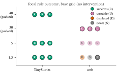
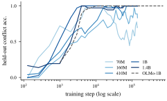
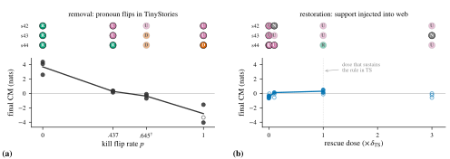

# Natural Ungrokking: Asymmetric Control of Which Rules Survive Pretraining

Juliana Li Affiliation: Harvard University, Cambridge, MA, USA Correspondence to: julianali@college.harvard.edu Diya Sreedhar Affiliation: Harvard University, Cambridge, MA, USA

## Abstract

Midway through an ordinary pretraining run, a small language model learns the pronoun-gender rule: cued with a girl’s name (“*Sue cried because*”), it resolves the next pronoun to *she*, generalizing to held-out probes ($0.94$ by step 925). By step 3,500 the same model scores near zero on the same probes, although the rule’s evidence is still in the training data. We call this within-run reversal *natural ungrokking*: the corpus decides, with no trace in the loss curve, which learned rules a model keeps.

Which rules survive is predictable from one corpus statistic: how often the training stream shows the rule winning. Across un-intervened runs (two corpora, three data budgets, three seeds), support frequency decides a rule’s fate; the data-to-parameter ratio only modulates how deeply a doomed rule falls. The same emerge-then-collapse training dynamics appear in public Pythia checkpoints, collapse depth ordered by model scale as predicted. The forgetting is a displacement: a competing surface pattern out-competes the rule, and the log-probability margin between them crosses zero within 100 training steps of the behavioral collapse.

Control over this fate is asymmetric: the same edit that destroys a rule on demand cannot restore it. Flipping support to counter-evidence in place kills the rule with monotone dose-response in two unrelated rules; but injecting support back—even to $450\times$ the level that naturally sustains it—buys no recovery. Every confirmatory threshold and prediction was pre-registered before the data it governed was read.

##### Keywords:

pretraining dynamics, language models, grokking, natural ungrokking, capability retention, transient capabilities, generalization dynamics, mechanistic interpretability, phase transitions

## 1 Introduction

*Figure 1: The focal pronoun-gender rule emerges and then collapses under web pretraining, and an internal margin crosses zero as it does. **(a)** Held-out conflict accuracy. On TinyStories (green: seed mean, min–max band) the rule survives at ceiling; on web the bold vermillion trace is the seed the abstract quotes ($0.94$ by step 925, gone by the end), with the two faint traces rising and collapsing the same way. Dotted lines are each corpus’s agree-condition control, which keeps climbing through the collapse: the construction stays solved and only the rule is lost. Grey dotted marks chance. **(b)** Contrast margin $\mathrm{CM}$ (Section 4.2), the model’s preference for the rule over the surface default, one strip per instrument-valid web seed; the vertical line marks behavioral collapse onset, the dot the $\mathrm{CM}$ zero crossing. The two coincide in both seeds (steps $2{,}800/2{,}800$ and $2{,}900/3{,}000$). The third web seed fails the instrument check (Section 3) and is omitted; its crossing is directionally consistent. TinyStories margins stay off scale at $+2$ to $+12$ nats.* **[p. 2]**

###### p1-6

Within a single pretraining run, a language model can lose a capability it had already acquired. The case this paper dissects is the pronoun-gender rule in an 11.5M-parameter model training on web text: cued with a girl’s name, the following pronoun should resolve to *she*. A conflict probe item is the prefix “*Sue cried because*”, scored on the continuation *she* against *he*; the corpus-wide prior favors *he*, the name cue demands *she*. Its agree-condition counterpart, “*Tom cried because*”, aligns cue and prior and acts as the control. The model scores $0.94$ on held-out conflict items by step 925 and near $0.00$ by steps 3,500–4,400 of the same run, while still scoring $1.00$ when rule and prior agree and the rule’s evidence stays in the stationary stream. No training data was removed, and no distribution shifted. The model acquired the rule and then stopped applying it (Figure 1a). We call this within-run reversal *natural ungrokking*.

A capability sighted at a mid-training checkpoint is no guarantee it will exist in the final model, but its support frequency in the corpus is predictive of whether it survives. Data filtering that thins a rare rule’s support can doom that rule without deleting a single example of it. Continual pretraining on a shifted mix can silently ungrok capabilities the base model had. In every case the failure is invisible to loss curves, because the model keeps the construction and abandons only the rule.

This paper makes three contributions.

**Capabilities are cheap to destroy and hard to restore.** Editing a rule’s evidence in place, flipping it to counter-evidence at a chosen rate with token counts and every other corpus statistic held fixed, destroys the rule with strictly monotone dose-response. A second, unrelated rule (*a*/*an* allomorphy) replicates the kill on a five-dose ladder built inside one corpus, dialing final accuracy monotonically from $0.96$ to $0.00$ while unrelated capabilities hold at baseline; in both rules, the scored blind predictions about kill direction all came out correct. The same knob fails in reverse—we injected support back into the collapsed corpus at up to $3\times$ the TinyStories support density, reaching post-injection rule:prior ratios far above the surviving TinyStories cell; the mechanistic margin moved, but no run produced a **[p. 2]** behavioral recovery that passed its controls (Section 4.3).

**A rule’s fate follows a support-frequency law.** Whether a rule survives to the end of training is decided by how often its supporting evidence appears in the corpus; the unique-data-to-parameter ratio $D/N$ modulates how deeply a doomed rule falls but never flips its fate (Section 4.1). We establish this across a grid of corpora, data budgets, and seeds. The same rise-and-fall reproduces in the smaller public Pythia checkpoints, with collapse depth following the predicted scale order, and the verdicts transfer to an out-of-distribution probe set.

**The loss is displacement.** The collapsing rule loses a competition with a strengthening surface pattern, here the corpus-wide preference for *he*, while the construction it lives in stays solved. A contrast margin between rule and prior crosses zero at the behavioral collapse step, and its final sign largely separates recovered from displaced cells across the grid, with a boundary case discussed below (Section 4.2).

Every threshold, metric, and directional prediction here was registered in advance (Section 3), with the full scoreboard in App. A. Predicting a rule’s fate works; predicting *where* on the frequency axis the survival boundary falls is the open problem this paper hands to future work (App. B). Code, configs, probe batteries, and the frozen registration document are released.[^1]

[^1]: https://github.com/lijuliana/Natural-Ungrokking

## 2 Related Work

Grokking is delayed generalization (Power et al. 2022; Nanda et al. 2023), with phase diagrams drawn over data size and hyperparameters (Liu et al. 2023; Liu et al. 2022). The nearest dynamical relative of our subject is *ungrokking* (Varma et al. 2023), where generalization recedes when the dataset shrinks below a critical size between runs; our capabilities rise and fall within a single run on stationary text, which is the kinship and the difference that *natural ungrokking* names. Transience itself has precedent: Singh et al. 2023 show emergent in-context learning can fade under continued training; we observe the analogous fate for in-weights linguistic rules, give it a frequency law, and steer it with corpus edits. Chen et al. 2024 document sudden transitions in syntax acquisition and control them through the training data; we follow the same observational-to-causal arc for a transition that runs from competence to incompetence. Chang et al. 2024 show that token-level forgetting during ordinary pretraining is frequency-dependent; our subject is a rule-level capability displaced while its evidence stays in the stream. Wei et al. 2021 causally tie agreement behavior to evidence frequency across separately trained models; we chart within-run fate. Closest in method is filtered-corpus training (Patil et al. 2024; Misra & Mahowald 2024), which withholds a construction’s direct evidence and finds models acquire it anyway; our edit instead converts evidence into counter-evidence at fixed token counts, and the near-parity dose nearest a pure ablation does not kill the rule, consistent with their results. Extended discussion is in App. J.

**[p. 3]**

## 3 Experimental Setup

#### Models and training.

All governed runs use a 4-layer decoder-only transformer (Vaswani et al. 2017) with $d_{\text{model}}=256$, two attention heads, a 2048-token context, and a corpus-specific BPE vocabulary (Sennrich et al. 2016) of 8192 symbols (11.5M parameters; 3.1M excluding embeddings); the architecture and initialization follow nanochat (Karpathy 2025). Each run trains for 4,400 steps at batch size 32 with cosine warmdown over the final 30% of steps. Learning rates were fixed once per corpus and never revisited; within any comparison, every cell shares the same architecture, tokenizer, schedule, and optimizer, so that only the named axis moves. Each cell is trained with three seeds, and a disjoint seed set is quarantined for a blind replication pass (App. D).

#### Corpora and the two axes.

We train on two corpora: TinyStories (Eldan & Li 2023), where the rule under study is densely supported, and a filtered web corpus derived from ClimbMix (Diao et al. 2025), where its support falls below our measurement floor under the registered windowed counter. The *support frequency* $f$ of a rule is the rate of supporting events per token under a frozen counting procedure (App. E): intuitively, how often the training stream shows the rule winning; for the focal rule, an occurrence of *she* within $16$ tokens of a feminine cue. We write $\delta_{\mathrm{TS}}=1.67\times 10^{-3}$ events per token for the focal pronoun-gender rule’s measured support frequency on TinyStories, the unit in which rescue doses are quoted. The *data ratio* $D/N$ is unique training tokens over parameters, varied by capping the token budget ($D/N\in\{1.5,5\}$, plus uncapped full-corpus runs, hereafter “packed” cells). The grid spans both corpora at all budgets, three seeds per cell.

#### Probe battery and outcome classifier.

Capabilities are scored by a frozen battery of templated probe families, each with two conditions: a *conflict* condition, where the rule’s cue and a competing surface cue disagree, and an *agree* control condition, where they align. A frozen classifier maps each family’s smoothed held-out conflict trajectory to one of five outcomes (recovered, displaced, partial, never, unstable). A family’s verdict counts only when its agree condition stays solved, which rules out trajectories where the model has simply lost the construction wholesale: a displaced verdict means the model still commands the construction but no longer follows the rule. Thresholds and smoothing are reproduced verbatim in App. E.

#### Mechanism metric.

Alongside behavior we track a contrast margin $\mathrm{CM}$: on a frozen prompt set disjoint from every training intervention, the mean log-probability margin for the rule-conforming continuation over its prior-conforming competitor. For the focal rule, on feminine-cue prompts $x$,

$$
\mathrm{CM}\;=\;\tfrac{1}{|\mathcal{P}|}\textstyle\sum_{x\in\mathcal{P}}\bigl[\log p_{\theta}(\textit{she}\mid x)-\log p_{\theta}(\textit{he}\mid x)\bigr], \tag{1}
$$

so $\mathrm{CM}>0$ means the rule outweighs the prior at the prediction site and $\mathrm{CM}<0$ means the prior has won (App. E). An instrument guard discards runs where smoothed $\mathrm{CM}$ never attains $0.5$ nats. $\mathrm{CM}$ is computed independently of the behavioral classifier, so mechanism and behavior can disagree, and in places they do.

#### Pre-registration protocol.

Every confirmatory metric, threshold, and directional prediction was committed to version control before the data it governs was read; later changes are dated amendments, failed predictions are reported as failures, and post-hoc analyses are marked as such and carry no scored verdicts (App. A). Two validity gates recur and leave a prediction *unscoreable* rather than passed or failed: an *instrument* gate when a metric fails its own preconditions (e.g. the $0.5$-nat margin guard), and an *intervention* gate when an edited corpus damages unrelated control families.

## 4 Results

The survival pattern (Section 4.1) establishes the law, the mechanism (Section 4.2) shows what the loss is, and the causal interventions (Section 4.3) test it in both directions. Every confirmatory claim below is a registered prediction, scored on the complete pass/fail scoreboard in App. A (Table 2).

### 4.1 Support Frequency Determines Rule Fate at Every Data Budget

###### p3-8

All four blind predictions made with the grid design (P1–P4) passed. Table 4 (App. D) gives the per-seed outcomes for all six families and Figure 2 plots the focal rule’s grid. The focal pronoun-gender rule survives (ends recovered under the frozen classifier) in 9/9 TinyStories runs at every budget, and in no web run at any budget: on the packed web cells it emerges, collapses, and is pinned at the competing prior. The one web run that approaches the threshold ($D/N{=}5$, seed 42, conflict final $0.770$ against the $0.8$ survival bar) is a boundary case that returns in Section 4.2. All four high-support families keep conflict final $\geq 0.8$ on packed web in 3/3 seeds (P2’s registered criterion, which scores conflict finals alone): two are fully recovered across the grid, and the other two solve their conflict items but carry unscoreable agree-control verdicts from a probe-calibration artifact. The reflexive_gender family ends below threshold on web, and the web budget ordering holds. Across all cells, $D/N$ modulates displacement depth but never flips a survival verdict; the fate axis is support frequency.

*Figure 2: Base grid for the focal pronoun-gender rule: one marker per seed per cell, lettered by the frozen classifier’s verdict (Recovered, Unstable, Displaced, Never); faded markers are seeds whose agree control failed (unscoreable). Rows are the unique-data/params budgets (ordinal spacing); the packed row has corpus-specific $D/N$, approximately $30$ for TinyStories and $40$ for web. The rule survives in every TinyStories cell and no web cell; the budget axis never flips the verdict.* **[p. 4]**

Two control cells rule out deflationary explanations. **[p. 4]** An optimizer-control cell (TinyStories under the web cell’s optimizer) ends at conflict $0.927$, so optimizer settings alone cannot cause the collapse; and noun-cued and name-cued items both end below the survival threshold on web, ruling out forgetting of particular name embeddings. The loss sits at the level of the rule.

The grid realizes its support-frequency axis through corpus identity, so the two corpora differ in many statistics at once. Clean attribution to support frequency therefore comes from the interventions of Section 4.3, which edit that one statistic in place, including a five-dose ladder within a single corpus where the same law reappears.

*Figure 3: The transient signature in public checkpoints, same frozen battery: held-out conflict accuracy for the focal rule across Pythia revisions (70M–1.4B) and OLMo-1B, frozen $k{=}3$ smoothing, log-axis steps. The rule emerges early in every model; end-of-training survival is ordered by scale (PUB3, Spearman $\rho=0.894$), the smallest model falling deepest and collapse gone by 410M. Agree controls of the collapsing models stay at or near ceiling throughout (not shown).* **[p. 4]**

#### Public-checkpoint transfer.

###### p4-2

The phenomenon is not an artifact of our 11.5M-parameter setting (Figure 3). Scored with the same battery, the focal rule emerges early in every public model (Pythia 70M–1.4B and OLMo-1B, trained by other labs on other corpora), then collapses in the smaller ones while the agree control stays solved. The predicted depth-by-scale ordering transfers to models two orders of magnitude larger: the smaller the model, the deeper the final collapse (Spearman $\rho=0.894$ across five Pythia sizes, collapse gone by 410M). Exact magnitudes did not: one prediction failed by $0.008$ and a boundary census missed (App. A).

### 4.2 A Contrast Margin Crosses Zero as Behavior Collapses

Two hypotheses compete when the rule disappears: *erasure* (the construction is lost wholesale) and *displacement* (the rule loses a race with a strengthening surface default fed far more often, so the model keeps the construction but stops honoring the rule where the two disagree). Two controls already constrain the answer: collapsed cells keep solving the construction when rule and prior agree (against erasure), and on web cells train-template finals track held-out finals within $0.11$ (against pure memorization).

The displacement signature lives in the contrast margin $\mathrm{CM}$ (Section 3), and mean final $\mathrm{CM}$ is a clean order parameter for the phase diagram: $+3.68/+2.98/+2.36$ across TinyStories budgets (packed, $D/N{=}5$, $D/N{=}1.5$) against $-0.52/-0.07/-0.85$ across the same web budgets, with the run-level sign rule (final $\mathrm{CM}$ positive exactly when final conflict accuracy exceeds $0.5$) holding in 18/18 base runs. The same scalar moves with the causal knob, the kill driving $\mathrm{CM}$ from $+3.68$ to $-2.99$ dose-monotonically (Section 4.3), exactly as displacement predicts.

###### p4-5

A registered prediction ties the margin to behavior in time. In both web seeds where the margin instrument is valid, the smoothed $\mathrm{CM}$ zero-crossing lands within one $100$-step checkpoint of the behavioral collapse onset (Figure 1b): crossings at steps $2{,}800$ vs. $2{,}800$ and $2{,}900$ vs. $3{,}000$ (the third seed fails the guard; its crossing is directionally consistent). The margin crosses *as* behavior collapses, not after, and every crossing precedes the cosine warmdown (step $3{,}080$ of $4{,}400$), ruling out a schedule artifact.

###### p4-6

A second, gate-free measure corroborates this on all three web seeds (post-hoc, descriptive; App. I). An exact decomposition of the *she*–*he* logit gap into a direct embedding-path term and a contextual term (all attention and MLP contributions) shows the direct term staying near zero while the contextual term carries the margin and ends negative: the collapse is in the contextual pathway, not the static readout. A parameter-free probe agrees, cue-gender decodability at **[p. 5]** the prediction site decaying toward chance on web while staying near ceiling on surviving TinyStories runs: the displacement reaches down into the representation, upstream of the logits.

Head-level analyses (exploratory; App. I, methods follow Elhage et al. 2021) support this picture: in surviving runs the margin rides a single last-layer head ($75$–$90\%$ of attribution, zero-ablation deletes it), while collapsed runs have no dominant carrier and no fitted gender direction moves the margin by more than $0.22$ nats. Patching within a single run reproduces the same destroy-easily/restore-hardly asymmetry at the circuit level (App. I).

One registered margin verdict failed (App. A): an all-cells sign prediction assumed every web run ends below the $0.5$ sign threshold, but the boundary run of Section 4.1 ended just above it (conflict final $0.770$, still under the $0.8$ survival bar), triggering the mechanism falsifier on that universal claim. The timing result stands on its own test: wherever the margin instrument is healthy, the margin crosses zero just as behavior dies.

### 4.3 Causal Control: An Asymmetry Between Removing and Restoring Support

*Figure 4: The two intervention directions, each on its own dose axis with the un-intervened base at dose zero. Top strips: per-seed behavioral outcome (colors as in Figure 2); faded markers failed a registered validity gate (their control condition, or in the ${\dagger}$ cell the whole-cell intervention check). Bottom: final $\mathrm{CM}$, one point per seed; hollow points fail the $\mathrm{CM}$ instrument gate, the line is the mean over gate-passing seeds. Removal **(a)** is monotone: more flipped support, deeper collapse. Restoration **(b)** never produces a control-valid recovery (none even at three times the sustaining dose) and shifts the margin only weakly, peaking at matched dose and regressing beyond it. ${\dagger}$: the intervention-invalid kill cell (Table 5).* **[p. 6]**

The causal experiment’s result illuminates an asymmetry: the same one-variable edit that destroys a rule on demand fails, run in reverse at up to triple strength, to bring the rule back. The survival pattern and the mechanism both nominate support frequency as the controlling variable; the causal experiment edits it in place. In the surviving TinyStories cell, we flip the rule-supporting pronoun token after girl-name cues at rates $p\in\{0.437,0.645,1.0\}$, chosen in advance to bring the rule-to-prior support ratio to parity, to match the web corpus’s ratio of $0.46$, and to remove all support, leaving the corpus byte-identical elsewhere with token counts unchanged. The ladder spans the withheld-evidence regime of filtered-corpus training (Patil et al. 2024; Misra & Mahowald 2024) and, at $p{=}1$, a strictly stronger contradiction regime. Blind directional predictions and per-cell validity gates preceded any intervened corpus (App. A). Figure 4 plots the results; the per-cell numbers are in Table 5 (App. F).

#### Removal is dose-graded and predictable.

###### p5-4

At full flip the rule dies in 3/3 seeds with $\mathrm{CM}$ collapsing from $+3.68$ (base) to $-2.99$, while the near-parity dose $p{=}0.437$ does not kill the cell ($0/3$ seeds displaced, mean margin $+0.27$). Monotonicity is exact: $\rho_{\mathrm{kill}}=-1.00$ over the four-point ladder of base plus three doses. With four points a perfect ordering has a one-sided null probability of $1/24$, so the evidential weight rests on the blind registration of direction, threshold, and falsifier, all of which came out as predicted. The middle dose damaged two unrelated control families in 2/3 seeds, so its behavioral verdict is voided by the intervention gate; scored at face value it would also have been correct (3/3 died, $\mathrm{CM}$ $-0.38$), and excluding the cell entirely the remaining points stay strictly monotone. The lethal boundary lies between parity and full flip, and *every scored prediction in the removal direction was correct* (3/3: full-flip behavior, full-flip margin, dose monotonicity).

#### A second rule, one corpus.

The kill generalizes, in the setting that matters most for the grid’s confound (Section 4.1): support varied at five doses *within* a single corpus, so corpus identity cannot carry the effect. The rule is *a*/*an* allomorphy (choose *an* before a vowel-initial word), at ceiling in base TinyStories with a rule:counter evidence ratio of $23.4$. We flip *an* to *a* before vowel-initial words at rates $p\in\{0.5,0.667,0.75,0.9,1.0\}$, three seeds each, every other statistic untouched, with five blind predictions made in advance (App. G). Final conflict accuracy falls strictly monotonically in dose (Table 1), cell means $0.96\to 0.67\to 0.49\to 0.29\to 0.13\to 0.00$ as the post-edit evidence ratio falls $23.4\to 0.92\to 0.47\to 0.32\to 0.11\to 0$. The edit is surgical: pronoun-gender, negation, and irregular-past families stay within $0.05$ of base at every dose, while a second probe family of the same rule (*a*/*an* before adjectives) co-degrades, $0.99\to 0.00$. The intermediate doses reproduce the grid’s phase structure inside one corpus: at $p{=}0.667$ the rule emerges and then collapses; at $p{=}1.0$ it never emerges. Two predictions missed (App. G): the rule destabilizes already at the parity dose we predicted it would survive, so both rules’ boundaries sit within a factor of two of evidence parity, and the agree-condition control we predicted would fail at high dose stayed valid everywhere.

*Table 1: The *a*/*an* kill ladder, run entirely within one TinyStories corpus: per-seed and mean final held-out conflict accuracy (frozen-classifier letter R/U/N) as the post-edit rule:counter evidence ratio falls. The rule degrades strictly monotonically to zero, and the adjacency family a_an_adj. co-degrades while unrelated families hold (App. G).* **[p. 5]**

|  |  | det_an_choice |  |  |  | a_an* |
|---|---|---|---|---|---|---|
| flip rate $p$ | r:c | final (letter), seeds 42/43/44 |  |  | mean | mean |
| 0 (base) | 23.4 | $0.95$ (R) | $0.98$ (R) | $0.96$ (R) | $0.96$ | $0.99$ |
| 0.5 | 0.92 | $0.76$ (U) | $0.69$ (U) | $0.55$ (U) | $0.67$ | $0.74$ |
| 0.667 | 0.47 | $0.66$ (U) | $0.37$ (N) | $0.45$ (U) | $0.49$ | $0.64$ |
| 0.75 | 0.32 | $0.28$ (U) | $0.13$ (U) | $0.47$ (U) | $0.29$ | $0.35$ |
| 0.9 | 0.11 | $0.25$ (U) | $0.07$ (U) | $0.08$ (N) | $0.13$ | $0.03$ |
| 1 | 0.00 | $0.00$ (N) | $0.00$ (N) | $0.00$ (N) | $0.00$ | $0.00$ |

#### Restoration fails at matched and overshot dose.

###### p5-6

The restoration arm injects the same kind of support the kill removes (*girl*$\to$*she* documents with symmetric *boy*$\to$*he* controls, token counts matched) into the collapsed web corpus at doses up to $3\times\delta_{\mathrm{TS}}$, where $1\times\delta_{\mathrm{TS}}$ is the support density under which the rule survives $3/3$ seeds on TinyStories. No dose produces a control-valid recovery in any seed, tripping **[p. 6]** the failure condition we committed to in advance for this arm. The margin registers a partial effect: at the $1\times$ dose final $\mathrm{CM}$ turns positive as predicted (cell mean $+0.16$) but lands an order of magnitude below the $+2.4$ to $+3.7$ of the surviving regime, and behavior does not follow. The moved margin is visible in the circuit too: at this dose the dominant last-layer head measurably re-forms, with roughly double the ablation cost of the un-injected base, yet the item-level confidence interval on the behavioral drop still excludes zero in every non-artifact-flagged rescue run (App. I): the dose produces a partial reassembly of the circuit while the behavior stays collapsed.

A unit check closes a natural objection: that density-matched doses might still be ratio-poor, the injected evidence drowned by the corpus prior. The opposite holds: under the same windowed counter, run post hoc on the injected cue class (App. F), the post-injection rule:prior ratio is already $37$ at the smallest dose and $3{,}565$ at $1\times$ (Table 5), against the $7.9$ of the TinyStories cell where the rule survives. By the evidence-ratio standard that governs every other cell in this paper, the injected construction is over-supported by orders of magnitude, and behavior still does not recover. The injected names are deliberately disjoint from the battery’s cues (an anti-teaching control), so recovery requires the class-level rule to generalize across names; a model that merely memorized the injected sentences would not register on the battery. Within this design, support frequency is causally sufficient for destruction and insufficient for restoration. One objection remained for the uniform-rate design: about a third of the injected dose arrives only after the collapse step, so the failure could have reflected a mistimed dose. A registered amendment (dated after the uniform-rate verdicts were read, before any timing run existed) concentrated the full $1\times$ dose into the window before the collapse step, with a matched late-window control. The early dose also failed: zero of three seeds show a control-valid recovery, and the one seed that held the rule while the dose flowed lost it once the dose ended. Full verdicts and the instrument gates that leave the mechanism comparison unscored are in App. F.

#### Out-of-distribution transfer.

All verdicts above are on the templated battery; an OOD battery (864 held-out items, frames disjoint from all training injections, App. E) rules out template artifacts. All three transfer predictions passed, competence, failure, and the transient emerge-then-collapse signature, and the kill dose gradient and collapsed restoration cells both reproduce out of distribution.

## 5 Discussion and Limitations

A learned capability was cheap to destroy, with exact dose-response in two unrelated rules, and could not be bought back by re-adding matched evidence: the same knob, run in reverse at up to triple strength, moved the internal margin modestly, with partial re-formation of the margin-carrying head, while restoring none of the behavior. The strongest registered objection was dose timing, and the asymmetry survived it: concentrating the full dose before the collapse step still produced zero control-valid recoveries (Section 4.3). At every dose and schedule we tested, matched data failed to buy back what pretraining had discarded, a pattern consistent with the selection of survivors being made early and then consolidating.

**[p. 7]**

The other two results say when to expect the loss and what it physically is. Natural ungrokking is predictable: a rule’s end-of-training fate can be read off a measurable corpus statistic, its support frequency, before training ends, and nothing about it is adversarial: the stream is stationary, and a rare rule’s support is simply outweighed by a more frequent competing pattern. And the loss takes a physical form, displacement, measurable as a margin-level order parameter that crosses zero exactly when behavior collapses. The practical consequences named in Section 1 follow from these three results jointly: mid-training evaluation, data filtering, and continual pretraining all interact with a survival law that is invisible to loss curves.

Several limitations bound the scope of these claims. **Scale:** the intervention is established at 11.5M parameters; the public suite shows the phenomenon and its scale-ordering to 1.4B, but no intervention has been run at larger scale. **Probes:** all primary verdicts use templated minimal pairs; the OOD battery transfers all three of its predictions and a surface $n$-gram baseline cannot reproduce the phase pattern (App. H), though both batteries are synthetic and naturalistic evaluation is left for future work. **The asymmetry:** its mechanism comparison rests on the one early-window seed with a valid margin readout, and its behavioral verdict spans three seeds per window and a single rule, so consolidation past a point of no return, which fits the results, remains to be measured directly (App. F). **Replication:** the quarantined seed set and its registered predictions remain unread by design (App. D).

What we hand to future work is *where* on the frequency axis the boundary falls. We registered a critical-frequency theory of exactly that before inspecting any counts; it predicted which rules survive but not the location of the boundary, so its quantitative form is left open (post-mortem in App. B), and the one candidate that fits the grid awaits the blind replication pass. The phenomenon that theory would complete already stands on firm ground: a rule’s fate is predictable from a corpus statistic before the run ends, the loss is displacement at the mechanism level, and that fate is controllable in one direction by a single knob, all registered in advance.

## Impact Statement

This work studies how language-model capabilities form and disappear during pretraining, and its practical thrust is constructive: a capability a model shows mid-run can be anticipated, monitored, and to a degree controlled before the run ends. If the findings generalize, three consequences for practice follow. A capability observed at a mid-training checkpoint can be absent from the final model, so evaluation timing belongs in release decisions. Corpus filtering can remove a rare rule without deleting a single example of it. Continual pretraining on a shifted mix can quietly undo rules a base model had already learned. None of the three shows up in the loss curve, which argues for capability-level monitoring during training rather than only after it.

Two responsibilities attend the method. The kill intervention edits gendered-pronoun statistics in a small synthetic corpus only to test a causal claim about rule retention at 11.5M parameters; the same technique aimed at capability removal at scale would carry dual-use concerns, and we report it so that defenders can recognize and monitor for it. The probes measure a grammatical resolution rule, whether a name cue overrides a frequency prior, so no conclusion about social bias in deployed models follows from them. Finally, the pre-registration protocol we follow, frozen thresholds and blind directional predictions with passes and failures reported alike, is itself a contribution we hope lowers the rate of unscrutinized claims in training-dynamics research.

## References

- Achille, A., Rovere, M., and Soatto, S. Critical learning periods in deep networks. In *International Conference on Learning Representations*, 2019. arXiv:1711.08856.

- Biderman, S., Schoelkopf, H., Anthony, Q., Bradley, H., O’Brien, K., Hallahan, E., Khan, M. A., Purohit, S., Prashanth, U. S., Raff, E., Skowron, A., Sutawika, L., and van der Wal, O. Pythia: A suite for analyzing large language models across training and scaling. In *International Conference on Machine Learning*, 2023. arXiv:2304.01373.

- Brants, T., Popat, A. C., Xu, P., Och, F. J., and Dean, J. Large language models in machine translation. In *Proceedings of the 2007 Joint Conference on Empirical Methods in Natural Language Processing and Computational Natural Language Learning (EMNLP-CoNLL)*, pp. 858–867, 2007.

- Chang, T. A. and Bergen, B. K. Word acquisition in neural language models. *Transactions of the Association for Computational Linguistics*, 10:1–16, 2022. doi: 10.1162/tacl_a_00444.

- Chang, T. A., Tu, Z., and Bergen, B. K. Characterizing learning curves during language model pre-training: Learning, forgetting, and stability. *Transactions of the Association for Computational Linguistics*, 12:1346–1362, 2024. doi: 10.1162/tacl_a_00708.

- Chen, A., Shwartz-Ziv, R., Cho, K., Leavitt, M. L., and Saphra, N. Sudden drops in the loss: Syntax acquisition, phase transitions, and simplicity bias in mlms. In *International Conference on Learning Representations*, 2024. arXiv:2309.07311.

**[p. 8]**

- Choshen, L., Hacohen, G., Weinshall, D., and Abend, O. The grammar-learning trajectories of neural language models. In *Proceedings of the 60th Annual Meeting of the Association for Computational Linguistics*, 2022.

- Diao, S., Yang, Y., Fu, Y., Dong, X., Su, D., Kliegl, M., Chen, Z., Belcak, P., Suhara, Y., Yin, H., Patwary, M., Lin, Y., Kautz, J., and Molchanov, P. Nemotron-climb: Clustering-based iterative data mixture bootstrapping for language model pre-training. *arXiv preprint arXiv:2504.13161*, 2025.

- Eldan, R. and Li, Y. Tinystories: How small can language models be and still speak coherent english? *arXiv preprint arXiv:2305.07759*, 2023.

- Elhage, N., Nanda, N., Olsson, C., Henighan, T., Joseph, N., Mann, B., Askell, A., Bai, Y., Chen, A., Conerly, T., et al. A mathematical framework for transformer circuits. *Transformer Circuits Thread*, 2021. https://transformer-circuits.pub/2021/framework/index.html.

- Gemma Team, Rivière, M., Pathak, S., Sessa, P. G., Hardin, C., Bhupatiraju, S., Hussenot, L., Mesnard, T., Shahriari, B., Ramé, A., et al. Gemma 2: Improving open language models at a practical size. *arXiv preprint arXiv:2408.00118*, 2024.

- Groeneveld, D., Beltagy, I., Walsh, P., Bhagia, A., Kinney, R., Tafjord, O., Jha, A. H., Ivison, H., Magnusson, I., Wang, Y., et al. Olmo: Accelerating the science of language models. In *Proceedings of the 62nd Annual Meeting of the Association for Computational Linguistics*, 2024. arXiv:2402.00838.

- Hoffmann, J., Borgeaud, S., Mensch, A., Buchatskaya, E., Cai, T., Rutherford, E., de Las Casas, D., Hendricks, L. A., Welbl, J., Clark, A., et al. Training compute-optimal large language models. *arXiv preprint arXiv:2203.15556*, 2022.

- Hoogland, J., Wang, G., Farrugia-Roberts, M., Carroll, L., Wei, S., and Murfet, D. The developmental landscape of in-context learning. *arXiv preprint arXiv:2402.02364*, 2024.

- Jagielski, M., Thakkar, O., Tramèr, F., Ippolito, D., Lee, K., Carlini, N., Wallace, E., Song, S., Thakurta, A., Papernot, N., and Zhang, C. Measuring forgetting of memorized training examples. *arXiv preprint arXiv:2207.00099*, 2022.

- Jordan, K., Jin, Y., Boza, V., You, J., Cesista, F., Newhouse, L., and Bernstein, J. Muon: An optimizer for hidden layers in neural networks. https://kellerjordan.github.io/posts/muon/, 2024.

- Kandpal, N., Deng, H., Roberts, A., Wallace, E., and Raffel, C. Large language models struggle to learn long-tail knowledge. In *International Conference on Machine Learning*, 2023.

- Karpathy, A. nanochat. https://github.com/karpathy/nanochat, 2025.

- Kirkpatrick, J., Pascanu, R., Rabinowitz, N., Veness, J., Desjardins, G., Rusu, A. A., Milan, K., Quan, J., Ramalho, T., Grabska-Barwinska, A., Hassabis, D., Clopath, C., Kumaran, D., and Hadsell, R. Overcoming catastrophic forgetting in neural networks. *Proceedings of the National Academy of Sciences*, 114(13):3521–3526, 2017. arXiv:1612.00796.

- Lindsey, J., Templeton, A., Marcus, J., Conerly, T., Batson, J., and Olah, C. Sparse crosscoders for cross-layer features and model diffing. Transformer Circuits Thread, 2024. URL https://transformer-circuits.pub/2024/crosscoders/index.html.

- Liu, Z., Kitouni, O., Nolte, N., Michaud, E. J., Tegmark, M., and Williams, M. Towards understanding grokking: An effective theory of representation learning. In *Advances in Neural Information Processing Systems*, 2022.

- Liu, Z., Michaud, E. J., and Tegmark, M. Omnigrok: Grokking beyond algorithmic data. In *International Conference on Learning Representations*, 2023. arXiv:2210.01117.

- Loshchilov, I. and Hutter, F. Decoupled weight decay regularization. In *International Conference on Learning Representations*, 2019.

- Lu, K., Mardziel, P., Wu, F., Amancharla, P., and Datta, A. Gender bias in neural natural language processing. In *Logic, Language, and Security*. Springer, 2020.

- Meng, K., Bau, D., Andonian, A., and Belinkov, Y. Locating and editing factual associations in GPT. In *Advances in Neural Information Processing Systems*, 2022.

- Misra, K. and Mahowald, K. Language models learn rare phenomena from less rare phenomena: The case of the missing AANNs. *arXiv preprint arXiv:2403.19827*, 2024.

- Muennighoff, N., Rush, A. M., Barak, B., Le Scao, T., Piktus, A., Tazi, N., Pyysalo, S., Wolf, T., and Raffel, C. Scaling data-constrained language models. In *Advances in Neural Information Processing Systems*, 2023. arXiv:2305.16264.

- Murty, S., Sharma, P., Andreas, J., and Manning, C. Grokking of hierarchical structure in vanilla transformers. In *Proceedings of the 61st Annual Meeting of the Association for Computational Linguistics (**[p. 9]** Volume 2: Short Papers)*, pp. 439–448, 2023. doi: 10.18653/v1/2023.acl-short.38.

- Nanda, N., Chan, L., Lieberum, T., Smith, J., and Steinhardt, J. Progress measures for grokking via mechanistic interpretability. In *International Conference on Learning Representations*, 2023. arXiv:2301.05217.

- Olsson, C., Elhage, N., Nanda, N., Joseph, N., DasSarma, N., Henighan, T., Mann, B., Askell, A., Bai, Y., Chen, A., et al. In-context learning and induction heads. *Transformer Circuits Thread*, 2022. arXiv:2209.11895.

- Patil, A., Jumelet, J., Chiu, Y. Y., Lapastora, A., Shen, P., Wang, L., Willrich, C., and Steinert-Threlkeld, S. Filtered corpus training (FiCT) shows that language models can generalize from indirect evidence. *Transactions of the Association for Computational Linguistics*, 12:1597–1615, 2024. doi: 10.1162/tacl_a_00720.

- Power, A., Burda, Y., Edwards, H., Babuschkin, I., and Misra, V. Grokking: Generalization beyond overfitting on small algorithmic datasets. *arXiv preprint arXiv:2201.02177*, 2022.

- Schaeffer, R., Miranda, B., and Koyejo, S. Are emergent abilities of large language models a mirage? In *Advances in Neural Information Processing Systems*, 2023. arXiv:2304.15004.

- Sennrich, R., Haddow, B., and Birch, A. Neural machine translation of rare words with subword units. In *Proceedings of the 54th Annual Meeting of the Association for Computational Linguistics*, 2016.

- Singh, A. K., Chan, S. C., Moskovitz, T., Grant, E., Saxe, A. M., and Hill, F. The transient nature of emergent in-context learning in transformers. In *Advances in Neural Information Processing Systems*, 2023. arXiv:2311.08360.

- Tirumala, K., Markosyan, A. H., Zettlemoyer, L., and Aghajanyan, A. Memorization without overfitting: Analyzing the training dynamics of large language models. In *Advances in Neural Information Processing Systems*, 2022. arXiv:2205.10770.

- Toneva, M., Sordoni, A., des Combes, R. T., Trischler, A., Bengio, Y., and Gordon, G. J. An empirical study of example forgetting during deep neural network learning. In *International Conference on Learning Representations*, 2019. arXiv:1812.05159.

- Varma, V., Shah, R., Kenton, Z., Kramár, J., and Kumar, R. Explaining grokking through circuit efficiency. *arXiv preprint arXiv:2309.02390*, 2023.

- Vaswani, A., Shazeer, N., Parmar, N., Uszkoreit, J., Jones, L., Gomez, A. N., Kaiser, Ł., and Polosukhin, I. Attention is all you need. In *Advances in Neural Information Processing Systems*, 2017.

- Vig, J., Gehrmann, S., Belinkov, Y., Qian, S., Nevo, D., Singer, Y., and Shieber, S. Investigating gender bias in language models using causal mediation analysis. In *Advances in Neural Information Processing Systems*, 2020.

- Wang, G., Hoogland, J., van Wingerden, S., Furman, Z., and Murfet, D. Differentiation and specialization of attention heads via the refined local learning coefficient. *arXiv preprint arXiv:2410.02984*, 2024.

- Warstadt, A., Parrish, A., Liu, H., Mohananey, A., Peng, W., Wang, S.-F., and Bowman, S. R. Blimp: The benchmark of linguistic minimal pairs for english. *Transactions of the Association for Computational Linguistics*, 8:377–392, 2020a. arXiv:1912.00582.

- Warstadt, A., Zhang, Y., Li, X., Liu, H., and Bowman, S. R. Learning which features matter: RoBERTa acquires a preference for linguistic generalizations (eventually). In *Proceedings of the 2020 Conference on Empirical Methods in Natural Language Processing*, pp. 217–235, 2020b. doi: 10.18653/v1/2020.emnlp-main.16.

- Wei, J., Garrette, D., Linzen, T., and Pavlick, E. Frequency effects on syntactic rule learning in transformers. In *Proceedings of the 2021 Conference on Empirical Methods in Natural Language Processing*, pp. 932–948, 2021. doi: 10.18653/v1/2021.emnlp-main.72.

- Wei, J., Tay, Y., Bommasani, R., Raffel, C., Zoph, B., Borgeaud, S., Yogatama, D., Bosma, M., Zhou, D., Metzler, D., Chi, E. H., Hashimoto, T., Vinyals, O., Liang, P., Dean, J., and Fedus, W. Emergent abilities of large language models. *Transactions on Machine Learning Research*, 2022. arXiv:2206.07682.

- Xie, S. M., Pham, H., Dong, X., Du, N., Liu, H., Lu, Y., Liang, P., Le, Q. V., Ma, T., and Yu, A. W. Doremi: Optimizing data mixtures speeds up language model pretraining. In *Advances in Neural Information Processing Systems*, 2023. arXiv:2305.10429.

- Zhao, J., Wang, T., Yatskar, M., Ordonez, V., and Chang, K.-W. Gender bias in coreference resolution: Evaluation and debiasing methods. In *Proceedings of NAACL-HLT*, 2018.

- Zucchet, N., Bornschein, J., Chan, S., Lampinen, A., Pascanu, R., and De, S. How do language models learn facts? dynamics, curricula and hallucinations. *arXiv preprint arXiv:2503.21676*, 2025.

**[p. 10]**

## Appendix A Pre-registration Ledger

Every confirmatory metric, threshold, and directional prediction in this paper was committed to version control *before* the data it governs existed or was read. The consolidated registration document (prereg/PREREGISTRATION.md) was frozen at the tag prereg-v1, with all later changes as dated amendment sections appended to it. That document and tag, together with the evaluator and analysis code, are released verbatim (App. C), so a reader can verify that each registration preceded the data it governs. Table 2 summarizes every registered prediction by group, and Table 3 lists them one by one. ID prefixes: P grid, PUB public checkpoints, F frequency theory, S/M mechanism, R rescue, K kill, RV5 out-of-distribution, CMR replication week (unread).

*Table 2: All registered predictions by group: passed (✓), failed ($\times$), or unscoreable under an instrument or intervention validity gate ($\circ$, never converted to ✓ or $\times$). The falsifier column reports each group’s registered hard falsifier (*silent* = untriggered, *triggered* = fired, — = none); the summary row counts triggered among the seven applicable falsifiers (2 of 7). The Step-6T falsifier is silent on a thinner base than the others: its margin-level clauses are unscoreable because the timing-window instrument gate passed in only $1/3$ seeds.* **[p. 10]**

| prediction group | ✓ | $\times$ | $\circ$ | falsifier |
|---|---|---|---|---|
| Budget-only pilot (pre-grid) | 0 | 1 | 0 | — |
| Phase grid (Step 3) | 4 | 0 | 0 | silent |
| Public suite (Pythia/OLMo) | 2 | 2 | 0 | — |
| Critical-frequency theory (Step 4) | 0 | 2 | 0 | silent |
| Mechanism (Step 5) | 3 | 1 | 2 | **triggered** |
| Causal control (Step 6): rescue | 3 | 3 | 2 | **triggered** |
| Causal control (Step 6): kill | 3 | 0 | 2 | silent |
| Rescue timing (Step-6T) | 1 | 1 | 2 | silent |
| Second-rule (a/an) kill ladder | 3 | 2 | 0 | — |
| OOD transfer (rvp5) | 3 | 0 | 0 | silent |
| all | 22 | 12 | 8 | 2 of 7 |

*Table 3: Complete per-prediction ledger behind the group summary of Table 2: every registered prediction, its verdict (✓ pass, $\times$ fail, $\circ$ unscoreable under a registered validity gate), and the gate or margin where one applies. R1’s margin clause is displayed as its own row but is a registered sub-clause of R1, giving the registered Step-6 count of 12 predictions (4 unscoreable; 5 of the 8 scored correct).* **[p. 19]**

| registered prediction | verdict | note |
|---|---|---|
| *Budget-only pilot (pre-grid)* |  |  |
| $D/N{=}1.5$ displacement predictions | $\times$ | falsified |
| *Phase grid (Step 3) (falsifier silent)* |  |  |
| P1 focal rule: survives all TS, dies web-packed | ✓ |  |
| P2 high-support families survive web | ✓ |  |
| P3 reflexive below 0.8 on web | ✓ |  |
| P4 web budget ordering (packed $\leq$ d15) | ✓ |  |
| *Public suite (Pythia/OLMo)* |  |  |
| PUB1 boundary-case census | $\times$ | decomposed |
| PUB2 pythia-70m displacement depth | $\times$ | by 0.008 |
| PUB2*′* secondary (reflexive) | ✓ |  |
| PUB3 depth vs. scale ordering | ✓ |  |
| *Critical-frequency theory (Step 4) (falsifier silent)* |  |  |
| F1 support-ratio/outcome ordering | $\times$ |  |
| F2 displaced families lowest ratio | $\times$ |  |
| *Mechanism (Step 5) (falsifier triggered)* |  |  |
| M1/M2 $S_{1}$ embedding-geometry scalar | $\circ$ | instrument failure |
| M3 no memorized-template residue | ✓ |  |
| M4b $\mathrm{CM}$ zero-cross times collapse | ✓ |  |
| M4a/M4c displacement direction | $\circ$ | $<2$ valid seeds |
| M4*′*-TS sign prediction, TS cells | ✓ |  |
| M4*′*-A sign prediction, all cells | $\times$ | falsifier hit |
| *Causal control (Step 6): rescue (falsifier triggered)* |  |  |
| R1 behavioral rescue at $d{\geq}1$ | $\times$ |  |
| R1 $\mathrm{CM}$ crosses positive at $d{=}1$ | ✓ |  |
| R1c behavioral rescue at $d{=}3$ | $\times$ |  |
| R1c $\mathrm{CM}$ at $d{=}3$ | $\circ$ | 0 $\mathrm{CM}$-valid seeds |
| R2 no rescue at trace dose | ✓ |  |
| R2 trace-dose $\mathrm{CM}$ | $\circ$ | 0 $\mathrm{CM}$-valid seeds |
| R3 dose monotonicity $\rho\geq 0.8$ | $\times$ | $\rho=+0.70$ |
| RS rescue specificity | ✓ |  |
| *Causal control (Step 6): kill (falsifier silent)* |  |  |
| K1 super-critical kill ($p{=}.645$), beh. | $\circ$ | KS gate |
| K1 super-critical kill ($p{=}.645$), $\mathrm{CM}$ | $\circ$ | KS gate |
| K1c full kill ($p{=}1$), behavioral | ✓ |  |
| K1c full kill ($p{=}1$), $\mathrm{CM}$ | ✓ |  |
| K2 dose monotonicity $\rho\leq-0.8$ | ✓ | $\rho=-1.00$ |
| *Rescue timing (Step-6T) (falsifier silent)* |  |  |
| T1 early-window dose rescues, beh. | $\times$ |  |
| T1 early-window $\mathrm{CM}$ ends positive | $\circ$ | G4 gate (1/3 valid) |
| T2 late-window dose fails, beh. | ✓ |  |
| T3 early ${>}$ late $\mathrm{CM}$ ordering | $\circ$ | G4 gate |
| *Second-rule (a/an) kill ladder* |  |  |
| AK1 dose monotonicity (cell means) | ✓ |  |
| AK2 full flip ($p{=}1$) kills | ✓ |  |
| AK3 boundary within $2\times$ of pronoun’s | $\times$ | crossed lower |
| AK4 agree-gate failure at high dose | $\times$ | gate stayed valid |
| AK5 dissociation (unrelated families) | ✓ |  |
| *OOD transfer (rvp5) (falsifier silent)* |  |  |
| RV5-P1 competence transfers | ✓ |  |
| RV5-P2 failure transfers | ✓ |  |
| RV5-P3 transience transfers | ✓ |  |
| Blind directional hit rate (Step 6) | 5/8 scored (12 registered, 4 unscoreable) |  |

#### Quarantine attestations.

Replication seeds 1042–1044 were designated before any training at those seeds, trained with identical configurations, and have never been evaluated, inspected, or plotted; they are reserved for the registered replication-week predictions (CMR1/CMR2, commit 1164c6f). Quarantined artifacts from failed builds are retained and renamed, never silently deleted.

## Appendix B The Critical-Frequency Theory: Statement, Verdicts, and Post-Mortem

The theory is a critical-frequency account: a rule survives when its supporting evidence outweighs the competing surface prior it must override, so outcomes should track a *support ratio* $(\mathrm{rule\ support}+1)/(\mathrm{prior\ support}+1)$ computed by a frozen counter over the tokenized training stream (App. E). We registered it in falsifiable ranking form before inspecting any counts: (F1) within each web cell, support ratio and conflict final should correlate positively across control-valid families; (F2) the displaced gender families should have the lowest web support ratios; plus a hard falsifier (a cell whose bottom-two-ratio families recover while its top-two are displaced).

###### p10-4

The qualitative account survives; its registered quantitative form does not. The hard falsifier was not triggered (no cell shows the inverted pattern that would kill the theory outright), but both ranking predictions failed. F1: Spearman by web cell is $+0.800$ (packed) but $-0.500$ (both capped budgets), over the 3–4 control-valid families per cell; with so few points per cell the coefficients are weakly determined. F2: under the registered windowed counter the gender families do not have the lowest ratios (a_an $2.50$ and negation $4.85$ sit below pronoun/reflexive at $6.94$). An instrument check found the registered counter undercounts on web text (the girl-name cue class tokenizes to zero events; deciding ratios rest on 5–85 counts). What predicts *where* the boundary lies therefore remains open. Descriptively, a simple bigram counter puts the two collapsing gender families’ web ratios below $1$ (pronoun $4547/9908=0.46$, reflexive $28/57=0.50$), the only sub-unity ratios in either corpus; the registered test of this stricter two-regime form belongs to replication week (App. D), not to this paper’s claims. The $0.46$ kill-dose target of Section 4.3 is the web rule-to-prior ratio under this bigram counter, adopted for dose design after the windowed counter’s blindness post-mortem was already on file, and frozen together with the rates themselves.

**[p. 11]**

## Appendix C Reproducibility and Compute

#### Code, configs, artifacts.

All training and evaluation code is released at https://github.com/lijuliana/Natural-Ungrokking. Configuration files are the single source of truth for hyperparameters; code reads configs and never hardcodes them, and every run archives the exact config_used.yaml it was launched with. All checkpoints, frozen probe batteries, eval logs (JSONL), and analysis outputs are mirrored to a versioned, append-only object store; nothing is ever deleted, including artifacts of failed or superseded builds (retained and renamed). Every figure and table in this paper is produced by a script in the repository reading those artifacts; no number is entered by hand.

#### Hardware and wall-clock.

All models in the main grid are the same 11.5M-parameter architecture (Section 3). One training run (4,400 steps) takes roughly 30 minutes on a single NVIDIA A10G; training jobs are launched from templated cloud configurations, and offline battery rescoring runs on CPU or a single A10G. Public-suite evaluation (Pythia 70M–1.4B, OLMo-1B across training revisions) used a single A100-80GB for the largest models and A10Gs below 410M. From the run tracking logs, a training run averages ${\approx}0.43$ A10G-hours: the base grid and registered control cells (23 runs) total ${\approx}10$ A10G-hours, the Step-6 intervention cells (21 runs) ${\approx}9$, the Step-6T timing cells (6 runs) ${\approx}3$, the a/an kill ladder (15 runs) ${\approx}6$, and the quarantined replication seeds (18 runs, trained but never read) ${\approx}8$, roughly 36 A10G-hours of training in all, plus offline rescoring and the public-suite evaluation pass.

#### Frozen evaluators and the independent verifier.

Every confirmatory read is executed by an evaluator committed before the governed data was read (App. A). For the causal-control step, a second verifier was written from scratch against the registered text (not the evaluator code), and required to agree with the frozen evaluator on every per-run field and all 19 verdict keys on synthesized cells before any real result was read; any future disagreement is adjudicated against the registered text and logged.

#### Determinism checks.

Intervened corpora (kill/rescue) are built deterministically; manifests were rebuilt on independent machines and verified byte-identical by checksum before training attached to them, and the registered support-counter instrument check verified post-intervention support ratios against their predicted values before launch (App. A).

## Appendix D Seeds, Robustness, and Replication

Every cell in every grid is trained at three exploratory seeds (42, 43, 44). A cell-level claim requires the registered behavior in at least 2/3 seeds; per-seed outcomes are always reported. A registered rule forbids adding seeds after a verdict is read; seeds may be added to a thin cell only by a dated amendment made *before* reading them, preventing seed-shopping.

*Table 4: Per-seed final outcomes (seeds 42/43/44) for six probe families across the grid. Letters: R recovered, D displaced, N never, U unstable (partial did not occur in any run); grey letters mark seeds whose agree (control) condition failed, which yield no classifiable verdict.* **[p. 20]**

|  | TinyStories ($D/N$) |  |  | web ($D/N$) |  |  |
|---|---|---|---|---|---|---|
| family | packed | 5 | 1.5 | packed | 5 | 1.5 |
| pronoun_gender (focal) | RRR | RRR | RRR | UUU | UUU (grey: 42,43,44) | DNN (grey: 42,43) |
| reflexive_gender | RRU | RRR | RUR | UUN (grey: 42,43) | UUN (grey: 42,44) | UUN (grey: 42,43) |
| det_an_choice | RRR | RRR | RRU | RRR | RRR | RRR |
| a_an_adjective | RRR | RRR | URR (grey: 42) | RRR | RRR | RRR |
| irregular_past | RRR | RRR | RRR | RRR (grey: 42,43,44) | RRR (grey: 42,43,44) | RRR (grey: 42,43,44) |
| negation_bare_verb | RRR | RRR | RRR | RRR (grey: 42,43,44) | RRR (grey: 42,43,44) | RRR (grey: 42,43,44) |

Separately, a quarantined replication seed set (1042–1044) was designated before any training at those seeds. These runs were trained with byte-identical configurations but have never been evaluated, inspected, or plotted. Two replication predictions over them (CMR1/ CMR2, registered at commit 1164c6f before any replication data was read) will be scored exactly once, by the frozen pipeline, during a designated replication week. At submission time the quarantine is intact.

## Appendix E Technical Definitions

#### Forced-choice scoring.

Each battery item is a (prefix, correct continuation, distractor) triple with a family.condition probe id, a template id, and a train-template/held-out split. The score of a continuation is its total token log-probability given the prefix; an item is correct iff the correct continuation’s log-probability strictly exceeds the distractor’s (ties score as incorrect). The primary metric is argmax accuracy aggregated per (probe, split); the secondary metric is the length-normalized log-probability difference. Classification uses the held-out split only.

#### Transience classifier (frozen constants).

Trajectories are smoothed with a rolling mean of width $k{=}3$ over scored checkpoints with step $\geq 100$. The final value is the mean of the last 10% of evals (at least 3). A family-cell-seed is *emerged* if smoothed conflict accuracy reaches $\geq 0.8$ at any checkpoint. The class is assigned in fixed order: unstable if the smoothed conflict range over the final window is $\geq 0.2$ (still moving at the stop point, so no final-state label applies); else recovered if final $\geq 0.8$; else displaced if emerged and final $\leq 0.6$; else partial if emerged (final strictly between $0.6$ and $0.8$); else never (never emerged). A trajectory is *control-valid* iff the agree-condition final is $\geq 0.8$ *and* the agree drop (max minus final) is $<0.15$. The class is a final-state property: dip-then-recover versus dip-then-stuck.

**[p. 12]**

#### Training details (from the frozen configs).

Muon (Jordan et al. 2024) on matrix parameters and AdamW (Loshchilov & Hutter 2019) ($\beta=(0.9,0.95)$) on embeddings and scalars. TinyStories cells: matrix LR $0.04$, embedding LR $0.6$, weight decay $0.2$ decayed linearly to zero over training; web cells: matrix LR $0.02$, embedding LR $0.2$, weight decay $0$. Batch 32 sequences of $2{,}048$ tokens ($65{,}536$ tokens/step), $4{,}400$ steps, cosine warmdown over the final $30\%$ (from step $3{,}080$). Learning rates were fixed per corpus by a registered sweep before any governed run and never revisited.

#### Support counter ($f^{*}$-v2).

For family $F$ in corpus $C$, $\mathrm{support\_ratio}(F,C)=(\mathrm{rule\_support}+1)/(\mathrm{prior\_support}+1)$ with exact-pattern counts over the tokenized training stream. Gender families use windowed mode: an event is the first “ she”/“ he” within $k{=}16$ tokens of a single-token gendered cue, counting both space variants of each cue; other families use exact bigrams. The TinyStories girl-class support frequency under this counter is $\delta_{\mathrm{TS}}=1.67175\times 10^{-3}$ events/token, the unit in which rescue doses are expressed.

#### Contrast margins (CM/PM) and instrument guard.

On a frozen prompt set disjoint from all training injections, $\mathrm{PM}$ is the he-minus-she logit margin on neutral prompts and $\mathrm{CM}$ the she-minus-he margin on feminine-cue prompts, each smoothed with the same $k{=}3$ convention. A run is CM-instrument-valid iff the maximum smoothed $\mathrm{CM}$ is $\geq+0.5$ nats at some step $\geq 100$; cells with fewer than two instrument-valid seeds yield no CM verdict (instrument-invalid), leaving behavioral verdicts unaffected. All instruments carry such validity preconditions; violations yield instrument-invalid, never pass/fail.

#### Confidence intervals.

Behavioral accuracies carry template-stratified bootstrap CIs: items are resampled within template strata, 1,000 resamples, fixed RNG seed; CIs are reported per (probe, split, checkpoint).

#### Out-of-distribution battery (rvp5).

864 held-out items in three families whose sentence frames are disjoint from all prior batteries and from every rescue-injection frame. Registered before any scoring: a seed is RVP5-valid iff OOD agree final $\geq 0.7$; transfer predictions use $\geq 0.7$ (recovered side, a fixed $0.1$ OOD allowance relative to the templated $0.8$) and $\leq 0.6$ (displaced side, unchanged); the transience-transfer prediction requires OOD smoothed max $\geq$ final $+\,0.15$ wherever the templated trajectory shows the transient signature. The registered falsifier: if in two or more recovered-and-valid cells at least 2/3 of valid seeds score OOD conflict final $<0.6$, the transfer claim fails and is reported as a main-text limitation. In the causal-control cells, per-seed OOD conflict finals are $0.57/0.72/0.83$ at kill rate $p{=}0.437$, $0.48/0.16/0.27$ at $0.645$ (descriptive; that cell is intervention-invalid), and $0.22/0.20/0.05$ at $1.0$; the restoration cells remain collapsed OOD ($0.08$–$0.33$).

## Appendix F The Restoration (Rescue) Arm in Full

This appendix reports every registered verdict of the restoration arm summarized in Section 4.3. Counting both causal-control arms, 12 predictions were registered, 4 became unscoreable under their registered validity gates, and 5 of the 8 scored were correct, with every miss on the restoration side (Table 3). The timing amendment (Step-6T, below) registered 4 further predictions: 2 became unscoreable under its margin-instrument gate and 1 of the 2 scored was correct.

*Table 5: Causal-control cells: behavioral outcome (seeds recovered-and-valid; seeds displaced) and final contrast margin. Rescue doses in units of $\delta_{\mathrm{TS}}$; kill rates are pronoun-flip probabilities. rule:prior is the post-edit support ratio under the windowed counter (first pronoun within 16 tokens of a cue): kill rows count the edited battery cue class, rescue rows (*) the injected, battery-disjoint class (App. F); the web-base entry is blank, the focal cue class being unmeasurable by the frozen counter on the web vocabulary. ${\dagger}$: intervention-invalid (2/3 seeds fail the registered KS control-family gate); its behavioral verdicts are unscoreable, not failed.* **[p. 20]**

| arm | dose | rule:prior | rec/3 | died/3 | $\mathrm{CM}$-valid | mean $\mathrm{CM}$ |
|---|---|---|---|---|---|---|
| TS base | — | 7.91 | 3/3 | 0/3 | 3 | $+3.68$ |
| kill | 0.437 | 1.04 | 1/3 | 0/3 | 3 | $+0.27$ |
| kill | 0.645† | 0.49 | 0/3 | 3/3 | 3 | $-0.38$ |
| kill | 1.0 | 0.02 | 0/3 | 3/3 | 2 | $-2.99$ |
| web base | — | — | 0/3 | 3/3 | 2 | $-0.52$ |
| rescue | 0.01 | 37.36* | 0/3 | 3/3 | 0 | $-0.30$ |
| rescue | 0.1 | 358* | 0/3 | 2/3 | 1 | $-0.18$ |
| rescue | 1.0 | 3,565* | 0/3 | 2/3 | 2 | $+0.16$ |
| rescue | 3.0 | 10,691* | 0/3 | 3/3 | 0 | $-0.28$ |

#### Design.

Support documents (*girl*$\to$*she* and *boy*$\to$*he*, symmetric) were injected into the collapsed web-packed corpus at doses $\{0.01,0.1,1,3\}\times\delta_{\mathrm{TS}}$, with an equal token count of neutral documents removed, so every cell matches the base corpus in size. A registered disjointness gate verified that no injected frame, cue name, or margin-prompt substring appears in any probe battery; the $n$-gram baseline (App. H) confirms operationally that the injection changes no battery-relevant surface statistic.

#### Verdicts (frozen evaluator; verifier agreed on all keys).

R1 behavioral rescue at $d\geq 1$: fail (0/3 seeds recovered at every dose). R1c at $d{=}3$: fail. R1 margin clause: pass; at $d{=}1$ the cell-mean final $\mathrm{CM}$ is positive ($+0.16$), as is the margin in each instrument-valid seed ($+0.12$, $+0.48$). R2 (no rescue at trace dose): pass. R3 (dose monotonicity $\rho\geq 0.8$): fail, $\rho_{\mathrm{rescue}}=+0.70$, because the $3\times$ dose regresses (mean $\mathrm{CM}$ $-0.28$, below the $1\times$ value). RS (specificity): pass. R1c/R2 margin clauses: instrument-invalid (zero $\mathrm{CM}$-valid seeds at $d{=}0.01$ and $d{=}3$). The registered falsifier fired on its non-recovery clause ($d{=}1$ and $d{=}3$ both below two recovered seeds); its blanket-*she* artifact clause stayed silent (artifact-flagged seeds per dose: $0/0/1/0$), so the failure is genuine non-restoration and no corrupted success is hiding in it.

**[p. 13]**

#### What moved and what did not.

Mean final $\mathrm{CM}$ by dose: $-0.30$, $-0.18$, $+0.16$, $-0.28$. The instrument gate voids verdict *clauses*, not descriptive means: with $\mathrm{CM}$-valid seed counts of $0/1/2/0$ across the four doses, the means at $0.01\times$ and $3\times$ average over gate-failing seeds only and carry no instrument warranty; R3 used them as registered. The registered margin clause at $d{=}1$ passed (both instrument-valid seeds end positive) and that was the only dose at which it did; the surrounding magnitudes are small (all four dose means lie within $0.5$ nats of zero, with two valid seeds at the passing dose and no registered uncertainty estimate), so we read the margin movement as the registered verdict states it and no further. Behavior never follows at any dose (OOD conflict finals in the restoration cells stay at $0.08$–$0.33$, Section 4.3). Mechanism and behavior, computed independently throughout, dissociate here. Head-level analyses (App. I) give the dissociation a finer grain: at the $1\times$ dose the injection measurably rebuilds a carrier head (the dominant last-layer head’s zero-ablation cost at the final checkpoint is $1.4$–$1.9$ nats in the instrument-valid seeds, roughly double the un-injected web base, with positive OV alignment), while the item-level bootstrap on the battery (Table 12) shows the behavioral drop still excluding zero everywhere except the artifact-flagged run. The dose buys a partial reassembly of the circuit while the behavior stays collapsed.

#### Post-injection evidence ratios.

The frozen battery-cue support counter cannot measure the injected support, for a reason that is a design property rather than a bug: the injected cue names are disjoint from every battery name (the anti-teaching control above), and only $2$ of the $24$ are single tokens in the web vocabulary, while the counter matches single-token cues only. Verified directly: the frozen counter returns identical class counts on the base corpus and all four rescue corpora while total tokens grow by the injected amount. We therefore re-ran the identical first-pronoun-within-16-tokens window logic with the injected cue names matched as full token sequences—defined, logged in the decisions record, and launched before any output was read, but after all rescue verdicts were known, so it is unit accounting, not a registered quantity. Post-injection rule:prior ratios for the injected female-cue class: $1.7$ (base web, the rescue names’ natural background), $37$, $358$, $3{,}565$, and $10{,}691$ across the $\{0.01,0.1,1,3\}\times\delta_{\mathrm{TS}}$ doses (Table 5); the male-cue class behaves symmetrically. For comparison, the battery girl-name ratio in the TinyStories cell where the rule survives is $7.9$. Every rescue dose, including the trace dose, places the injected construction’s evidence ratio above the level at which the rule survives elsewhere; the restoration failure is not an artifact of doses that are ratio-poor in context.

#### The timing test (Step-6T, registered amendment).

The injection above is uniform-rate: its support is spread evenly across the run, so the window before the collapse onset (${\approx}2{,}800$ of $4{,}400$ steps; Section 4.2) receives only ${\approx}64\%$ of the nominal dose and the remaining ${\approx}36\%$ arrives after the behavior has already collapsed. Two adjacent literatures make timing a plausible moderator: critical periods, where late removal of a deficit fails to restore what early training would have built (Achille et al. 2019), and fact learning, where knowledge injected late in pretraining corrupts rather than integrates (Zucchet et al. 2025). A registered amendment (with all tests, gates, and a named outcome for every branch before launch) therefore split the $1\times$ dose by schedule: rescue_d100_early concentrates the full dose into steps $0$–$2{,}400$, entirely before the collapse step, and rescue_d100_late concentrates it into steps $2{,}800$–$4{,}400$, entirely after it; three seeds each, scored by the frozen evaluator (scripts/eval_step6t.py).

The early window failed behaviorally (registered test T1: fail). Zero of three seeds show a control-valid recovery; final held-out conflict accuracies are $0.17/0.36/0.66$ (frozen classes never/unstable/unstable), with two of three ending below $0.5$. The third seed is the most informative trajectory in the arm: it reaches conflict $1.00$ while the concentrated dose flows, then re-collapses after the dose ends: the dose props the rule up, and withdrawal hands it back to the prior. The late window failed exactly as the amendment predicted (T2: pass; zero of three recoveries). The mechanism-ordering tests returned no verdict: the margin instrument gate (G4, at least two seeds with a valid $\mathrm{CM}$ readout) holds in the late cell but fails in the early cell ($1$ of $3$), so T1’s margin clause and the cross-window ordering test T3 are instrument-invalid under the registered rule, and the falsifier, which requires the early gate, stayed silent for that reason. The amendment’s pre-named outcome for this branch is “behavioral non-rescue, mechanism unscoreable.” Scored hit rate: $1$ of $2$ scorable, of $4$ registered.

The supported summary is therefore stronger than the uniform-rate result alone: support removal is causally sufficient to destroy the rule, and restoration at matched dose fails under a uniform schedule, an early-concentrated schedule, and a late-concentrated schedule alike. What the timing test leaves open is the mechanism-level comparison (the margin instrument was valid in too few early seeds to score) and any claim beyond this rule and this scale.

**[p. 14]**

## Appendix G The Second-Rule (a/an) Kill Ladder in Full

This appendix carries the full record of the second-rule kill ladder summarized in Section 4.3: design, registered predictions, per-seed outcomes, and the two registered misses.

#### Design.

The target rule is *a*/*an* allomorphy, probed by two frozen battery families: det_an_choice (article choice before a vowel-initial noun; conflict items pit the rule against the corpus-dominant *a*) and a_an_adjective (the same rule before vowel-initial adjectives). Base TinyStories contains $485{,}862$ rule-supporting events (*an* before a vowel-initial word) against $20{,}731$ counter-events (*a* before a vowel-initial word), an evidence ratio of $23.4$, and the rule survives at ceiling in all three base seeds. The intervention flips *an* $\to$ *a* before vowel-initial words at rate $p$, independently per eligible site, leaving every other token untouched; each flip converts one supporting event into a counter-event, so the post-edit evidence ratio is $(1-p)\,S/(C+pS)$ for base counts $S,C$. Five doses ($p\in\{0.5,0.667,0.75,0.9,1.0\}$, spanning evidence ratios $0.92$ down to $0$) were trained at three seeds each (42/43/44) under the v1-reproduction configuration and scored with the frozen rvp31 battery and frozen classifier conventions, the same machinery, unmodified, that scored every other cell in this paper.

#### Registered predictions and verdicts.

Five blind predictions (AK1–AK5) were registered in the decisions log before any intervened corpus or run existed. **AK1** (pass): final conflict accuracy decreases monotonically in dose: the six cell means are strictly decreasing. **AK2** (pass): the full flip kills the rule: all three $p{=}1.0$ seeds end below $0.1$ (all at $0.00$); with the rule never emerging at this dose (peaks $\leq 0.16$), the trained model behaves as if the construction does not exist. **AK3** (fail): we predicted the boundary would fall within a factor of two of the focal rule’s, with survival ($\geq 0.8$ in $\geq 2/3$ seeds) at the parity dose $p{=}0.5$ and clear degradation by $p{=}0.75$. The degradation clause held but the survival clause did not: $0/3$ seeds reach $0.8$ at parity (finals $0.76/0.69/0.55$). Descriptively the two boundaries are compatible (the focal rule crossed between window ratios $0.487$ and $1.035$, and a/an destabilizes at $0.92$), but the registered operationalization predicted survival at $0.92$ and is scored as written. **AK4** (fail): we predicted the agree-condition validity gate would fail at the highest dose ($\geq 2/3$ seeds at $p{=}1.0$). It never fired: agree accuracy stays $\geq 0.94$ in all $18$ runs. This miss is benign for the ladder’s interpretation (it is what makes every behavioral verdict in Table 1 scoreable), but it is a miss, and it counts as one. **AK5** (pass): the edit dissociates: pronoun-gender, negation, and irregular-past family means stay within $0.05$ of the base cell at every dose (observed range $0.98$–$1.00$).

Two scoring operationalizations were fixed at scoring time, before verdicts were computed, and logged in the decisions record: AK4’s “gate fails” reads as the frozen control-validity check failing for det_an_choice in $\geq 2/3$ seeds at $p{=}1.0$, and AK5’s “within noise” reads as a $\pm 0.05$ tolerance on cell means per family per dose. Scored verdicts live in runs/eval_ankill.json; the scoreboard rows in Table 2 are generated from that artifact.

## Appendix H Alternative Mechanisms Considered

We list the alternative explanations a skeptic should consider, the registered control that addresses each, and, where the control has already run, its result.

#### “The rescue just biases the model toward ‘she’ globally.”

The injection is symmetric (*girl*$\to$*she* and *boy*$\to$*he*); the agree condition acts as a per-seed validity gate; and the registered rescue falsifier explicitly names the blanket-she artifact (conflict recovery with a control-invalid agree condition in $\geq 2/3$ seeds) as a failure mode, not a success. *Outcome:* moot in the strongest sense: the rescue falsifier did fire, but on its *non-recovery* clause; the blanket-she clause stayed silent (artifact-flagged seeds per dose: $0/0/1/0$). There was no spurious rescue to explain away, because there was no rescue.

#### “The kill removes data, so the effect is just less data.”

The kill is token-count preserving: it flips single pronoun token ids in place, and a registered gate (D4) asserts token-count equality, with everything outside flipped positions byte-identical to the source corpus.

#### “The kill damages the corpus generally.”

A registered predicate (KS) requires four unrelated control families to remain recovered-and-valid in every kill cell; if two or more fail in a cell, that cell is intervention-invalid and yields no verdict. *Outcome:* the gate bound exactly once, at $p{=}0.645$, 2/3 seeds lost det_an_choice and a_an_adjective, so that cell was voided as registered (K1 unscoreable, reported as such in Table 5); the $p{=}0.437$ and $p{=}1.0$ cells passed the gate, so the kill verdicts quoted in the main text rest only on intervention-valid cells.

**[p. 15]**

#### “An $n$-gram model would show the same dose-response, so no capability is displaced.”

We trained a Stupid Backoff $n$-gram baseline (Brants et al. 2007) ($\alpha{=}0.4$; orders 2 and 5; exact, query-restricted counts) on the *exact token stream each cell’s model saw* (same shard order, same token budget) and scored the frozen battery with the same forced-choice rule. The interpretation rule was registered before any output was read. Results (Tables 6, 7, 8 and 9):

- *The baseline cannot exhibit the phase pattern at all*: on held-out items its agree (control) condition fails in every relevant cell ($0.33$ on the TinyStories base, $0.00$ on the web base at $n{=}5$), so under the registered control-validity gate no cell-seed of this model class is even classifiable. Surface co-occurrence does not solve the held-out control condition, let alone the conflict condition.
- *Kill side*: 5-gram conflict accuracy tracks the kill dose ($1.00\to 0.17\to 0.08\to 0.00$), expected by construction, since the kill edits pronoun tokens directly; this doubles as a positive control on the intervention’s surface-statistical strength. Meanwhile all eleven non-target families are numerically identical across kill doses (Table 7), confirming surface-level specificity of the kill.
- *Rescue side*: held-out battery scores are *identical to the un-injected base at every dose* (conflict $0.50$, agree $0.00$; identical margins), across two orders of magnitude of dose. The injected documents change no battery-relevant surface statistics, an operational confirmation of the registered disjointness gate, and direct evidence that any behavioral rescue in the trained models cannot be probe-surface leakage.
- *The displacement puzzle gets harder*: on the TinyStories base corpus the 5-gram scores held-out conflict at $1.00$ (the surface evidence for the rule is present throughout training), which is precisely what makes a trained model’s loss of the rule on stationary data a fact about learning dynamics rather than about the data.

*Table 6: Stupid-backoff $n$-gram baseline ($\alpha=0.4$) on the frozen battery, pronoun family, heldout split, forced-choice argmax accuracy. The baseline is counted on the exact token stream each cell’s model saw.* **[p. 20]**

|  | $n=2$ |  | $n=5$ |  |
|---|---|---|---|---|
| Cell | conflict | agree | conflict | agree |
| TS base | 0.50 | 0.50 | 1.00 | 0.33 |
| kill p437 | 0.00 | 1.00 | 0.17 | 1.00 |
| kill p645 | 0.00 | 1.00 | 0.08 | 1.00 |
| kill p1000 | 0.00 | 1.00 | 0.00 | 1.00 |
| web base | 0.00 | 1.00 | 0.50 | 0.00 |
| rescue d=0.01 | 0.00 | 1.00 | 0.50 | 0.00 |
| rescue d=0.1 | 0.00 | 1.00 | 0.50 | 0.00 |
| rescue d=1 | 0.00 | 1.00 | 0.50 | 0.00 |
| rescue d=3 | 0.00 | 1.00 | 0.50 | 0.00 |
| TS D/N=5 | 0.50 | 0.50 | 1.00 | 0.08 |
| TS D/N=1.5 | 0.50 | 0.50 | 1.00 | 0.00 |
| web D/N=5 | 0.00 | 1.00 | 0.00 | 1.00 |
| web D/N=1.5 | 0.00 | 1.00 | 0.00 | 1.00 |

*Table 7: $5$-gram baseline, all families, heldout argmax accuracy (conflict / agree): TinyStories base and kill cells.* **[p. 21]**

| Family | TS base | kill p437 | kill p645 | kill p1000 |
|---|---|---|---|---|
| a_an_adjective | 1.00 / 1.00 | 1.00 / 1.00 | 1.00 / 1.00 | 1.00 / 1.00 |
| comparative_er | 1.00 / 1.00 | 1.00 / 1.00 | 1.00 / 1.00 | 1.00 / 1.00 |
| det_an_choice | 1.00 / 1.00 | 1.00 / 1.00 | 1.00 / 1.00 | 1.00 / 1.00 |
| irregular_past | 1.00 / 1.00 | 1.00 / 1.00 | 1.00 / 1.00 | 1.00 / 1.00 |
| irregular_past_v2 | 1.00 / 0.75 | 1.00 / 0.75 | 1.00 / 0.75 | 1.00 / 0.75 |
| modal_agreement | 1.00 / 0.00 | 1.00 / 0.00 | 1.00 / 0.00 | 1.00 / 0.00 |
| modal_agreement_v2 | 1.00 / 0.06 | 1.00 / 0.06 | 1.00 / 0.06 | 1.00 / 0.06 |
| negation_bare_verb | 1.00 / 1.00 | 1.00 / 1.00 | 1.00 / 1.00 | 1.00 / 1.00 |
| negation_bare_verb_v2 | 1.00 / 1.00 | 1.00 / 1.00 | 1.00 / 1.00 | 1.00 / 1.00 |
| plural_was_were | 1.00 / 1.00 | 1.00 / 1.00 | 1.00 / 1.00 | 1.00 / 1.00 |
| pronoun_gender_ref | 1.00 / 0.33 | 0.17 / 1.00 | 0.08 / 1.00 | 0.00 / 1.00 |
| reflexive_gender | 0.29 / 0.79 | 0.29 / 0.79 | 0.29 / 0.79 | 0.29 / 0.79 |

*Table 8: $5$-gram baseline, all families, heldout argmax accuracy (conflict / agree): Web base and rescue cells.* **[p. 21]**

| Family | web base | rescue d=0.01 | rescue d=0.1 | rescue d=1 | rescue d=3 |
|---|---|---|---|---|---|
| a_an_adjective | 0.88 / 1.00 | 0.88 / 1.00 | 0.88 / 1.00 | 0.88 / 1.00 | 0.88 / 1.00 |
| comparative_er | 1.00 / 1.00 | 1.00 / 1.00 | 1.00 / 1.00 | 1.00 / 1.00 | 1.00 / 1.00 |
| det_an_choice | 0.99 / 1.00 | 0.99 / 1.00 | 0.99 / 1.00 | 0.98 / 1.00 | 0.98 / 1.00 |
| irregular_past | 1.00 / 0.28 | 1.00 / 0.28 | 1.00 / 0.28 | 1.00 / 0.28 | 1.00 / 0.31 |
| irregular_past_v2 | 1.00 / 0.25 | 1.00 / 0.25 | 1.00 / 0.25 | 1.00 / 0.25 | 1.00 / 0.25 |
| modal_agreement | 1.00 / 0.00 | 1.00 / 0.00 | 1.00 / 0.00 | 1.00 / 0.00 | 1.00 / 0.00 |
| modal_agreement_v2 | 1.00 / 0.04 | 1.00 / 0.04 | 1.00 / 0.04 | 1.00 / 0.04 | 1.00 / 0.04 |
| negation_bare_verb | 1.00 / 0.17 | 1.00 / 0.17 | 1.00 / 0.17 | 1.00 / 0.17 | 1.00 / 0.17 |
| negation_bare_verb_v2 | 1.00 / 0.50 | 1.00 / 0.50 | 1.00 / 0.50 | 1.00 / 0.50 | 1.00 / 0.50 |
| plural_was_were | 1.00 / 0.94 | 1.00 / 0.94 | 1.00 / 0.94 | 1.00 / 0.94 | 1.00 / 0.94 |
| pronoun_gender_ref | 0.50 / 0.00 | 0.50 / 0.00 | 0.50 / 0.00 | 0.50 / 0.00 | 0.50 / 0.00 |
| reflexive_gender | 0.08 / 1.00 | 0.08 / 1.00 | 0.08 / 1.00 | 0.08 / 1.00 | 0.08 / 1.00 |

*Table 9: $5$-gram baseline, all families, heldout argmax accuracy (conflict / agree): Data-budget cells.* **[p. 21]**

| Family | TS D/N=5 | TS D/N=1.5 | web D/N=5 | web D/N=1.5 |
|---|---|---|---|---|
| a_an_adjective | 1.00 / 1.00 | 1.00 / 1.00 | 1.00 / 1.00 | 1.00 / 1.00 |
| comparative_er | 1.00 / 1.00 | 1.00 / 1.00 | 1.00 / 1.00 | 1.00 / 1.00 |
| det_an_choice | 1.00 / 0.99 | 0.99 / 1.00 | 1.00 / 1.00 | 1.00 / 1.00 |
| irregular_past | 1.00 / 0.97 | 1.00 / 0.94 | 1.00 / 0.08 | 1.00 / 0.03 |
| irregular_past_v2 | 1.00 / 0.75 | 1.00 / 0.75 | 1.00 / 0.25 | 1.00 / 0.17 |
| modal_agreement | 1.00 / 0.12 | 1.00 / 0.06 | 1.00 / 0.00 | 1.00 / 0.06 |
| modal_agreement_v2 | 1.00 / 0.08 | 1.00 / 0.04 | 1.00 / 0.02 | 1.00 / 0.00 |
| negation_bare_verb | 1.00 / 1.00 | 1.00 / 1.00 | 1.00 / 0.08 | 1.00 / 0.04 |
| negation_bare_verb_v2 | 1.00 / 0.88 | 1.00 / 0.75 | 1.00 / 0.38 | 1.00 / 0.38 |
| plural_was_were | 1.00 / 1.00 | 1.00 / 1.00 | 1.00 / 1.00 | 1.00 / 0.88 |
| pronoun_gender_ref | 1.00 / 0.08 | 1.00 / 0.00 | 0.00 / 1.00 | 0.00 / 1.00 |
| reflexive_gender | 0.29 / 0.75 | 0.29 / 0.75 | 0.00 / 1.00 | 0.00 / 1.00 |

## Appendix I Second Mechanism Measure: Decomposition and Decodability

*Figure 5: The second mechanism measure. **(a)** Exact decomposition of the pre-softcap *she*–*he* gap on the conflict prefixes, per web seed: the contextual contribution $C_{\mathrm{ctx}}$ (vermillion) carries the margin and ends negative, the direct embedding-path contribution $C_{\mathrm{dir}}$ (grey) stays near zero throughout; vertical line = behavioral collapse onset. The measure requires no peak-height gate, so all three seeds are shown at full strength, including seed 44, which the $\mathrm{CM}$ instrument rejects. **(b)** Cross-frame nearest-class-mean decodability of the cue’s gender in the final-layer residual at the prediction site (seed mean, min–max band): after an early transient, marginal on web through the rule’s lifetime and near chance by the end: the cue’s gender is no longer transported to where the pronoun is predicted.* **[p. 15]**

**Status.** This measure was defined and committed (logs/DECISIONS.md) before any checkpoint was scored with it, but after the registered $\mathrm{CM}$ results were known. It is corroboration for the displacement mechanism, never confirmatory evidence, and no registered verdict depends on it. It is computed by offline rescoring of the same frozen checkpoints and the same frozen battery slices as the $\mathrm{CM}$ instrument (conflict/heldout prefixes as the girl-cue set, agree/heldout as the boy-cue set; identical frames), so no new prompts were authored after results were known.

**Direct-logit decomposition.** Following the residual-stream view of Elhage et al. 2021, the final residual state is an exact sum of the embedding stream and every block’s attention and MLP increments, $x_{\mathrm{final}}=\mathrm{rmsnorm}(\mathrm{wte})+\sum_{i}a_{i}+\sum_{i}m_{i}$, and the pre-softcap logit gap is $x_{\mathrm{final}}\cdot(w_{she}-w_{he})/\mathrm{rms}(x_{\mathrm{final}})$, so each component’s contribution is exact given the **[p. 16]** realized rms (reconstruction error $<10^{-3}$ asserted at every checkpoint; the replicated forward path reproduces the registered $\mathrm{CM}$ values exactly at all 114 checkpoints per run). The model caps logits with a $\tanh$ soft-cap as in Gemma Team et al. 2024, hence “pre-softcap.” $C_{\mathrm{dir}}$ is the embedding-stream term; $C_{\mathrm{ctx}}$ is the sum of all attention and MLP terms. The softcap is monotone elementwise, so the pre- and post-cap gaps agree in sign; pre-cap amplitudes run larger than $\mathrm{CM}$. Because no peak-height validity gate applies, $C_{\mathrm{ctx}}$ is defined on all seeds. Result (Figure 5a): in all three web seeds $C_{\mathrm{dir}}$ is pinned near zero from early training onward (final values $-0.01$ to $-0.05$ nats) while $C_{\mathrm{ctx}}$ rises with the rule and ends negative ($-1.6/-0.4/-1.5$ smoothed). The surviving TinyStories runs show the same structure with the opposite sign: $C_{\mathrm{dir}}$ stays below $0.1$ nats while $C_{\mathrm{ctx}}$ ends at $+8$ to $+14$. The margin—and its collapse—lives entirely in the contextual pathway; surviving and collapsed runs differ in the sign of the contextual term, and the path itself never switches. At layer grain the attention and MLP terms are large and partially cancelling, and we claim nothing there; the head-grain analyses below, registered separately, give a finer-grained view at the prediction position.

**Cue-gender decodability.** At each checkpoint we take the rms-normalized residual at the final (prediction) position after each block, for girl-cue and boy-cue prompts, and classify cue gender with a cross-frame nearest-class-mean rule: class means are fit on one syntactic frame’s prompts and tested on the other’s, in both directions. The classifier has no trained parameters and no hyperparameters, and is unbiased at chance $0.5$ under no signal. A leave-one-out variant ran first and was replaced when its first partial outputs sat far below $0.5$; synthetic-noise tests confirmed that variant is chance-biased downward under no signal, the replacement unbiased, and the swap was made and logged on bias grounds before any complete run had been scored. The embedding layer scores $0$ by construction (same-frame prompts share their final token, so all distances tie and ties score as errors) and is excluded. Result (Figure 5b): on web, apart from a brief transient that precedes the rule’s behavioral emergence (smoothed seed-mean peak $0.74$ at step $175$), final-layer decodability stays within $0.50$–$0.64$ through the rule’s behavioral lifetime and ends at $0.56$; in the surviving TinyStories runs the same instrument runs near ceiling (smoothed seed mean $0.94$ from step $500$ on, $0.96$ at the end). This is the representation-level face of displacement: after collapse the network no longer delivers the cue’s gender to the prediction site, against the alternative that an intact rule is merely outvoted at the logit layer, which would leave the signal decodable. The instrument is a lower bound (nearest-class-mean can miss low-variance directions), so the evidence is the web-vs-TinyStories contrast under the identical instrument; the absolute level carries no weight.

**Head-level analyses (same status).** A second battery of analyses (per-head attribution and ablation, OV alignment (Elhage et al. 2021), same-run activation patching (Vig et al. 2020; Meng et al. 2022), direction specificity, and item-level bootstrap CIs) was registered the same way (committed to the decisions log before any checkpoint was scored with it, after all registered verdicts were known) and carries the same status: descriptive corroboration over the same frozen checkpoints, prompts, and scorer; no registered verdict depends on any of it. It covers the base cells and the causal-control cells at full kill and the two highest rescue doses (Tables 10, 11 and 12).

**Per-head attribution and ablation.** The attention term of the decomposition splits exactly over heads (each layer’s value-embedding mixture is attributed to the head that reads it; head terms sum to the layer term, asserted to $<10^{-3}$ at every checkpoint). In the surviving TinyStories runs the margin rides a single last-layer head: one head carries $0.75$–$0.90$ of the total head-level $|$attribution$|$ at the $\mathrm{CM}$ peak and $0.75$–$0.85$ at the final checkpoint, and zero-ablating that one head at all positions deletes essentially the entire post-softcap margin (e.g. $-20.3$ of $+20.5$ nats at the strongest peak; $-2.7$ to $-3.8$ of the $+2.4$ to $+4.8$ final margins). Which head plays the role differs by seed (L3H0 or L3H1): the structure repeats across seeds while the head’s identity varies, consistent with the seed-robust-displacement framing of Section 4.2. In the collapsed web runs no such carrier exists: top-head share $0.27$–$0.52$, the identity unstable between peak and final and across seeds, single-head ablation effects fractional (Table 10).

*Table 10: Dominant last-position head per run (largest $|$attribution$|$ to the pre-softcap *she*–*he* gap), at the run’s own $\mathrm{CM}$-peak checkpoint and at the final checkpoint. share = that head’s fraction of total head-level $|$attribution$|$; $\Delta\mathrm{CM}_{\mathrm{abl}}$ = change in post-softcap $\mathrm{CM}$ when the head’s output is zeroed at all positions; cos = cosine of the head’s mean OV output on feminine cue tokens with $w_{she}-w_{he}$. Descriptive, post-hoc (App. I).* **[p. 22]**

|  |  | at $\mathrm{CM}$ peak |  |  |  |  | at final |  |  |  |  |
|---|---|---|---|---|---|---|---|---|---|---|---|
| Cell | seed | $\mathrm{CM}$ | head | share | $\Delta\mathrm{CM}_{\mathrm{abl}}$ | cos | $\mathrm{CM}$ | head | share | $\Delta\mathrm{CM}_{\mathrm{abl}}$ | cos |
| TS base | 42 | $+20.53$ | L3H0 | 0.85 | $-20.28$ | $+0.49$ | $+3.83$ | L3H0 | 0.75 | $-3.79$ | $+0.54$ |
|  | 43 | $+22.32$ | L3H1 | 0.90 | $-22.29$ | $+0.69$ | $+2.42$ | L3H1 | 0.85 | $-2.74$ | $+0.59$ |
|  | 44 | $+13.77$ | L3H1 | 0.77 | $-7.72$ | $+0.45$ | $+4.79$ | L3H1 | 0.81 | $-3.63$ | $+0.50$ |
| web base | 42 | $+1.46$ | L3H1 | 0.52 | $-1.98$ | $+0.09$ | $-0.75$ | L2H1 | 0.39 | $-0.35$ | $+0.04$ |
|  | 43 | $+1.89$ | L1H0 | 0.31 | $-0.08$ | $+0.39$ | $-0.27$ | L3H1 | 0.35 | $-1.01$ | $+0.41$ |
|  | 44 | $+1.08$ | L1H0 | 0.33 | $-0.77$ | $+0.14$ | $-0.64$ | L3H0 | 0.27 | $-0.63$ | $+0.38$ |
| kill $p{=}1$ | 42 | $+0.90$ | L3H0 | 0.40 | $+0.64$ | $+0.07$ | $-4.74$ | L3H0 | 0.58 | $-1.83$ | $+0.20$ |
|  | 43 | $+1.40$ | L3H0 | 0.26 | $-2.93$ | $+0.13$ | $-1.04$ | L3H1 | 0.56 | $-2.62$ | $+0.20$ |
|  | 44 | $+2.70$ | L3H0 | 0.51 | $-2.32$ | $+0.12$ | $-3.80$ | L3H1 | 0.64 | $+3.41$ | $-0.32$ |
| rescue $d{=}1$ | 42 | $+1.10$ | L3H0 | 0.37 | $-0.13$ | $+0.01$ | $-0.22$ | L3H1 | 0.38 | $-0.54$ | $+0.34$ |
|  | 43 | $+1.51$ | L3H0 | 0.56 | $-1.23$ | $+0.20$ | $+0.16$ | L3H0 | 0.55 | $-1.86$ | $+0.18$ |
|  | 44 | $+1.18$ | L3H0 | 0.41 | $-0.89$ | $+0.44$ | $+0.44$ | L3H0 | 0.51 | $-1.38$ | $+0.42$ |
| rescue $d{=}3$ | 42 | $+0.70$ | L3H0 | 0.29 | $-0.42$ | $-0.01$ | $-0.01$ | L3H0 | 0.43 | $-0.12$ | $-0.00$ |
|  | 43 | $+0.69$ | L3H0 | 0.38 | $-1.18$ | $+0.24$ | $-0.49$ | L3H0 | 0.68 | $-2.04$ | $+0.25$ |
|  | 44 | $+0.64$ | L3H1 | 0.54 | $-0.79$ | $+0.08$ | $-0.28$ | L3H1 | 0.41 | $-0.50$ | $+0.12$ |

**OV alignment.** The cosine between the dominant head’s mean OV output on the frozen feminine-cue tokens and the readout direction $w_{she}-w_{he}$ is $0.45$–$0.69$ in the surviving runs at both checkpoints; in the collapsed web runs the (smaller, unstable) dominant head’s alignment spans $0.04$–$0.41$. The full kill produces the one sign reversal in the sweep: at the final checkpoint of one $p{=}1$ seed the dominant head is *anti*-aligned (cosine $-0.32$, attribution $-4.7$ nats): under fully reversed evidence the carrier position ends up writing the masculine direction, a displacement by outright reversal.

**Same-run activation patching.** Thirteen component outputs (embedding stream, eight heads, four MLP increments) are cached on the frozen cue prompts at one of the run’s own checkpoints and swapped, one at a time, into the other checkpoint’s forward pass (Table 11). In every collapsed web run the two directions are asymmetric: no single peak component patched into the final model recovers more than $0.38$ of the peak-minus-final margin gap, while a single late-MLP component of the final model patched into the peak model reproduces $0.5$–$1.6\times$ the full collapse. Descriptively, one displaced component **[p. 17]** suffices to destroy the margin and no single preserved component suffices to restore it, the same asymmetry the corpus-level interventions show behaviorally (Section 4.3), visible inside a single run’s own trajectory. The surviving TinyStories runs, where the final checkpoint still carries the rule and the gap merely shrinks, show no such consistent pattern; recovery there is distributed and overshoots occur in both directions.

*Table 11: Single-component activation patching between each run’s own $\mathrm{CM}$-peak and final checkpoints (cached component outputs on the frozen feminine-cue prompts, swapped at all positions). Each entry is the component with the largest recovery fraction $(\mathrm{CM}_{\mathrm{patch}}-\mathrm{CM}_{\mathrm{dst}})/(\mathrm{CM}_{\mathrm{src}}-\mathrm{CM}_{\mathrm{dst}})$; fractions above $1$ overshoot the source value. Descriptive, post-hoc (App. I).* **[p. 22]**

|  |  | peak $\to$ final |  | final $\to$ peak |  |
|---|---|---|---|---|---|
| Cell | seed | component | rec. | component | rec. |
| TS base | 42 | MLP 2 | $+0.63$ | MLP 3 | $+1.12$ |
|  | 43 | MLP 1 | $+0.35$ | MLP 3 | $+1.18$ |
|  | 44 | MLP 0 | $+1.72$ | MLP 0 | $+1.53$ |
| web base | 42 | MLP 3 | $+0.34$ | MLP 3 | $+1.63$ |
|  | 43 | MLP 1 | $+0.18$ | MLP 3 | $+0.82$ |
|  | 44 | MLP 3 | $+0.38$ | MLP 0 | $+0.52$ |
| kill $p{=}1$ | 42 | MLP 2 | $+0.84$ | MLP 2 | $+1.67$ |
|  | 43 | MLP 2 | $+2.89$ | MLP 3 | $+0.67$ |
|  | 44 | head L3H1 | $+0.43$ | MLP 3 | $+0.68$ |
| rescue $d{=}1$ | 42 | MLP 2 | $+0.36$ | MLP 2 | $+1.56$ |
|  | 43 | MLP 3 | $+1.48$ | MLP 2 | $+0.66$ |
|  | 44 | head L1H0 | $+0.25$ | MLP 2 | $+0.39$ |
| rescue $d{=}3$ | 42 | MLP 0 | $+1.15$ | MLP 3 | $+4.00$ |
|  | 43 | MLP 3 | $+0.51$ | MLP 3 | $+0.74$ |
|  | 44 | head L0H0 | $+0.26$ | MLP 3 | $+2.15$ |

**Direction specificity.** At each post-block depth a class-mean feminine-minus-masculine direction is fit on the frozen cue prompts and projected out of the residual stream at all positions. In the TinyStories runs at peak, removing the single final-layer direction costs most of the margin ($\Delta\mathrm{CM}$ $-9.4$ to $-16.1$ nats against margins of $+13.8$ to $+22.3$), while the mean absolute change it induces across the eleven non-target families’ frozen margins is $9$–$18\times$ smaller ($0.76$–$1.25$ nats) and the validation bits-per-byte cost is $+0.07$ to $+0.11$: the direction is specific to the rule and carries little of the general computation. In the collapsed web runs no fitted direction at any depth moves $\mathrm{CM}$ by more than $0.22$ nats, consistent with the decodability result: after displacement there is no coherent gender direction left to remove.

**Item-level uncertainty.** The frozen probe log stores aggregates, so the peak and final checkpoints of each run were rescored at item level with the frozen scorer and given template-stratified bootstrap CIs, with the same item resample applied to both checkpoints so the peak-minus-final drop respects the item pairing (Table 12). Every web-base, kill $p{=}1$ (pronoun), and rescue drop excludes zero at $95\%$, with one exception: the pronoun drop of the registered artifact-flagged rescue run. The TinyStories drops are zero to within resolution. The full kill also shows item-level specificity within the gender families themselves: the pronoun family it edits drops by $0.50$–$1.00$ while the untouched reflexive family’s drop is exactly zero in all three seeds.

*Table 12: Item-level bootstrap on the displaced gender families (heldout conflict split; pronoun $n{=}12$ items, reflexive $n{=}24$): final-checkpoint accuracy, and the peak-minus-final drop with its 95% CI from 10,000 template-stratified resamples applied jointly to the peak and final checkpoints (the pairing is preserved, so the drop CI accounts for item-level correlation). The peak checkpoint per family is the probe-log argmax snapped to the nearest stored checkpoint. The rescue $d{=}1$ seed-44 run is the registered blanket-*she* artifact-flagged run (App. F); its near-zero pronoun drop fails the agree-condition control. Descriptive, post-hoc.* **[p. 23]**

|  |  | pronoun_gender_ref |  | reflexive_gender |  |
|---|---|---|---|---|---|
| Cell | seed | final | drop [95% CI] | final | drop [95% CI] |
| TS base | 42 | $1.00$ | $+0.00$ $[+0.00,+0.00]$ | $1.00$ | $+0.00$ $[+0.00,+0.00]$ |
|  | 43 | $1.00$ | $+0.00$ $[+0.00,+0.00]$ | $1.00$ | $+0.00$ $[+0.00,+0.00]$ |
|  | 44 | $1.00$ | $+0.00$ $[+0.00,+0.00]$ | $0.96$ | $+0.04$ $[+0.00,+0.12]$ |
| web base | 42 | $0.00$ | $+1.00$ $[+1.00,+1.00]$ | $0.38$ | $+0.62$ $[+0.46,+0.79]$ |
|  | 43 | $0.17$ | $+0.83$ $[+0.67,+1.00]$ | $0.08$ | $+0.83$ $[+0.67,+0.96]$ |
|  | 44 | $0.17$ | $+0.83$ $[+0.67,+1.00]$ | $0.17$ | $+0.75$ $[+0.62,+0.88]$ |
| kill $p{=}1$ | 42 | $0.00$ | $+0.75$ $[+0.58,+0.92]$ | $1.00$ | $+0.00$ $[+0.00,+0.00]$ |
|  | 43 | $0.50$ | $+0.50$ $[+0.50,+0.50]$ | $1.00$ | $+0.00$ $[+0.00,+0.00]$ |
|  | 44 | $0.00$ | $+1.00$ $[+1.00,+1.00]$ | $1.00$ | $+0.00$ $[+0.00,+0.00]$ |
| rescue $d{=}1$ | 42 | $0.17$ | $+0.83$ $[+0.67,+1.00]$ | $0.25$ | $+0.75$ $[+0.62,+0.88]$ |
|  | 43 | $0.58$ | $+0.42$ $[+0.25,+0.50]$ | $0.08$ | $+0.88$ $[+0.75,+1.00]$ |
|  | 44 | $0.92$ | $+0.08$ $[+0.00,+0.25]$ | $0.46$ | $+0.50$ $[+0.38,+0.62]$ |
| rescue $d{=}3$ | 42 | $0.42$ | $+0.58$ $[+0.33,+0.83]$ | $0.08$ | $+0.92$ $[+0.83,+1.00]$ |
|  | 43 | $0.00$ | $+0.92$ $[+0.75,+1.00]$ | $0.33$ | $+0.67$ $[+0.54,+0.79]$ |
|  | 44 | $0.25$ | $+0.75$ $[+0.50,+1.00]$ | $0.17$ | $+0.83$ $[+0.71,+0.96]$ |

## Appendix J Extended Related Work

#### Grokking and its variants.

Grokking (Power et al. 2022) is delayed generalization: train accuracy saturates long before test accuracy jumps. Mechanistic accounts explain the jump as circuit formation (Nanda et al. 2023) or as a competition between memorizing and generalizing circuits under efficiency pressure (Varma et al. 2023); Liu et al. 2023 show the phenomenon extends beyond modular arithmetic, Murty et al. 2023 observe it for hierarchical structure in transformers trained on natural language, and Liu et al. 2022 draw phase diagrams of grokking regimes over data size and hyperparameters, differing from ours in axes (training-set size and model size against our frequency statistic of natural text and $D/N$) and in charting a rise rather than a within-run reversal. Varma et al.’s “ungrokking” (generalization receding when the data budget shrinks below a critical size) is the closest dynamical relative of our subject, but it is induced by changing the dataset between training runs. The phenomenon we study has the opposite sign and a different trigger: a capability is acquired *early*, then lost *within a single run on stationary data*, while the evidence for the rule remains in every epoch (and, as the $n$-gram baseline in App. H shows, remains recoverable from surface statistics throughout). Circuit-competition accounts predict which circuit wins as a function of efficiency; our phase diagram makes the analogous prediction as a function of two measurable data quantities, $D/N$ and support frequency, and tests it causally.

#### Forgetting.

Catastrophic forgetting (Kirkpatrick et al. 2017) and example forgetting (Toneva et al. 2019) concern interference under distribution shift or sample-level dynamics under SGD; Tirumala et al. 2022 and Jagielski et al. 2022 study memorization and its decay in LM pretraining, where earlier-seen examples are forgotten as training continues on *new* data. In all of these, forgetting is driven by the disappearance or dilution of the supporting data. Closer to our setting, Chang et al. 2024 document that individual tokens are forgotten during ordinary pretraining on a fixed distribution, at rates that depend on token frequency, so frequency-dependent forgetting on stationary data is not by itself new. What is new here is the level and the structure: a rule-level capability, verified on held-out conflict items against a surface prior, that is acquired, exercised, and then displaced; a phase diagram in $(f,D/N)$ for whether that happens; and a mechanism-plus-intervention account of why. The continued presence of the rule’s evidence through the loss is what makes displacement (a competing prior crowding out a learned rule) rather than erasure the natural mechanistic hypothesis.

#### Frequency and grammar learning in LMs.

The psycholinguistically flavored literature anticipates parts of our frequency axis. Wei et al. 2021 causally vary the pretraining frequency of subject–verb agreement evidence and show that rule behavior tracks absolute and relative frequency; Chang & Bergen 2022 relate acquisition age to frequency; at scale, factual-recall accuracy tracks the frequency of supporting documents at final checkpoints (Kandpal et al. 2023), where we chart within-run fate; Choshen et al. 2022 document shared, sometimes non-monotonic phenomenon-level learning curves across LMs; and Warstadt et al. 2020b show that the shift from surface heuristics to linguistic generalization is data-dependent. The filtered-corpus line is methodologically closest to our kill: Patil et al. 2024 remove a construction’s **[p. 18]** direct evidence at scale and find BabyLM-class models still learn it from indirect evidence, and Misra & Mahowald 2024 reach the same conclusion for the rare article-adjective-numeral-noun construction. Their ablations and our intervention answer different questions. Filtered corpora withhold positive evidence; our edit flips it in place, so that at full dose every supporting event becomes a counter-example while token counts and all other statistics are held fixed. The near-parity dose $p{=}0.437$ (the rung closest to a pure ablation, thinning support without net contradiction) does not kill the rule ($0/3$ seeds displaced), the outcome the filtered-corpus results would suggest; death arrives only as the edit approaches contradiction. The two bodies of evidence are therefore consistent, and jointly they narrow the claim: indirect evidence can carry a rule when direct support is withheld, but it cannot defend one against reversed support. The flip edit itself is counterfactual data augmentation in the tradition of gender-swap debiasing (Zhao et al. 2018; Lu et al. 2020); what is new is its use as a registered, dose-graded causal probe under blind directional predictions.

#### Critical learning periods.

Achille et al. 2019 showed that deficits imposed early in training cause permanent capability loss in deep networks. We impose no deficit: the corpus is stationary and the schedule fixed; the “sensitive period” structure we observe arises from the data distribution itself. The kill intervention can be read as a converse experiment: rather than depriving the network of input during a window, it removes the statistical support for one rule uniformly in time and asks whether the acquisition-then-loss trajectory shifts as the theory predicts.

#### Emergence and phase transitions in LMs.

Emergent-abilities claims (Wei et al. 2022) and their metric-artifact critique (Schaeffer et al. 2023) concern capability appearance as a function of *scale*. Our axis is training time at fixed scale, where sudden structural change is well documented: induction heads form in an abrupt window (Olsson et al. 2022), syntax acquisition in MLMs shows phase transitions and simplicity bias (Chen et al. 2024), emergent in-context learning can itself be transient, fading as in-weights solutions take over (Singh et al. 2023), and the developmental-interpretability program (Hoogland et al. 2024; Wang et al. 2024) gives quantitative tools (local learning coefficients) for locating such transitions. Chen et al. 2024 is the closest precedent (capabilities moving non-monotonically during pretraining) but documents the rise; our subject is the fall, its predictability, and its causal control. The forced-choice minimal-pair methodology descends from BLiMP (Warstadt et al. 2020a); our battery differs in pitting a *rule* against a *prior* (conflict items) while measuring the same rule where rule and prior agree (control items), which is what lets a trajectory distinguish rule loss from global drift. Crosscoders (Lindsey et al. 2024) motivated our model-diffing framing of displacement, though the confirmatory mechanism metric in this paper is the simpler contrast-margin instrument (App. E).

#### Data budgets and mixtures.

Compute-optimal scaling (Hoffmann et al. 2022) fixes the token budget axis of our grid; Muennighoff et al. 2023 characterize the data-constrained regime (our $D/N$ axis is the reciprocal lens on the same quantity); and mixture-optimization work (Xie et al. 2023; Diao et al. 2025) treats domain weights as the controllable knob. Our causal knob is finer-grained: the within-domain frequency of support for a single linguistic rule, moved in both directions at matched token counts. Corpora: TinyStories (Eldan & Li 2023) and a web mixture derived from ClimbMix (Diao et al. 2025). The public-suite validation uses Pythia (Biderman et al. 2023) and OLMo (Groeneveld et al. 2024) training-revision checkpoints.
