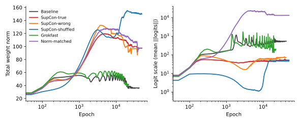

# Howe 2026 — Structure-Specific Representational Priors Causally Control the Grokking Delay

See also: [the global concept index](../../concepts/index.md).

**Gunner Levi Howe** (gunnerlevihowe@gmail.com).

arXiv [2607.04333](https://arxiv.org/abs/2607.04333), July 2026 (v3 was read), 16 pages, 7 figures, 3 tables. Citations by Semantic Scholar — 0, in the corpus — 0. A single-author work: a causal test of the claim that the grokking delay is the time it takes for task-structured representations to form. The instrument is an auxiliary supervised contrastive loss (SupCon) on the hidden representation of a single-layer transformer on modular addition at $p=97$; the experimental variable is the content of the positive sets alone, at an unchanged form, strength and geometry of the loss. The outcome is a clean gradation by content: the true structure $(a+b)\bmod p$ — 22/30 generalisations; a related-but-wrong $(a-b)\bmod p$ — 14/15, but with no speed-up; a random partition — 0/20 (Fisher $p=1.3\times 10^{-7}$); and a control reproducing the norm trajectory under a pure cross-entropy — 0/15, which rules the norm out as a mediator. Only the true structure speeds things up (by up to $2.75\times$, bimodally); removing the inflation of the norm turns the lever into a reliable accelerator — a norm clamp at $\|W\|=45$ groks 10/10 with a median of $8.6\times$ (up to $22\times$).

The files of this paper's analysis:

- [`2607.04333.structure-specific-representational-priors-causally-control-the-grokking-delay.license.txt`](2607.04333.structure-specific-representational-priors-causally-control-the-grokking-delay.license.txt) — the arXiv licence record for this paper.

The anchor scheme and the rules for linking into a card are in the [README of the papers folder](../README.md).

**Excerpt card.** The paper's licence (`arxiv-nonexclusive`) does not permit republishing the paper itself; what stands here are the editorial sections and the fragments the corpus quotes (right of quotation). The paper: <https://arxiv.org/abs/2607.04333>.

## Concepts covered

**[Grokking](../../concepts/grokking.md)** — a move from observation to intervention on the question of the nature of the delay: all the earlier accelerators (Grokfast, the norm clamp, radial suppression) are structureless, whereas here the structure of the task itself is injected into the network through the positive sets of a contrastive loss, and the outcome is governed by the content — the true structure gives 22/30 (and the fastest transitions in the set, up to $2.75\times$), the related one 14/15 with no speed-up, the random one 0/20 ([`p5-4`](#p5-4)). The analysis: this is the cleanest separation of "content against geometry" in the corpus — the shuffled control keeps the form, the strength, the temperature, the class sizes and the geometry of the projections identical; but the grid of conditions is uneven (20 shuffled runs do not divide evenly over three strengths, and the related condition is run half as often and was added on the suggestion of Truong Xuan Khanh — see the acknowledgements), and "in all 95 runs the structure predicts the generalisation" is weakened by the author's own footnote (the first threshold is non-empty in only the 51 runs that generalised).

**[Structured representation learning](../../concepts/structured-representation-learning.md)** — an interventional twin of the observational analyses of "structure before generalisation": the cosine margin of the class clusters on frozen representations grows on the plateau thousands of epochs before the jump of the accuracy, the ordering of the structure times across the conditions repeats the ordering of the generalisation times, and the "rightness" of a structure is decided at the level of features rather than labels — $(a-b)\bmod p$ requires the same periodic features and keeps the road to generalisation open, whereas a random partition requires memorising ones and closes it ([`p7-2`](#p7-2)). The analysis: the discriminating experiment with a different feature family (magnitude bands) is declared in §6 to have already been carried out in a companion work [18] with an outcome of 1/15, while §7 of the same version says it "remains to be run" — a direct internal disagreement in an under-edited late version; the companion work by the same author has no arXiv number, so there is nothing to check it against; and the CKA separates weakly — it is high in the control frozen at the memorisation too.

**[The norm separation law](../../concepts/norm-separation-delay-law.md)** — a restriction of the domain of the norm delay law: reproducing the epoch-by-epoch norm trajectory of a SupCon run under a pure cross-entropy gives the disease without the benefit (0/15, logits up to $\sim 10^{4}$, a confidence $>0.99$, a diverging test entropy) — the trace of the speed-up in the norm does not by itself produce a speed-up, and the structural prior generalises at norms of 105–150, where structureless training dies; the norm law is declared a law for structureless training, and the same knob is turned in reverse — the median speed-up is monotone in the level at which the norm is held: a clamp at $\|W\|=45$ gives $8.6\times$, the reproduction (56) gives $6.6\times$, the annealing (a peak of 120) gives $1.7\times$ ([`p6-2`](#p6-2)). The analysis: there is no run of "a norm clamp under a pure CE without SupCon", although that is precisely the subject of Truong's law; the contribution of the prior to the $8.6\times$ is in no way separated out, and "standalone" in the table means only "requires no paired baseline run"; and the monotonicity rests on four points, one pair of which (56 against 57 at a difference of $2.4\times$ in speed) undermines it — the authors themselves admit that the held level is an incomplete summary.

**[The emergence of features](../../concepts/feature-emergence-feature-learning.md)** — the three-step gradation as an argument about the feature level: the reliability of the generalisation is given by the coherence of the feature family (a related structure built from the same $\cos\omega a$, $\sin\omega a$ is indistinguishable from the true one in terms of "will it happen", $p=0.23$), while the speed comes only from a match with the genuine equivalence of the task; a random partition, expressible only by memorisation, cancels the grokking entirely and at a high strength pushes even the fitting of the training sample out to 10–15 thousand epochs ([`p6-1`](#p6-1)). The analysis: a second, structureless channel of the prior is also uncovered — both contrastive conditions keep the logits soft (a confidence of 0.6–0.7) where weight decay alone does not save them from saturation, but an anti-saturation without the right content gives nothing (0/20); the breakdown of a minority of the seeds is explained by a "race" between the prior and the inflation of the norm — this is an analysis of trajectories, with no separate measurement of the race; and the word "wrong" in the paper denotes now the related, now the shuffled condition (contribution 4 against the tables).

## What is shown and what is conjectured

These are the card editor's remarks, not the authors' text, drawn from a numbered pass over the paper's claims.

**The strong points — a triple of conditions of equal form, and the norm control.** The separation of "content against geometry" is built as cleanly as possible: three contents of the positive sets at an identical form of the loss, strength, distribution of class sizes and geometry; the norm is cut off as a mediator twice (the reproduction of the trajectory — 0/15; the related condition inflates the norm in the same way and groks where the control dies); the LayerNorm is removed deliberately so that the norm control stays readable; and the prediction about the race is checked by three independent ways of removing the inflation, all of which give 10/10.

**The late version is under-edited, and the accelerator is not decomposed into its terms.** §6 and §7 contradict one another about whether the discriminating experiment with a foreign feature family has been carried out; there is a reliance on a companion work with no arXiv number in two places (the confirmation of a prediction and the choice of $\|W\|=45$); "two conditions" at the end of §3.2 is a trace of an edition without the related condition; the "2000 epochs — the fastest in the set" of §4.1 argues with the 850 epochs of §5; the contribution of the prior proper to the $8.6\times$ is not separated from the norm clamp — Truong's lever; the statistics of the breakdowns are significant only in the pooled form (0/40 against 6/20), not per method; and the medians of the truncated conditions are a budget rather than a measurement.

**How the work will be cited** ("it is proved that the grokking delay is the time it takes representations to form"; "a structural prior speeds grokking up by 8.6 times") — more precisely: on modular addition at $p=97$ with a single-layer transformer without a LayerNorm it is shown that the outcome (whether it will generalise within 50 thousand epochs) is governed by the content of the injected partition rather than by the form, the strength or the geometry of the loss; and the $8.6\times$ speed-up is obtained by the pairing "SupCon-true + a norm clamp", in which the contribution of the clamp is not measured separately and coincides with the lever of the norm delay law.

---

# Quoted fragments

Only the fragments the corpus cards refer to are
reproduced here (right of quotation); the paper's licence does not permit
republishing the whole text. Anchor numbering matches the original.

###### p5-4

Across 30 runs (10 seeds $\times$ 3 strengths), training with the true-structure prior reaches 95% test accuracy within budget in 22 cases (Table 1, Fig. 1). The shuffled-structure control — identical loss form, strength, temperature, positive-set cardinalities, and normalized-projection geometry — *never* generalizes within budget (0/20; Fisher exact $p=1.3\times 10^{-7}$). At $\lambda{=}1.0$ the contrast is maximal: the true prior yields the fastest generalization we observe anywhere in the dataset (2,000 epochs, versus 5,500 for the same seed’s baseline), while the shuffled prior leaves test accuracy at chance **[p. 6]** ($\leq 2\%$) and even delays training-set interpolation to $\sim$10–15k epochs. Whatever the contrastive term contributes — optimization pressure, representation-norm control, gradient noise — is present in both conditions; only the *content* of the equivalence structure differs.

###### p6-1

A random partition is satisfiable only by memorization, so its failure could in principle reflect unlearnability rather than task-mismatch. The wrong-but-coherent control — positives sharing $(a-b)\bmod p$ — removes this concern: it is a real algebraic structure, identically size-distributed, and independently grokkable. The result splits the causal claim in two. On *whether* generalization occurs, the sibling structure behaves like the true one: 14/15 runs grok (versus 22/30 true; Fisher $p=0.23$, no detectable difference), against 0/20 for the random partition. On *when*, it behaves like a perturbation rather than a prior: median paired ratios are 1.33/1.06/1.25 across $\lambda$ (versus 0.80 for true at $\lambda{=}1.0$), its fastest run groks at 12,950 epochs (versus 2,000 for true), and its best paired ratio is 0.64 (versus 0.36 for true). Mechanistically this is exactly what a feature-level account predicts: representing $(a-b)\bmod p$ requires the same periodic token embeddings as the task — only the sign of the combination differs — so the sibling prior drives the network toward the right *feature family* without favoring the right *circuit*, preserving the path to generalization without shortening it. The random partition, requiring memorization-like features, blocks that path entirely. Notably, the sibling prior inflates the weight norm as much as the true one (peak $\sim$120) and shares its anti-saturation behavior (confidence $\sim$0.6–0.7), yet groks at norms where the norm-matched control (0/15) dies — reinforcing that coherent structure, not norm state, is what keeps learning alive.

###### p6-2

The true-structure prior inflates the total weight norm from $\sim$50 to 105–150, and Truong et al. [6] show the norm alone rescales the grokking timescale exponentially. Replaying each SupCon-true run’s per-epoch norm trajectory onto plain cross-entropy training (same seed, initialization, and split) reproduces the *pathology* but none of the *benefit*: 0/15 norm-matched runs generalize. Pure CE at the inflated norm collapses into saturated memorization — logit scale grows to $\sim$$10^{4}$, softmax **[p. 7]** confidence exceeds 0.99, test cross-entropy diverges ($>$2,000), and embedding Fourier concentration never leaves its memorization value (Fig. 2) — exactly the norm$\to$logit-scale$\to$saturation chain of Truong [7]. Critically, this holds even for the trajectory of the run that grokked in 9,800 epochs (twice the baseline speed): the norm signature of acceleration confers no acceleration. Both contrastive conditions, true and shuffled, avoid the saturation collapse (confidence $\approx$0.6–0.7 throughout), identifying a second, structure-*agnostic* channel of the auxiliary loss: it keeps logits soft where decoupled weight decay alone cannot. But anti-saturation without correct structure never yields generalization (shuffled: 0/20).

###### p7-2

The probes tie the delay to the timing of structure formation. In the true-structure condition the class cosine gap of held-out representations rises during the plateau, thousands of epochs before the accuracy jump, and embedding Fourier concentration rises earlier than in any other condition (Fig. 2); the accuracy transition occurs as these measures complete their ascent. **[p. 8]** In the shuffled condition the same optimization pressure produces *no* task-relevant class structure (cosine gap $\approx$0 until late), and in the norm-matched condition no structure forms at all. Across all 95 runs, none generalizes before its representation probes move, and none completes the Fourier rise without generalizing[^1] — the interventional counterpart of the observational representation-first accounts [9, 10].

[^1]: Operationalized as: every run reaching 95% test accuracy first crossed cosine gap $>0.05$ or Fourier top-8 fraction $>0.45$ at an earlier epoch; no run reached Fourier top-8 $>0.8$ without generalizing. The first conditional is non-vacuous in the 51 generalizing runs and trivially satisfied in the rest; both hold in all 95/95.

*Figure 3: Mediating variables (medians across seeds, primary $\lambda{=}1.0$). **Left**: total weight norm. Both contrastive conditions inflate the norm well above the baseline’s weight-decay equilibrium; the norm-matched control (purple) replays the SupCon-true trajectory by construction. **Right**: logit scale. Pure cross-entropy at the inflated norm diverges into softmax saturation (purple), while both contrastive conditions hold logits soft — the structure-agnostic anti-saturation channel. Neither variable separates true from shuffled structure; only the representational content does.* **[p. 9]**
