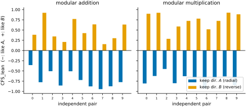
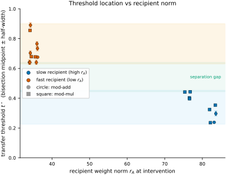
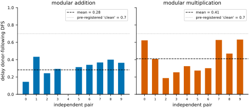

# Truong Xuan Khanh 2026 — Cross-Trajectory Chimera Interventions Reveal Dissociable Roles of Weight Magnitude and Direction in Grokking

See also: [the global concept index](../../concepts/index.md).

**Truong Xuan Khanh** (H&K Research Studio, Clevix LLC, Hanoi; khanh@clevix.vn).

arXiv [2607.06628](https://arxiv.org/abs/2607.06628), July 2026 (v1), 12 pages, 8 figures, 1 table. Citations by Semantic Scholar — 0, in the corpus — 0. A single-author work: "cross-trajectory chimera interventions" — the weight vector is decomposed into a length $r$ and a direction $u$, the length of one independently trained run is glued to the direction of another, and the training is continued. On addition and multiplication modulo 59 the fork is clean: the direction transfers the spectral identity of the circuit (40/40 recombinations correct in sign; the angle-matched random control gives no slope), and the transfer is thresholded rather than blended, with the location of the threshold $t^{\star}$ predicted by the norm of the recipient (a perfect separation of the classes over all 20 pairs, a joint exact probability of $1.9\times 10^{-4}$); the length, meanwhile, carries only a weak, smeared effect on the delay (~30 % of the way to the donor) and no identity at all. The threshold is localised by bisection to $\pm 1/64$; the results survive a transplant of the Adam moments.

The files of this paper's analysis:

- [`2607.06628.cross-trajectory-chimera-interventions-reveal-dissociable-roles-of-weight-magnitude-and-direction-in-grokking.license.txt`](2607.06628.cross-trajectory-chimera-interventions-reveal-dissociable-roles-of-weight-magnitude-and-direction-in-grokking.license.txt) — the arXiv licence record for this paper.

The anchor scheme and the rules for linking into a card are in the [README of the papers folder](../README.md).

**Excerpt card.** The paper's licence (`arxiv-nonexclusive`) does not permit republishing the paper itself; what stands here are the editorial sections and the fragments the corpus quotes (right of quotation). The paper: <https://arxiv.org/abs/2607.06628>.

## Concepts covered

**[Grokking](../../concepts/grokking.md)** — a change of question from "what is necessary within a single run" to "what is transferable between runs": interventions within one trajectory (freezing, rescaling, projections) cannot in principle answer which properties of an under-trained network act causally when transplanted into another, independently trained one; grokking is taken as the setting rather than the subject — two phases and pre-grokking checkpoints are needed for the transplant ([`p4-4`](#p4-4)). The analysis: the "fork" is drawn between one scalar degree of freedom (the length) and the remaining $d-1$ (the direction) — a transplant of the direction is a transplant of nearly the whole weight configuration up to a scale, and the conclusion "the direction carries the identity" is close to "the weights carry the identity" (this disproportion is not addressed in the text, §9 denying only the strong form); and the "40 independent recombinations" are a pooling of mirror variants over the same 20 pairs, with half of the cases being outcomes in which nothing changed.

**[The loss landscape and basins](../../concepts/loss-landscape-basins.md)** — the transfer of identity as a threshold switch between basins: as the direction slides along the geodesic from $u_{A}$ to $u_{B}$ at a fixed norm, 82–88 % of the whole change falls on a single grid step with plateaus on either side; the location of the threshold is organised by the norm of the recipient — the high-norm ones ("far from grokking") switch early ($t^{\star}\in[0.235,0.443]$), the low-norm ones late ($[0.641,0.891]$), with a perfect separation of the classes; the reading is one of susceptibility: at a large norm the identity is easily overwritten, at a small one the trajectory is already committed to its basin ([`p5-5`](#p5-5)). The analysis: the causality of the norm itself for the threshold is not tested — $t^{\star}$ is always measured at the recipient's own norm, a foreign norm was never substituted with the threshold then measured, and since the norm is almost identical with the stage of training and the pairs were selected for a large difference of norms, the explanatory variable may with equal right be the time remaining to grokking; and the "perfect separation" rests on classes of 2–3 pairs (recoverable from the exact probabilities $1/45$ and $1/120$).

**[Causal interventions and ablations](../../concepts/causal-ablation-intervention.md)** — two transferable methodological devices: the matched_random control (a random direction at exactly the same angular distance as the donor's — without matching the angle, "the donor acted" is indistinguishable from "a perturbation of that magnitude acted", since in high dimensions a random direction is nearly orthogonal while two trained runs are not) and an adaptive bisection localising the threshold to $\pm 1/64$ in about three continuations per pair; a control on the optimiser state — the transfer of the identity and the threshold–norm relation survive a transplant of the Adam moments from the recipient and from the donor ([`p8-1`](#p8-1)). The analysis: the stability of repeated continuations, on which "one continuation per grid point" rests, is assumed rather than measured (no spread over repeats is given); the random_u control announced in §3 is reported nowhere; and the joint probability of $6.3\times 10^{-12}$ in §8 multiplies six separations as though independent, although three optimiser conditions are applied to the very same pairs.

**[Weight norm minimisation](../../concepts/weight-norm-minimization.md)** — a radial-angular decomposition $\theta=r\,u$ with a causal check of the role of each part: the length carries a weak, smeared influence on the delay — the chimera travels about 30 % of the way to the donor's delay (a following of 0.28 on addition, 0.41 on multiplication), three levels of substituted length order the delay monotonically in 17/20 pairs, and the pre-announced threshold of 0.7 for a "clean" transfer is reached by no pair (said outright); restricting the exchange of the length to individual layers kills the effect in every group of layers — it is a property of the whole vector; and changing the length alone (mid_norm) does not change the identity at all ([`p6-3`](#p6-3)). The analysis: the negative outcome for the length is not hidden — a rare honesty; but the following index of the delay is described in words only, with no formula, and "the threshold of 0.7 was announced in advance" comes with no indication of where; and the same author's work 2606.18465 shows that a norm clamp is inseparable from the logit scale — so the quantity by which the pairs are laid out may not be the norm as such.

**[Behavioural against true grokking](../../concepts/behavioral-vs-true-grokking.md)** — the distinction receives a number here: half of the post-grokking rearrangement is attained a median of $350$ steps after the test accuracy has already crossed the threshold ([`p7-3`](#p7-3)). The curve, then, counts the transition earlier than the circuit is assembled.
## What is shown and what is conjectured

These are the card editor's remarks, not the authors' text, drawn from a numbered pass over the paper's claims.

**The strong points — the methodological apparatus and honest negative cells.** Three exemplary decisions: matched_random equalises the angular displacement (without it the main result is indistinguishable from "a perturbation of that magnitude"); the spectral transform domain is matched to the task (a permutation by the discrete logarithm for multiplication; the wrong domain is blind — a similarity of 0.9998 against 0.0000 on synthetic circuits); and the pairs come from disjoint seeds with an explicit reference to pseudo-replication. Plus a section on "what does NOT follow from our results", a direct admission of the circularity of the layer-wise analysis cells (the measure is computed from the embedding spectrum) and an unreached delay-transfer threshold shown in a prominent place.

**An asymmetry of degrees of freedom, an untested causality of the norm, and under-described quantities.** "Direction against length" is $d-1$ degrees of freedom against one, so the victory of the direction in transferring the identity is close to a tautology; the causality of the norm for the threshold is not tested by substituting a foreign norm, and the stage of training is an equally good candidate; the classes of the "perfect separation" are 2–3 pairs; $-0.719$ coincides to three decimals in three cells of different tasks with no explanation; the "relation to earlier work" comes without a single reference, and the claim of reproducibility without a link to a repository; and the random_u control is announced and not reported.

**How the work will be cited** ("it is proved that the direction of the weights carries the identity of the circuit and the norm carries only the delay") — more precisely: on two cyclic tasks at $p=59$ and one single-layer transformer, transplanting the WHOLE direction between pre-grokking checkpoints transfers the spectral fingerprint of the embedding, and does so with a threshold, while the scalar length gives only about a third of the way to a foreign delay; the matched_random control and the bisection are transferable devices worth a separate mention.

---

# Quoted fragments

Only the fragments the corpus cards refer to are
reproduced here (right of quotation); the paper's licence does not permit
republishing the whole text. Anchor numbering matches the original.

###### p4-4

Implanting the donor’s direction while keeping the recipient’s norm drives the continued run toward the donor’s eventual circuit. On modular addition, the radial variant (recipient direction $u_{A}$, donor norm $r_{B}$) yields a final circuit that is $A$-like in every pair (mean $\mathrm{CFS\_lean}=-0.719$, $10/10$ negative), while its mirror reverse_radial (donor direction $u_{B}$) is $B$-like in every pair (mean $+0.478$, $10/10$ positive). Modular multiplication replicates this exactly and more strongly on the $B$-side (means $-0.719$ and $+0.725$; $10/10$ and $10/10$). Pooling the two variants across both tasks, the final circuit follows the direction donor in $40/40$ independent recombinations; each per-task, per-variant sign test gives $p=2\!\times\!10^{-3}$ (Figure 2).

*Figure 2: **The angular component carries transferable circuit identity. Per-pair $\mathrm{CFS\_lean}$ under the endpoint swaps, for both tasks. The radial variant (keep recipient direction $u_{A}$; blue) yields an $A$-like final circuit in every pair (negative), while reverse_radial (keep donor direction $u_{B}$; orange) yields a $B$-like circuit (positive). Pairs are fully independent (disjoint seeds). Sign is consistent in $40/40$ recombinations pooled across the two variants and two tasks.***

**[p. 5]**

###### p5-5

The interpolation value $t^{\star}$ at which identity flips is not constant across pairs, and it is organized by the recipient’s weight norm. Localizing $t^{\star}$ to $\pm 1/64$ by bisection, pairs whose recipient has high norm (far from grokking) flip early—only a small move toward $u_{B}$ is needed—whereas pairs whose recipient has low norm (near grokking) flip late. On modular addition **[p. 6]** the high-norm (slow) recipients have $t^{\star}\in[0.238,0.297]$ and the low-norm (fast) recipients $t^{\star}\in[0.641,0.891]$, a clean gap of $0.34$; on modular multiplication the corresponding ranges are $[0.235,0.443]$ and $[0.678,0.856]$, a gap of $0.23$. The two norm classes separate perfectly on every pair in both tasks; pooling all $20$ pairs preserves perfect separation (gap $0.20$). Treating each task’s separation as an exact permutation test under the observed grouping gives probabilities $2.2\!\times\!10^{-2}$ and $8.3\!\times\!10^{-3}$, and $1.9\!\times\!10^{-4}$ jointly (Figure 4).

*Figure 4: **The transfer threshold is predicted by recipient norm. Bisection-localized threshold $t^{\star}$ (midpoint $\pm$ half-width, $\pm 1/64$) against the recipient’s weight norm $r_{A}$, for all $20$ pairs across both tasks (circles: modular addition; squares: modular multiplication). High-norm (slow) recipients flip early; low-norm (fast) recipients flip late. The two norm classes separate without overlap; the green band marks the separation gap. The shaded bands are a visual aid for the grouping, not a fitted relationship.***

Because the intervention holds the recipient’s norm fixed and varies only direction, this is a statement about *susceptibility*: at high norm, circuit identity is easily overwritten by a donor direction; at low norm, it resists.

###### p6-3

The norm carries a genuine but weak influence on grokking *delay*, and no detectable identity information. Under the radial variant, the chimera’s delay shifts toward the norm donor by a normalized displacement whose per-pair donor-following score averages $0.28$ on addition ($9/10$ positive) and $0.41$ on multiplication ($10/10$ positive)—reliably nonzero but far from the value that would indicate the chimera fully inherits the donor’s delay. Expressed as a fractional displacement between recipient and donor delay, the chimera moves about $30\%$ of the way toward the donor, pooled across tasks. The three implanted-norm levels available per pair (recipient, averaged, donor norm) order delay monotonically in $17/20$ pairs, consistent with a graded but weak norm–delay relationship. Crucially, when the norm swap is restricted to individual layer groups the delay effect vanishes for every group—it is a property of the whole weight vector, not attributable to any single layer.

*Figure 5: **The radial component carries a modest, distributed delay effect. Per-pair delay donor-following score under the radial variant. The mean is reliably positive (dashed) but no pair reaches the pre-registered “clean” threshold of $0.7$ (dotted): the norm shifts delay toward its donor, but only partially, and the effect vanishes when the swap is restricted to individual layer groups (not shown).***

**[p. 7]**

Relative to the strong, localizable, threshold-structured identity effect, the delay effect is weak, distributed, and carries no identity signal: the two geometric components play different roles.

###### p7-3

Tracking each run’s spectral similarity to its own final circuit across training, we find that $50\%$ of the post-grokking reorganization is reached at a median of $350$ steps after the test-accuracy transition, and $90\%$ at a median of $1250$–$1850$ steps, in every one of $32$ seeds per task. Circuit structure thus continues to consolidate well after generalization is behaviourally complete; our contribution here is to quantify this on independent seeds with a spectral identity measure, complementing qualitative reports of a post-grokking cleanup phase [9].

###### p8-1

AdamW carries, in addition to the weights $\theta$, a per-parameter history of gradient statistics (the first and second moment estimates $m,v$). When we build a chimera and continue training, this history could in principle belong to either parent run rather than being a property of $\theta$ itself. We test this directly: for both the endpoint-swap intervention (Section 4) and the threshold-localization intervention (Section 5), we repeat the experiment under three sources for the continuation optimizer’s moments—reset (freshly initialized, as reported above), recipient (transplant $A$’s moments), and donor (transplant $B$’s moments)—and ask whether the reported effect survives all three.
