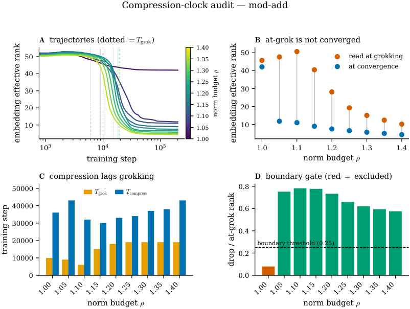
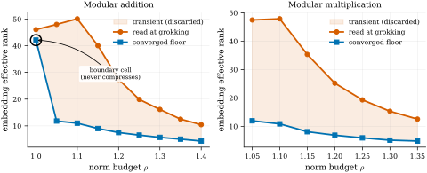

# Truong Xuan Khanh 2026 — At-Grok Is Not Converged: A Measurement-Validity Audit for Grokking Representation Metrics

See also: [the global concept index](../../concepts/index.md).

**Truong Xuan Khanh** (H&K Research Studio / Clevix LLC, Hanoi; khanh@clevix.vn).

arXiv [2607.06639](https://arxiv.org/abs/2607.06639), July 2026 (v1), 26 pages, 7 figures, 3 tables. Citations by Semantic Scholar — 0, in the corpus — 0. A single-author instrument paper: can a representation metric read off at the grokking point be trusted? On modular arithmetic the effective rank of the embedding at $T_{\mathrm{grok}}$ is a transient outlier, overstating the converged value by 3–5 times on an MLP (1.3–1.5 on a transformer) and erasing the distinction between "compresses" and "does not compress"; the compression LAGS the accuracy transition by a quantity of order $T_{\mathrm{grok}}$ ($\geq 10^{4}$ steps) — a named correction of the "coincides" of Yunis et al. The main positive outcome: the size of the lag is governed by the normalisation — adding a single LayerNorm moves the fraction of the pre-grokking compression frac-pre from 0.87 to 0.25. All of it is packed into an audit with a boundary gate, a censoring flag, a check that the shelf has reached a plateau, and a refusal to deliver a verdict when the statistics are indeterminate; and a side "law of depth" is self-falsified by a pre-registered check.

The files of this paper's analysis:

- [`2607.06639.at-grok-is-not-converged-a-measurement-validity-audit-for-grokking-representation-metrics.license.txt`](2607.06639.at-grok-is-not-converged-a-measurement-validity-audit-for-grokking-representation-metrics.license.txt) — the arXiv licence record for this paper.

The anchor scheme and the rules for linking into a card are in the [README of the papers folder](../README.md).

**Excerpt card.** The paper's licence (`arxiv-nonexclusive`) does not permit republishing the paper itself; what stands here are the editorial sections and the fragments the corpus quotes (right of quotation). The paper: <https://arxiv.org/abs/2607.06639>.

## Concepts covered

**[Grokking](../../concepts/grokking.md)** — the grokking point is declared an unsafe place at which to read structure off: the compression of the representation does not coincide with the accuracy transition but lags it by a quantity of order $T_{\mathrm{grok}}$ (a median gap of 17–18 thousand steps on the MLP, ~27 thousand on the transformer), and the norm budget confidently orders $T_{\mathrm{grok}}$ ($\rho_{S}=+0.85,+0.90$) but not $T_{\mathrm{compress}}$ ($+0.29,+0.18$) — "partly separated clocks + a large lag" rather than a single clock ([`p11-1`](#p11-1)). The analysis: the lag coefficient wanders through $[0.65,1.46]$ depending on the threshold $\varepsilon$, and only "$\geq 10^{4}$ steps" is robust; the magnitude, by the author's own conclusion, is set by the normalisation rather than by grokking as such; and there is a self-correction on the data — the earlier small grid (4–5 cells) gave $+0.40$/$+0.95$ and called for "a single clock", while widening it dropped these to $+0.18$/$+0.29$, and the author left the script reproducing both readings.

**[Spectral analysis](../../concepts/spectral-analysis-svd-esd-fve.md)** — a measurement hazard: the effective rank of the embedding (the spectral entropy with a quadratic normalisation) at $T_{\mathrm{grok}}$ is a transient outlier that long training drives down onto a low-rank shelf: on the MLP the overstatement is 3–5 times, and the boundary non-compressing cell ($\rho=1.00$, a shelf of $\approx 42$) reads at grokking almost like its strongly compressing neighbour (46 against 48); the transience is reproduced without the clamp (a free decay: 2–7×, most vividly on parity, $23\to 3$) and is metric-agnostic — it is visible in the participation ratio and in the stable rank, and a setting with no outlier in one of them gives none in the others either ([`p8-5`](#p8-5)). The analysis: there is a numerical strain around the headline figure — "3–5×, a median of 3.3×" sits next to "$\approx 50\to\approx 7$" at a typical shelf of 7.5, which gives 6–7×; on a transformer taken to convergence the overstatement is more modest (1.3–1.5×, up to 3.6× on $W_{\mathrm{out}}$); and the denominator may itself be transient — at wd $=0.5$ the shelf holds and then collapses a second time ($22\to 4$) as the norm doubles.

**[Progress measures](../../concepts/progress-measures.md)** — an instrument rather than a result: the audit separates the clock of the onset ($T_{\mathrm{grok}}$) from the clock of the compression ($T_{\mathrm{compress}}$), gates the boundary cells that failed to generalise, flags the censoring, checks that the shelf has reached a plateau and refuses a verdict about the clocks when the ordinal statistics are indeterminate; nine adversarial cases fix the verdict and its reason in advance and caught a real regression of false confidence (a verdict of "a single clock" at a NaN Spearman); and different representational quantities cross the transition in different directions — the synchronisation of the circuit leads the grokking by ~1 700 steps, while the rank lags by ~$2\times 10^{4}$ ([`p17-4`](#p17-4)). The analysis: the most valuable argument for the corpus is that "which quantity is read and when" determines the picture; but the decisive check "the shelf has reached a plateau" is nowhere given a threshold and a procedure (it is not among the five free parameters of appendix B); and Sec. 3 does not state the training fraction, the learning rate or the decay strength of the main sweep — a notable gap for a work about reproducibility.

**[The compression of representations](../../concepts/manifold-representation-compression.md)** — the main positive outcome: the size of the post-grokking lag of the compression is governed by the normalisation — in a three-arm harness with one change at a time, frac-pre (the fraction of the compression completed by the grokking) equals 0.87 for the canonical transformer without a LayerNorm, 0.66 for the MLP and 0.25 when a single LayerNorm is added; a pre-registered cross-check rejects the explanation through a per-token scale invariance (the rms arm: PD2 passed, PD1 failed with a frac-pre of 0.90) ([`p13-2`](#p13-2)). The analysis: there is an internal disagreement on precisely the load-bearing arm — fig. 5A gives the frac-pre of the LayerNorm arm as 1.00 against the 0.25 of Sec. 6/fig. 4B (and the MLP as 0.55 against 0.66), and fig. 5B gives a Spearman of $+0.13$ against the $-0.80$ of the text, so that the pre-registered threshold of 0.40 would not have separated even the LayerNorm; the harness has few seeds ($6\times 10^{4}$ steps), and the most vivid number (3.2×) is called the least supported by the author himself; and the side "law of depth" ($\rho_{S}=-1.0$ on the MLP) is self-falsified: on the transformer it is $+0.14$/$+0.82$, and under a free decay the sign turns around ($+1.0$).

## What is shown and what is conjectured

These are the card editor's remarks, not the authors' text, drawn from a numbered pass over the paper's claims.

**The strong point — an instrument with a built-in refusal to conclude.** This is the first work in the corpus in which the refusal of a verdict is built into the instrument and checked by adversarial tests (a clock verdict is obliged to rest on a finite ordinal statistic — a check of the string "a single clock" would have let a broken analyser through, while its own test does not); two named acts of honesty — the self-correction of the reading when the grid was widened, and the self-falsification of the law of depth by two pre-registered checks (the architecture and the protocol); and the transience is confirmed three times independently: without the clamp, across three metrics, and externally — Brown et al. with the same spike-and-fall in the intrinsic dimension of the activations.

**Inconsistent numbers on the load-bearing arm, an unspecified decisive check, and elastic coefficients.** Fig. 5 against Sec. 6: a frac-pre of 1.00 against 0.25 and a Spearman of $+0.13$ against $-0.80$ on exactly the LayerNorm arm on which the main outcome rests — which leaves the logic of the pre-registration PD1 hanging (the threshold would not have separated the LayerNorm either); "the shelf is on a plateau" is a decisive safeguard with no specified procedure; the rule for selecting verdicts in appendix B cannot be reconstructed from the table ($+0.20$ and $+0.30$ are called "a single clock", $+0.54$ is not); and the hazard is shown as possible rather than as having occurred (not one published work with a reversed conclusion is produced, as is admitted outright).

**How the work will be cited** ("it is proved that the compression lags the grokking by $\sim T_{\mathrm{grok}}$"; "the rank at grokking is overstated by 3–5 times") — more precisely: on an MLP at $p=59$ under a norm clamp the median gap is 17–18 thousand steps at a coefficient wandering through $[0.65,1.46]$ with the threshold $\varepsilon$, on the transformer it is 0.63, and the magnitude is set by the normalisation; the overstatement of 3–5× is the modular MLP under the clamp, while on a transformer taken to convergence it is 1.3–1.5×.

---

# Quoted fragments

Only the fragments the corpus cards refer to are
reproduced here (right of quotation); the paper's licence does not permit
republishing the whole text. Anchor numbering matches the original.

###### p8-5

Figure 2 makes the hazard explicit by plotting the effective rank read at grokking against the converged floor, both as functions of the norm budget. The two curves tell qualitatively different stories. The converged curve is the depth law: a strict monotone fall from the boundary cell down to a low floor. The at-grok curve is high and nearly flat at the low-budget end, then falls, and at every budget that compresses it sits $3$–$5\times$ above the converged value (median **[p. 9]** $3.3\times$). Most sharply, the at-grok snapshot cannot separate the one cell that does not compress from the ones that do: the boundary cell ($\rho=1.00$, converged rank $\approx 42$) and its neighbour ($\rho=1.05$, converged rank $\approx 12$) read $46$ and $48$ at grok, a $4\%$ difference that hides a $3.6\times$ difference in the converged solution. A study that read embedding rank at the transition would therefore report a circuit complexity several-fold too high, miss that one budget never compresses, and recover a complexity-vs-budget shape that the converged network does not have. This is the failure mode the audit exists to catch; it is not hypothetical, and it is invisible without training past the transition.

*Figure 1: Compression-lag dashboard on the modular-addition MLP ($p=59$, 6 seeds, real data), the primary result. **A**: embedding effective-rank trajectories per norm budget $\rho$ (dotted: $T_{\mathrm{grok}}$); fast-grokking budgets fall from $\approx 50$ to a low floor, while the floor cell $\rho=1.00$ (dark) stays near $42$. **B**: effective rank at grokking (red) vs. at convergence (blue) — the at-grok value sits well above the converged floor at every budget that completes, i.e. it is a transient; only at $\rho=1.00$ do the two coincide (no compression). **C**: $T_{\mathrm{grok}}$ (orange) vs. $T_{\mathrm{compress}}$ (teal); compression lags grokking at every budget. **D**: the boundary gate — the $\rho=1.00$ cell (red) has a drop/at-grok ratio below threshold and is excluded before the ordering statistics are computed, preventing a spurious two-clock verdict.* **[p. 9]**

*Figure 2: Reading effective rank at grokking inverts the picture. Embedding effective rank read at grokking (red) vs. the converged floor after long training (blue), against the norm budget $\rho$; the grey band is the transient the converged network discards. The converged curve is the monotone depth law; the at-grok curve overstates it by $3$–$5\times$ and is nearly flat where the converged curve falls steepest. On addition (left) the boundary cell $\rho=1.00$ (circled) reads the same as its neighbours at grok but never compresses — a distinction the snapshot erases and only long training reveals.* **[p. 10]**

**[p. 10]**

###### p11-1

On both modular addition and multiplication the audit returns partially separated clocks + large lag (Table 2). Compression follows grokking by a lag comparable to the time-to-grok itself: median lag $1.7\times 10^{4}$ steps on multiplication ($\mathrm{lag}/T_{\mathrm{grok}}=1.04$) and $1.8\times 10^{4}$ on addition ($\mathrm{lag}/T_{\mathrm{grok}}=1.00$); Figure 3 is the multiplication dashboard. This large separation is the robust, replicated result. The norm budget strongly orders $T_{\mathrm{grok}}$ ($\rho_{S}(\rho,T_{\mathrm{grok}})=+0.90,+0.85$) but does not order $T_{\mathrm{compress}}$ ($\rho_{S}(\rho,T_{\mathrm{compress}})=+0.18,+0.29$): generalization onset and representation compression are temporally separable, with a real and large gap, but the compression time is not a clean function of the budget. We therefore report a large separation rather than a single shared clock.

We state the robust form of the lag carefully. Its magnitude is of order $T_{\mathrm{grok}}$ and always $\geq 10^{4}$ steps; the exact ratio $\mathrm{lag}/T_{\mathrm{grok}}$ depends on the compression tolerance $\varepsilon$ (which sets how close to the floor counts as “compressed”) and ranges over $[0.65,1.46]$ as $\varepsilon$ varies from $0.20$ to $0.05$ (Appendix B, Table 3). We report $\varepsilon=0.10$, where $\mathrm{lag}/T_{\mathrm{grok}}\approx 1.0$, as the default, and treat “$\geq 10^{4}$ steps” rather than “$=T_{\mathrm{grok}}$” as the claim that does not depend on the tolerance.

*Table 2: Compression-lag audit on the two modular-arithmetic MLPs ($p=59$, 6 seeds per cell, $2\times 10^{5}$-step budget), on the enlarged budget grid. The large post-grok lag and the monotone floor law replicate on both tasks; the compression time is not cleanly ordered by the budget. On modular addition the boundary gate excludes the floor cell $\rho=1.00$, which only partially generalizes and never compresses, before the ordering statistics are computed.* **[p. 11]**

|  | modular multiplication | modular addition |
|---|---|---|
| cells (norm budgets $\rho$) | 7 ($1.05$–$1.35$) | 9 ($1.00$–$1.40$) |
| median gap $T_{\mathrm{compress}}-T_{\mathrm{grok}}$ | $17{,}000$ | $18{,}000$ |
| $\mathrm{lag}/T_{\mathrm{grok}}$ | $1.04$ | $1.00$ |
| $\rho_{S}(\rho,T_{\mathrm{grok}})$ | $+0.90$ | $+0.85$ |
| $\rho_{S}(\rho,T_{\mathrm{compress}})$ | $+0.18$ | $+0.29$ |
| $\rho_{S}(\rho,\text{converged floor})$ | $-1.00$ | $-1.00$ |
| boundary cell excluded | — | $\rho=1.00$ |
| verdict | part. separated $+$ large lag | part. separated $+$ large lag |

###### p13-2

The arms differ sharply in when the embedding compresses relative to grokking. Define $\mathrm{frac\text{-}pre}=(r_{\mathrm{init}}-r_{\mathrm{grok}})/(r_{\mathrm{init}}-r_{\mathrm{floor}})$, the fraction of the total embedding-rank compression already completed by the grok step. It is $0.87$ on the canonical transformer (most compression precedes grokking, leaving a small residual lag and a small transient), $0.66$ on the MLP, and $0.25$ on the LayerNorm transformer (most compression follows grokking, producing both the large lag and the $\approx 3\times$ transient). The single LayerNorm ablation B-vs-C moves frac-pre from $0.87$ to $0.25$: within this harness it is LayerNorm, not “being a transformer,” that defers compression past grokking. Equivalently, the grok-to-compression lag is smallest for the canonical transformer and large with LayerNorm or on the MLP — but present, not zero, in every arm (the canonical transformer still settles within $\approx 0.63\,T_{\mathrm{grok}}$ of grokking, Sec. 7). We read the lag qualitatively here, since its precise coefficient is seed-sensitive when a high frac-pre leaves only a narrow band to the floor, and note that its direction agrees with the better-powered transformer estimate of Section 7 ($\mathrm{lag}/T_{\mathrm{grok}}\approx 0.63$). The transient and the lag are thus two views of one quantity — how much of the representation has compressed at the moment one reads it; the normalization scheme modulates that quantity. Consistent with this, the post-grok coupling between the global weight norm and the embedding rank is strongly negative only under LayerNorm (Spearman $-0.80$) and positive for the canonical model ($+0.70$): the LayerNorm arm compresses as its norm grows after grokking, whereas the canonical arm has already compressed.

###### p17-4

The strongest evidence that these checks are load-bearing is that they fired on us. During development a reporting branch that added genuinely useful low-power and no-grok diagnostics was forked from before two ordering fixes, and it re-introduced a verdict **[p. 18]** that asserted “one clock” while the underlying rank correlation was undefined ($\mathrm{NaN}$ Spearman). The nine-case adversarial suite caught this, not because a verdict string was missing, but because the suite requires a clock-type verdict to be backed by a finite order statistic. A test that checked only for the presence of the words “one clock” would have passed the broken analyzer; its own bundled test did. This is one way a representation study can fool itself, with a measurement that looks like a finding but rests on an undefined or transient quantity. The same check fired a second time at the data level: an apparent single-clock ordering on a small budget grid dissolved once the grid was enlarged, and we report the corrected reading rather than the original (Sec. 5).
