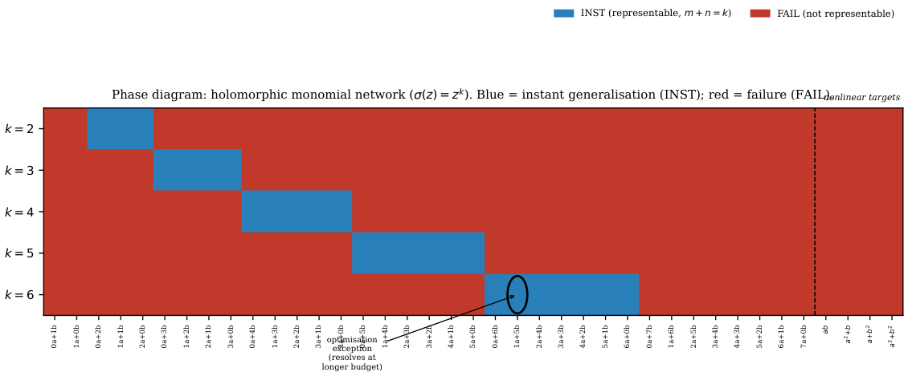
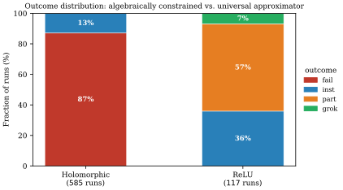
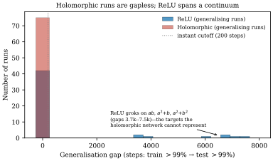

# Algebraic Representability as the Limiting Regime of Grokking: An Exactly Solvable Model with Holomorphic Activations

**Chon-Fai Kam** Thanks: Corresponding author: kam.chonfai@gmail.com Affiliation: University Paris City & University of Reunion, Paris, France Affiliation: Dipartimento di Fisica e Chimica Emilio Segrè, Università degli Studi di Palermo, Palermo, Italy **Xavier Cadet** Affiliation: Thayer School of Engineering, Dartmouth College, Hanover, NH 03755, USA **Miloud Bessafi** Affiliation: EnergyLab, University of Reunion, Saint-Denis, France **Frederic Cadet** Thanks: frederic.cadet.run@gmail.com Affiliation: University Paris City & University of Reunion, Paris, France Affiliation: PEACCEL, AI for Biologics, Paris, France

## Abstract

Neural networks trained on modular arithmetic tasks exhibit grokking—a delayed transition from memorisation to generalisation that has been shown to depend on model capacity: too little capacity and the network memorises slowly or not at all, too much and it generalises almost immediately. What happens at the extreme end of this spectrum, when the architecture’s expressible function class collapses to a finite-dimensional algebraic variety? We study this question using two-layer networks with a holomorphic monomial activation $\sigma(z)=z^{k}$, trained on modular tasks encoded via roots of unity. In this setting the network output, regardless of hidden width, is confined to a $(k{+}1)$-dimensional subspace of characters of $(\mathbb{Z}_{p})^{2}$—a vanishingly small, $O(k/p^{2})$ slice of the full function space. We give a complete algebraic characterisation of this subspace: a task is representable if and only if its discrete Fourier support lies in the degree-limited set $S_{k}=\{(\ell,k-\ell):0\leq\ell\leq k\}$ of $k+1$ frequencies on the diagonal $u+v\equiv k\pmod{p}$, a condition that for linear-phase targets reduces to the arithmetic criterion $m+n=k$. This representability criterion is not merely a constraint on eventual generalisation; it is a constraint on memorisation itself. Because the network’s outputs are algebraically confined, a non-representable target cannot be fit even on the training set, and we prove a positive lower bound on the training loss that is independent of hidden width. Across 585 experimental runs the algebraic prediction matches the observed outcome with $99.8\%$ accuracy, with no memorisation regime and no grokking: outcomes split cleanly into instant success and outright failure. This binary behaviour is the limiting case of the capacity–grokking relationship studied in the recent literature—when the expressible class shrinks to a fixed algebraic object, the question of when a network will grok dissolves into the question of whether it can represent the target at all. A bottleneck ablation connects this algebraic extreme to standard networks, tracing a continuous path from representational failure, through memorisation without generalisation, to grokking with a shrinking gap as capacity grows.

## 1 Introduction

There is something genuinely puzzling about grokking. A network trained on a modular arithmetic task will, after memorising the training set, sit quietly for a long time—its training loss near zero, its test accuracy near chance— and then, without warning, generalise. The wait can be thousands of gradient steps, sometimes orders of magnitude longer than the time it took to memorise. This is not noise or bad luck; the delay is systematic, it reproduces across seeds, and it responds predictably to changes in model size and regularisation. Small networks skip the delay entirely and generalise immediately, or fail outright. Large networks memorise quickly and grok after a shorter wait. Model capacity, it turns out, governs not just whether a network can solve a task but when, during training, the solution will appear. The recent work of Song and Ye 2026 makes this precise: they show that grokking emerges from the intersection of two measurable timescales, a memorisation speed and a generalisation speed, both functions of parameter count. As capacity grows, the memorisation timescale shrinks faster than the generalisation timescale, and the grokking window **[p. 2]** narrows. The picture is one of a continuous dial: turn it one way and you delay grokking; turn it far enough the other way and grokking disappears into immediate generalisation.

What this picture takes for granted, and what is easy to miss, is a prior condition that must hold before the two-timescale competition can begin. Memorisation must be possible. The network must be able to fit its training data. Once it can, the race begins: will the structured generalising solution, favoured by weight decay, overtake the memorised one before training ends? That race is what grokking is. But if the network cannot memorise in the first place—if the target function simply cannot be expressed within the architecture’s function class—then the race never starts. There is no memorised solution to wait around, no weight-decay pressure that could eventually dislodge it, no delayed transition to witness. The question of when a network will grok is replaced by the prior question of whether it can represent the target at all: representability is a prior structural constraint, and optimisation only determines whether and how quickly an available solution is reached. (We use *exactly solvable*, in the title and throughout, to mean that the expressible function class admits a closed-form characterisation; the optimisation dynamics themselves are not solved analytically.)

This is not merely a degenerate edge case. It describes a regime that the capacity literature does not cover, because standard architectures are universal approximators: given enough width, they can represent any target, so memorisation is always possible in principle and capacity governs only the speed. The interesting constraint, in that setting, is never representability but always optimisation dynamics. To make representability the binding constraint, one needs an architecture whose expressible class is not merely small but *algebraically fixed*—a class that does not grow with width, that has a precise mathematical description, and that can be checked for any given target without training the network. Such architectures are rare in the literature, and their learning dynamics have received comparatively little attention, in part because they do not look like practical neural networks. But they offer something that universal approximators do not: a setting in which the question of what a network can express has a clean, verifiable answer, and the relationship between that answer and the outcome of training can be studied without the confound of optimisation difficulty.

The architecture we study is a two-layer complex-valued network [15] with holomorphic monomial activation $\sigma(z)=z^{k}$, trained on modular arithmetic tasks via a roots-of-unity encoding, $(\omega^{a},\omega^{b})$ with $\omega=e^{2\pi i/p}$ and $p$ prime. The choice is motivated by tractability: because $\sigma$ is a degree-$k$ polynomial, the network output is a polynomial of degree $k$ in the inputs, and on the roots-of-unity encoding the discrete Fourier structure of the group $(\mathbb{Z}_{p})^{2}$ makes the expressible class completely explicit. A standard binomial expansion shows that for *any* hidden width $H$, the network output is a linear combination of exactly $k+1$ characters of $(\mathbb{Z}_{p})^{2}$, the functions $(a,b)\mapsto\omega^{\ell a+(k-\ell)b}$ for $\ell=0,\dots,k$. The expressible class $\mathcal{F}_{k}$ is therefore a $(k{+}1)$-dimensional subspace of the $p^{2}$-dimensional space of functions on $(\mathbb{Z}_{p})^{2}$. Increasing the hidden width $H$ does nothing to enlarge this subspace; it only introduces redundancy within it. The architecture is not a universal approximator by any stretch, and it is not trying to be.

The central theoretical contribution of this paper is a complete algebraic characterisation of which modular tasks lie in $\mathcal{F}_{k}$. The subspace $\mathcal{F}_{k}$ corresponds, in the Fourier domain, to the $k+1$ characters whose frequency label is $(\ell,k-\ell)$ for some $0\leq\ell\leq k$—the finite set $S_{k}$, which sits on (but does not fill) the diagonal $u+v\equiv k\pmod{p}$ of the frequency plane. A task is representable if and only if its Fourier support is contained in $S_{k}$. For the linear-phase targets $f(a,b)=ma+nb\bmod p$ that form the core of the standard grokking literature, this criterion reduces to the arithmetic condition $m+n=k$: a given target either lies exactly in $\mathcal{F}_{k}$, as a single character, or is orthogonal to the entire subspace, depending on a simple arithmetic check. There is no middle ground. For nonlinear-phase targets such as $ab$ or $a^{2}+b^{2}$, the Fourier support spreads across a line or the whole frequency plane—a consequence of quadratic Gauss sums—and no finite degree $k$ suffices to represent them. The architecture acts, in the Fourier domain, as a hard bandpass filter, and the pass-band is determined entirely by the degree $k$.

This algebraic structure has a direct mechanical consequence for training. When the target is not in $\mathcal{F}_{k}$, the network’s outputs are confined to a subspace that does not contain the target, and we prove a lower bound on the training loss that is strictly positive and independent of the hidden width. The network cannot fit its training data—not slowly, not after longer training, not with a wider architecture. The bound comes from the spectral distance between the target and $\mathcal{F}_{k}$, and for the nonlinear-phase targets this distance is close to its maximum value. The consequence for training dynamics is stark: there is no memorisation, no grokking, and no suggestion of gradual progress. Training accuracy stays at chance level throughout, as if the task did not exist.

The experimental findings are correspondingly clean. Across 585 training runs spanning five activation degrees, thirty-nine modular tasks, and three random seeds, the algebraic representability criterion predicts the outcome of training with $99.8\%$ accuracy. Every non-representable task fails at the level of training accuracy; every representable task is learned almost instantly, with no gap between the training and test curves and no sign of the delay that characterises grokking. A standard ReLU network on the same tasks tells the complementary story: being a universal approximator, it memorises every task without exception, and on the harder nonlinear-phase targets it exhibits textbook **[p. 3]** grokking—generalisation lagging memorisation by thousands of gradient steps. The targets that produce outright failure for the holomorphic network produce delayed success for ReLU. The difference is not in the tasks but in the expressible class.

The relationship to the broader grokking literature is one of adjacent regimes rather than competing accounts. Existing work, including the precise capacity framework of Song and Ye 2026, studies what happens when the network is at least large enough to memorise: in that regime, capacity governs the speed of memorisation, the speed of generalisation, and the resulting grokking gap. The holomorphic network sits below that regime, in a setting where the expressible class is too small to accommodate the target at all. The two analyses describe different parts of the same underlying spectrum, and the connection between them is not merely conceptual: a bottleneck ablation we report in Section 4 traces the full three-regime path—failure to memorise, memorisation without grokking, and grokking with a shrinking gap—as the expressible class is progressively compressed toward the algebraic extreme we study analytically.

## 2 Setup

The architecture we study is designed to make the expressible function class as transparent as possible. It is a two-layer complex-valued network whose forward pass computes

$$
\hat{y}(x;\,W,v)\;=\;\sum_{j=1}^{H}v_{j}\,\bigl(W_{1j}\,x_{1}+W_{2j}\,x_{2}\bigr)^{k}, \tag{1}
$$

where $x=(x_{1},x_{2})\in\mathbb{C}^{2}$ is the input, $W\in\mathbb{C}^{2\times H}$ and $v\in\mathbb{C}^{H}$ are the learnable weights, and $k$ is a fixed positive integer. The activation $\sigma(z)=z^{k}$ is holomorphic, and the entire map $\hat{y}$ is a degree-$k$ polynomial in the inputs. The key structural fact is that once the activation degree is fixed, the output of the network—for *any* choice of weights and *any* hidden width $H$—is a polynomial of the same degree. Widening the network does not raise the degree; it only allows more terms in the sum, all of degree $k$. This is what makes the expressible class algebraically fixed rather than merely small.

#### Tasks and encoding.

Fix an odd prime $p$ and let $\omega=e^{2\pi i/p}$, a primitive $p$-th root of unity. We consider tasks of the form $f:\mathbb{Z}_{p}\times\mathbb{Z}_{p}\to\mathbb{Z}_{p}$. The roots-of-unity encoding maps each integer $a\in\mathbb{Z}_{p}$ to the point $\omega^{a}$ on the unit circle in $\mathbb{C}$, so that the input for the pair $(a,b)$ is $x=(\omega^{a},\omega^{b})$ and the target output is $\omega^{f(a,b)}$. This encoding is not merely a convenient parameterisation; it is the natural one. The Fourier analysis of functions on $\mathbb{Z}_{p}\times\mathbb{Z}_{p}$ is equivalent, under this encoding, to the analysis of trigonometric polynomials on the product of two unit circles, and the group structure of $\mathbb{Z}_{p}$ becomes the rotation structure of the circle. In particular, the map $a\mapsto\omega^{a}$ turns the group operation of addition modulo $p$ into multiplication of complex numbers, which is what allows the network’s polynomial structure to interact cleanly with the task’s arithmetic structure.

Training minimises the mean-squared error between the network output and the target on a randomly chosen fraction of all $p^{2}$ input pairs:

$$
L(W,v)\;=\;\frac{1}{|S|}\sum_{(a,b)\in S}\bigl|\hat{y}(\omega^{a},\omega^{b};\,W,v)-\omega^{f(a,b)}\bigr|^{2}, \tag{2}
$$

where $S\subseteq\mathbb{Z}_{p}\times\mathbb{Z}_{p}$ is the training set. The network’s output and the target both lie on the unit circle in $\mathbb{C}$, so the loss measures the squared chord distance between them. We say the architecture *represents* the task $f$ if there exist parameters $(W,v)$ such that $\hat{y}(\omega^{a},\omega^{b};\,W,v)=\omega^{f(a,b)}$ for every $(a,b)\in\mathbb{Z}_{p}\times\mathbb{Z}_{p}$, i.e. if the global minimum of the population loss (2) is zero.

#### Harmonic analysis on $\mathbb{Z}_{p}\times\mathbb{Z}_{p}$.

The group $G=(\mathbb{Z}_{p})^{2}$ is finite and abelian, so its irreducible characters are the one-dimensional homomorphisms $\chi_{u,v}:G\to\mathbb{C}^{\times}$ indexed by $(u,v)\in(\mathbb{Z}_{p})^{2}$ and given by

$$
\chi_{u,v}(a,b)\;=\;\omega^{ua+vb}. \tag{3}
$$

Equipped with the normalised inner product $\langle f,g\rangle=|G|^{-1}\sum_{(a,b)\in G}f(a,b)\,\overline{g(a,b)}$, the characters form an orthonormal basis of $\mathbb{C}^{G}$ by Schur’s theorem. We write $\hat{f}(u,v)=\langle f,\chi_{u,v}\rangle$ for the Fourier coefficients of $f$ and $\mathrm{supp}(\hat{f})=\{(u,v):\hat{f}(u,v)\neq 0\}$ for the Fourier support. The squared norm decomposes as $\|f\|^{2}=\sum_{u,v}|\hat{f}(u,v)|^{2}$, and the projection onto any character-spanned subspace is given by the orthogonal projection in this inner product.

**[p. 4]**

Throughout the paper we assume $k<p$. This ensures that the integers $0,1,\dots,k$ are distinct modulo $p$, which in turn ensures that the $k+1$ characters that appear in the network’s output are distinct elements of the orthonormal basis—a condition needed for the representability criterion to be sharp. All experiments use $p=97$ and $k\leq 6$, so this assumption is comfortably satisfied.

## 3 The Expressible Function Class

The architecture (1) is a degree-$k$ polynomial map from $\mathbb{C}^{2}$ to $\mathbb{C}$. Everything that follows is essentially a careful unpacking of what that means for functions on the group $G=(\mathbb{Z}_{p})^{2}$ encoded via roots of unity. The argument proceeds in three steps: first, we expand the polynomial to identify the basis functions that span the expressible class; second, we show that the class is exactly $(k+1)$-dimensional and describe it in Fourier terms; third, we characterise which modular tasks lie inside the class and which do not, and derive a lower bound on the training loss for non-representable targets.

### 3.1 Expanding the forward pass

The starting point is a direct application of the binomial theorem to the hidden units.

##### **Lemma 1**(Polynomial expansion)**.**

*For all $x=(x_{1},x_{2})\in\mathbb{C}^{2}$,*

$$
\hat{y}(x;\,W,v)\;=\;\sum_{l=0}^{k}c_{l}(W,v)\,x_{1}^{l}\,x_{2}^{k-l},\qquad c_{l}(W,v)\;=\;\binom{k}{l}\sum_{j=1}^{H}v_{j}\,W_{1j}^{l}\,W_{2j}^{k-l}. \tag{4}
$$

##### Proof.

For each hidden unit $j$, the binomial theorem gives $(W_{1j}x_{1}+W_{2j}x_{2})^{k}=\sum_{l=0}^{k}\binom{k}{l}W_{1j}^{l}W_{2j}^{k-l}x_{1}^{l}x_{2}^{k-l}$. Summing over $j$ in (1) and interchanging the two finite sums yields (4), with $c_{l}$ collecting the terms that do not depend on the monomials $x_{1}^{l}x_{2}^{k-l}$. ∎

The expansion (4) shows that the network output, for any weights and any hidden width, is a linear combination of exactly $k+1$ monomials: $x_{1}^{k},x_{1}^{k-1}x_{2},\dots,x_{2}^{k}$. The coefficients $c_{l}(W,v)$ are determined by the weights, but the monomials themselves are fixed by the degree. This is the sense in which the expressible class is algebraically fixed: no choice of $H$, $W$, or $v$ can produce a monomial of degree other than $k$, or a function that is not in the span of these $k+1$ terms.

What the expansion does not yet tell us is what these monomials look like as functions on $G$ under the roots-of-unity encoding. Substituting $x_{1}=\omega^{a}$ and $x_{2}=\omega^{b}$ gives $x_{1}^{l}x_{2}^{k-l}=\omega^{la+(k-l)b}$, which is the character $\chi_{l,\,k-l}$ evaluated at $(a,b)$. The network output thus becomes a linear combination of the $k+1$ functions $\phi_{l}(a,b):=\chi_{l,\,k-l}(a,b)=\omega^{la+(k-l)b}$, and the expressible class on $G$ is the subspace they span.

### 3.2 The expressible class as a character subspace

##### **Lemma 2**(The expressible class)**.**

*Define $\phi_{l}(a,b)=\omega^{la+(k-l)b}$ for $l=0,\dots,k$, and let*

$$
\mathcal{F}_{k}:=\operatorname{span}_{\mathbb{C}}\{\phi_{0},\dots,\phi_{k}\}\subseteq\mathbb{C}^{G}. \tag{5}
$$

*Every network output $\hat{y}(\omega^{a},\omega^{b};\,W,v)$ lies in $\mathcal{F}_{k}$, for any $H$, $W$, and $v$. Under the assumption $k<p$, the functions $\phi_{0},\dots,\phi_{k}$ are distinct irreducible characters of $G$, hence mutually orthogonal with respect to the inner product on $\mathbb{C}^{G}$, hence linearly independent, and $\dim\mathcal{F}_{k}=k+1$.*

##### Proof.

The first claim follows from the identification $x_{1}^{l}x_{2}^{k-l}=\phi_{l}$ under the encoding, which gives $\hat{y}(\omega^{a},\omega^{b};\,W,v)=\sum_{l}c_{l}(W,v)\phi_{l}(a,b)\in\mathcal{F}_{k}$.

For the second claim, note that $\phi_{l}=\chi_{l,\,k-l}$, so two functions $\phi_{l}$ and $\phi_{m}$ are identical as characters if and only if $l\equiv m\pmod{p}$ and $k-l\equiv k-m\pmod{p}$, both of which reduce to $l\equiv m\pmod{p}$. Since $0\leq l,m\leq k<p$, the residues are their own integer representatives, so $l\equiv m\pmod{p}$ forces $l=m$. The $k+1$ characters are therefore distinct, and by Schur orthogonality distinct irreducible characters are mutually orthogonal. Orthogonal non-zero vectors are linearly independent, so $\dim\mathcal{F}_{k}=k+1$. ∎

**[p. 5]**

###### p5-1

The geometric picture is this. The full function space $\mathbb{C}^{G}$ has dimension $p^{2}$, with the $p^{2}$ characters $\chi_{u,v}$ as an orthonormal basis. The subspace $\mathcal{F}_{k}$ consists of the $k+1$ characters whose frequency label is $(\ell,k-\ell)$ for some $0\leq\ell\leq k$: the finite set $S_{k}$ of $k+1$ points lying on the diagonal $u+v\equiv k\pmod{p}$ of the frequency plane $(\mathbb{Z}_{p})^{2}$—not the whole diagonal, which contains $p$ points. The architecture acts as a bandpass filter in the Fourier domain, transmitting exactly the $k+1$ frequencies of $S_{k}$ and blocking everything else. Increasing the hidden width $H$ does not move or widen the pass-band; it only increases the amplitude resolution within the $k+1$ transmitted channels.

### 3.3 Every function in $\mathcal{F}_{k}$ is reachable

The previous lemma establishes an upper bound on the expressible class: network outputs are confined to $\mathcal{F}_{k}$. The converse is also true, and for essentially trivial reasons once the right construction is identified.

##### **Lemma 3**(Surjectivity)**.**

*For any hidden width $H\geq k+1$, the coefficient map $(W,v)\mapsto(c_{0},\dots,c_{k})\in\mathbb{C}^{k+1}$ defined by (4) is surjective. Consequently, every element of $\mathcal{F}_{k}$ is the output of some network.*

##### Proof.

Since the binomial coefficients $\binom{k}{l}$ are nonzero, it suffices to show that the rescaled coefficients $\tilde{c}_{l}=c_{l}/\binom{k}{l}=\sum_{j}v_{j}W_{1j}^{l}W_{2j}^{k-l}$ can be chosen freely. Restrict to the first $k+1$ hidden units, set $W_{2j}=1$ for $j=1,\dots,k+1$, and write $x_{j}:=W_{1j}$. The system $\sum_{j=1}^{k+1}v_{j}x_{j}^{l}=\tilde{c}_{l}$ for $l=0,\dots,k$ has the matrix form $Vv=\tilde{c}$, where $V_{l,j}=x_{j}^{l}$ is a $(k+1)\times(k+1)$ Vandermonde matrix. Choosing the $x_{j}$ to be distinct—for example $x_{j}=j$—makes $\det V=\prod_{i<j}(x_{j}-x_{i})\neq 0$, so the system has the unique solution $v=V^{-1}\tilde{c}$. This gives an explicit construction for any target coefficient vector, and the conclusion follows. ∎

Lemmas 1–3 together say that $\mathcal{F}_{k}$ is *exactly* the expressible class: neither more nor less. The network traces out all of $\mathcal{F}_{k}$ as the weights vary, and nothing outside $\mathcal{F}_{k}$ is ever produced. This makes the representability question precise: a task $f$ is representable if and only if $\omega^{f}\in\mathcal{F}_{k}$, which is a purely Fourier-analytic condition with nothing to do with optimisation or initialisation.

### 3.4 Which tasks are representable

We now translate the condition $\omega^{f}\in\mathcal{F}_{k}$ into explicit criteria for the two families of tasks studied in the experiments.

##### **Theorem 1**(Linear-phase criterion)**.**

*Under the assumption $k<p$ and with $H\geq k+1$, the architecture represents the task $f(a,b)=ma+nb\bmod p$ if and only if there exists $l\in\{0,1,\dots,k\}$ such that $m\equiv l\pmod{p}$ and $n\equiv k-l\pmod{p}$. For nonnegative integers $m,n$ with $m+n\leq k$, this reduces to the arithmetic condition $m+n=k$.*

##### Proof.

The target function is the single character $\psi=\chi_{m,n}$.

For the *if* direction: if $(m\bmod p,n\bmod p)=(l,k-l)$ for some $l\leq k$, then $\psi=\phi_{l}\in\mathcal{F}_{k}$, and Lemma 3 gives weights achieving $c_{l}=1$, $c_{j}=0$ for $j\neq l$.

For the *only if* direction: suppose $\psi\in\mathcal{F}_{k}$, so $\psi=\sum_{j=0}^{k}c_{j}\phi_{j}$. Taking the inner product of both sides with $\psi$ and applying Schur orthogonality, $1=\langle\psi,\psi\rangle=\sum_{j}c_{j}\langle\phi_{j},\psi\rangle$. If $(m\bmod p,n\bmod p)\notin S_{k}$, then $\psi\neq\phi_{j}$ for every $j$, so each inner product $\langle\phi_{j},\psi\rangle=0$ and the right-hand side is zero, giving $1=0$, a contradiction. Hence $(m\bmod p,n\bmod p)\in S_{k}$, where $S_{k}=\{(l,k-l)\bmod p:l=0,\dots,k\}$ is the support of $\mathcal{F}_{k}$ in the frequency plane. The reduction to $m+n=k$ for small nonneg integers follows since then the residues coincide with the integers. ∎

###### p5-11

The criterion is sharp in both directions and has no continuous gradation: a linear-phase target is either in $\mathcal{F}_{k}$ as a single character, or orthogonal to the entire subspace. The subtraction task $f(a,b)=a-b$, for instance, corresponds to $(m,n)=(1,p-1)$ after reduction modulo $p$; since $1+(p-1)=p\equiv 0\pmod{p}$, representability requires $k\equiv 0\pmod{p}$, meaning the smallest usable degree is $k=p$ itself. For $p=97$ this is numerically impractical, and the task is effectively unrepresentable for any reasonable architecture of this type.

For nonlinear-phase tasks, the situation is more drastic.

##### **Theorem 2**(Nonlinear-phase tasks)**.**

*Under the assumption $k<p$, none of the tasks $f(a,b)\in\{ab,\;a^{2}+b,\;a+b^{2},\;a^{2}+b^{2}\}$ is representable for any $k$.*

##### Proof.

By Lemma 2, representability requires $\supp(\widehat{\omega^{f}})\subseteq S_{k}$. We compute the Fourier support of each target directly, using the identity $\sum_{b\in\mathbb{Z}_{p}}\omega^{cb}=p\cdot[c\equiv 0]$ and the fact that for an odd prime $p$ the quadratic Gauss sum $g=\sum_{x\in\mathbb{Z}_{p}}\omega^{x^{2}}$ satisfies $|g|=\sqrt{p}$.

**[p. 6]** For $f=ab$: $\widehat{\omega^{ab}}(u,v)=\frac{1}{p^{2}}\sum_{a,b}\omega^{ab-ua-vb}=\frac{\omega^{-uv}}{p}$, which is nonzero for every $(u,v)$. The support is all of $(\mathbb{Z}_{p})^{2}$, which has $p^{2}$ elements, while $|S_{k}|=k+1\leq p$, so containment is impossible.

For $f=a^{2}+b$: the Fourier transform factors as a product of a Gauss sum in $a$ and a geometric sum in $b$; the latter forces $v=1$, and the former is nonzero for all $u$. The support is the line $\{(u,1):u\in\mathbb{Z}_{p}\}$, which has $p$ elements. This line intersects $S_{k}$ at the single point $(k-1,1)$, so the support is not contained in $S_{k}$ for $k<p$.

The cases $f=a+b^{2}$ and $f=a^{2}+b^{2}$ follow by symmetry and by the same Gauss sum argument, with supports $\{(1,v)\}$ and $(\mathbb{Z}_{p})^{2}$ respectively. ∎

The Fourier-support argument makes the obstruction geometric rather than algebraic: representable targets are *single points* in the frequency plane, while nonlinear-phase targets have *extended* support—an entire line or the whole plane. No single-line pass-band can capture extended support, and no choice of degree $k$ resolves this, because the issue is the shape of the support, not its size.

### 3.5 Why non-representability blocks memorisation

The representability theorems above address whether a target can be expressed in principle. A subtler question is what happens during training when the target is not representable. Standard intuition from overparameterised networks suggests that a wide network should be able to memorise any finite training set, regardless of whether it can express the full target function. This intuition fails here, and the reason is worth making precise because it accounts for the most distinctive feature of the experimental results: the complete absence of a memorisation regime.

The key is that the width-independence of $\mathcal{F}_{k}$ is not just a statement about the function class in the limit of infinite parameters; it holds for every finite $H$. Because $\hat{y}(\omega^{a},\omega^{b};\,W,v)\in\mathcal{F}_{k}$ for all $(W,v)$ by Lemma 2, the minimum training loss is at least the squared distance from the target values to the nearest element of $\mathcal{F}_{k}$ restricted to the training set. When the global target function is not in $\mathcal{F}_{k}$, this distance is bounded away from zero by a term that reflects the spectral energy of the target outside the pass-band.

To make this precise, define the spectral gap

$$
\delta^{2}\;:=\;\|\,\omega^{f}-\mathrm{Proj}_{\mathcal{F}_{k}}\,\omega^{f}\,\|_{G}^{2}\;=\;\sum_{(u,v)\notin S_{k}}|\widehat{\omega^{f}}(u,v)|^{2}\;>\;0, \tag{6}
$$

where the inequality holds by the theorems above whenever $f$ is not representable. The following result shows that $\delta^{2}$ propagates to the training loss.

##### **Theorem 3**(Training-loss lower bound)**.**

*Let $S\subseteq G$ be a training set drawn uniformly at random with $|S|=N$. With probability $1-O(1/N)$ over the draw,*

$$
\min_{W,\,v}\;\frac{1}{N}\sum_{(a,b)\in S}\bigl|\hat{y}(\omega^{a},\omega^{b};\,W,v)-\omega^{f(a,b)}\bigr|^{2}\;\geq\;\delta^{2}-O\!\left(N^{-1/2}\right). \tag{7}
$$

*The bound is independent of the hidden width $H$.*

##### Proof.

By Lemma 2 every network output is in $\mathcal{F}_{k}$, so the empirical minimum is at least $\min_{g\in\mathcal{F}_{k}}\frac{1}{N}\sum_{i\in S}|T_{i}-g(a_{i},b_{i})|^{2}$ where $T_{i}=\omega^{f(a_{i},b_{i})}$. For any fixed $g\in\mathcal{F}_{k}$ the summands $|T_{i}-g(a_{i},b_{i})|^{2}$ are bounded random variables drawn without replacement from $G$; by the Hoeffding–Serfling inequality the empirical mean concentrates around the population mean $\|{\omega^{f}-g}\|_{G}^{2}$ at rate $O(N^{-1/2})$. Since $\mathcal{F}_{k}$ is $(k+1)$-dimensional and the restriction map from $\mathcal{F}_{k}$ to functions on $S$ is injective for $N\geq k+1$ with high probability (by a Schwartz–Zippel-type argument over $\mathbb{Z}_{p}$, detailed in the appendix), a uniform bound over $g\in\mathcal{F}_{k}$ costs only a dimension-dependent constant. The population minimum is $\delta^{2}$ by definition of $\mathrm{Proj}_{\mathcal{F}_{k}}$, and the result follows. ∎

###### p6-11

For the nonlinear-phase tasks we study, the spectral gap $\delta^{2}$ is close to its maximum. The target $\omega^{ab}$ has $|\widehat{\omega^{ab}}(u,v)|=1/p$ for all $(u,v)$, so the fraction of spectral energy in $S_{k}$ is $(k+1)/p^{2}$; for $p=97$ and $k\leq 6$ this is at most $7/9409<0.1\%$. The training loss is therefore bounded away from zero by a margin indistinguishable from the maximum loss of an untrained network. This is what the experiments observe: for every non-representable task, training accuracy stays at chance level throughout and the loss curves are flat. The width of the network is irrelevant because the bound in Theorem 3 does not depend on $H$: a network with $H=10{,}000$ hidden units performs identically to one with $H=10$.

**[p. 7]**

### 3.6 Beyond the fixed encoding: the rank barrier

Theorems 1 and 2 characterise representability for the specific roots-of-unity encoding, in which the expressible class is the degree-limited set $S_{k}$ of $k+1$ frequencies on the diagonal $u+v\equiv k\pmod{p}$. It is natural to ask how much of this structure survives when the encoding itself is allowed to vary—in particular, whether the failure of a target such as $ab$ is an artefact of the fixed basis or an intrinsic property of the architecture. The next observation isolates the part of the obstruction that is encoding-independent.

Let $e_{1},e_{2}:\mathbb{Z}_{p}\to\mathbb{C}$ be *arbitrary* embeddings and write the forward pass as $\hat{y}(a,b)=\sum_{j=1}^{H}v_{j}\bigl(W_{1j}\,e_{1}(a)+W_{2j}\,e_{2}(b)\bigr)^{k}$. Collecting the outputs into a matrix $Y\in\mathbb{C}^{p\times p}$ with $Y_{ab}=\hat{y}(a,b)$, and writing $\omega^{f}$ for the target matrix $(\omega^{f(a,b)})_{a,b}$, we have the following.

##### **Proposition 1**(Encoding-free rank barrier)**.**

*For every choice of embeddings $e_{1},e_{2}$, weights $W$, and $v$, the output matrix satisfies $\operatorname{rank}Y\leq k+1$. Consequently, a task $f$ is representable under some choice of $(e_{1},e_{2},W,v)$ only if $\operatorname{rank}(\omega^{f})\leq k+1$.*

##### Proof.

The binomial expansion of Lemma 1 does not use the encoding and gives $\hat{y}(a,b)=\sum_{l=0}^{k}c_{l}\,e_{1}(a)^{l}\,e_{2}(b)^{k-l}$ with $c_{l}=\binom{k}{l}\sum_{j}v_{j}W_{1j}^{l}W_{2j}^{k-l}$. Each summand is the outer product of the column vector $\bigl(e_{1}(a)^{l}\bigr)_{a\in\mathbb{Z}_{p}}$ with the row vector $\bigl(e_{2}(b)^{k-l}\bigr)_{b\in\mathbb{Z}_{p}}$, hence a rank-one $p\times p$ matrix. A sum of $k+1$ rank-one matrices has rank at most $k+1$, so $\operatorname{rank}Y\leq k+1$. If $Y=\omega^{f}$ for some parameters, then $\operatorname{rank}(\omega^{f})\leq k+1$. ∎

This condition is strictly weaker than the fixed-encoding criterion: fixing $e_{1}(a)=e_{2}(a)=\omega^{a}$ forces the support onto a single Fourier character on the line $u+v\equiv k$ (Theorem 1), whereas a learned encoding constrains only the *rank*. The gap between the two conditions is exactly the set of targets that a learned embedding makes reachable but the fixed basis does not.

##### **Corollary 1**($ab$ is the irreducible obstruction)**.**

*The matrix $\omega^{ab}=(\omega^{ab})_{a,b}$ equals $\sqrt{p}$ times the unitary DFT matrix of $\mathbb{Z}_{p}$; it therefore has full rank $p$, with all singular values equal to $\sqrt{p}$. For $k<p-1$ we have $\operatorname{rank}(\omega^{ab})=p>k+1$, so by Proposition 1 the task $ab$ is *not representable under any encoding*, and the normalised residual of the best rank-$(k+1)$ output is $1-(k+1)/p$. In contrast, every linear-phase target $\omega^{ma+nb}$ and every separable target in $\{a^{2}+b,\;a+b^{2},\;a^{2}+b^{2}\}$ yields a rank-one matrix and is representable under a suitable learned embedding for every $k\geq 2$.*

##### Proof.

For $ab$, the matrix $(\omega^{ab})_{a,b}$ is the character table of $\mathbb{Z}_{p}$, i.e. the DFT matrix scaled by $\sqrt{p}$; its singular values are all $\sqrt{p}$ and its rank is $p$. The residual is the tail of the singular spectrum beyond the top $k+1$ values, normalised by the total energy: $(p-k-1)\,p/p^{2}=1-(k+1)/p$. For the sufficiency direction, a rank-one target factors as $T_{ab}=g(a)h(b)$ with $g,h$ unit-modulus; taking $l=1$, $c_{1}=1$, $c_{l\neq 1}=0$, $e_{1}(a)=g(a)$, and $e_{2}(b)=h(b)^{1/(k-1)}$ gives $e_{1}(a)^{1}e_{2}(b)^{k-1}=g(a)h(b)=T_{ab}$, where the $(k-1)$-th root is a clean $\omega$-power because $k-1$ is invertible modulo $p$ for $2\leq k\leq 6<p$; the coefficient vector is realised by the Vandermonde construction of Lemma 3. ∎

Proposition 1 recasts the spectral gap of (6) in a basis-free form: the energy of $\omega^{f}$ outside the fixed pass-band $S_{k}$ is replaced, for a learned encoding, by the tail energy beyond the top $k+1$ singular values of $\omega^{f}$. The lower bound of Theorem 3 carries over with this substitution, since its only input is that every network output lies in a family of dimension—here, rank—at most $k+1$. The prediction is sharp: under a learned encoding the representability boundary moves from the line $m+n=k$ to the single condition $\operatorname{rank}(\omega^{f})\leq k+1$, and $ab$ is the only task in our grid that remains on the wrong side of it. Section 4.5 tests this prediction directly.

## 4 Experiments

The theory of Section 3 makes predictions that are unusually sharp. A task is representable if and only if a specific arithmetic condition holds, and when the condition fails the training loss is bounded below by a constant that does not depend on any hyperparameter. This means the experiments have a clear job: to check whether gradient descent actually realises these predictions, or whether there is something about the optimisation landscape that introduces intermediate behaviour the theory does not account for. The answer, across nearly six hundred training runs, is that gradient descent is obedient to the algebra.

**[p. 8]**

### 4.1 Protocol

We use $p=97$ throughout. The task grid consists of thirty-nine modular functions on $(\mathbb{Z}_{97})^{2}$: thirty-five linear-phase targets $ma+nb\bmod 97$ with $m,n\geq 0$ and $m+n\in\{1,\dots,7\}$, chosen to cover both representable and non-representable cases at every degree $k\in\{2,3,4,5,6\}$, together with four nonlinear-phase targets $ab$, $a^{2}+b$, $a+b^{2}$, and $a^{2}+b^{2}$. The network has hidden width $H=128$, weights initialised i.i.d. complex Gaussian, and trains full-batch with AdamW at learning rate $10^{-3}$ and weight decay $10^{-2}$ on $40\%$ of the $97^{2}=9409$ input pairs. Each $(k,\text{task})$ cell is run at three independent seeds, giving $5\times 39\times 3=585$ runs in total.

We classify each run as INST if both train and test accuracy exceed $99\%$ and the gap between them is under 200 steps, GROK if both exceed $99\%$ but the gap is above 500 steps, MEM if train exceeds $99\%$ but test does not, and FAIL if train accuracy never exceeds $99\%$. The FAIL category in our setting is not the ordinary sense of a network that is insufficiently trained; it corresponds to training accuracy staying at chance level ($1/97\approx 1\%$) throughout, which is the signature of the training-loss lower bound in Theorem 3 being active.

### 4.2 The algebraic prediction matches the outcome

###### p8-3

Figure 1 shows the outcome across the full grid. The pattern is the staircase that Theorem 1 predicts: a cell is INST precisely on the diagonal $m+n=k$, FAIL everywhere else in the linear-phase region, and FAIL for all nonlinear-phase targets at every degree. Of the 585 runs, 584 match the algebraic prediction, giving a $99.8\%$ agreement rate. The confusion matrix in Table 1 records the single discrepancy.

*Figure 1: Phase diagram for the holomorphic monomial network across activation degrees $k$ (rows) and the 39 tasks (columns; linear tasks left of the dashed line ordered by $m+n$, nonlinear tasks to the right). Blue cells reach INST; red cells FAIL. The INST cells form the staircase $m+n=k$ predicted by Theorem 1; all nonlinear tasks fail at every degree, as predicted by Theorem 2. The circled cell ($k=6$, $a+5b$) is the single optimisation exception, which resolves to INST under longer training.* **[p. 8]**

*Table 1: Confusion matrix over all 585 runs. The single off-diagonal entry is an optimisation artefact discussed in the text.* **[p. 8]**

|  | observed FAIL | observed INST |
|---|---|---|
| predicted FAIL | $510$ | $0$ |
| predicted INST | $1$ | $74$ |

Two features of this table deserve attention. The first is the zero in the upper right: not one of the 510 runs predicted to fail actually generalises. This is a consequence of Theorem 3, not just an empirical observation; the theory guarantees that generalisation is impossible, and the experiments confirm that the optimiser does not find a loophole. **[p. 9]** The second feature is what is absent from the table entirely: there are no MEM outcomes and no GROK outcomes. The network never memorises a non-representable task. Every run lands in exactly one of the two extreme categories, with no intermediate behaviour of any kind.

The INST success rate varies across degrees in a way that reflects the numerical difficulty of higher-degree polynomial optimisation rather than any failure of representability. For $k\leq 5$, every representable task is learned at $100\%$ of seeds. At $k=6$ the rate drops to $95\%$ ($20/21$ seeds), with the single exception being the task $a+5b$ at one seed. Re-running this cell with a longer budget of 8000 steps and gradient clipping drives the training loss to zero at all seeds, confirming that the task is representable and the shortfall was a transient optimisation issue. The activation $z^{k}$ has gradients scaling as $kz^{k-1}$, so higher degrees produce more poorly conditioned loss surfaces and occasionally require more steps to converge to the zero-loss solution that the theory guarantees exists. Representability remains the binding constraint; the optimisation is a secondary effect.

*Table 2: Among representable cells, the fraction of the three seeds reaching INST in the fast classification pass.* **[p. 9]**

| Degree $k$ | 2 | 3 | 4 | 5 | 6 |
|---|---|---|---|---|---|
| INST rate | $9/9$ | $12/12$ | $15/15$ | $18/18$ | $20/21$ |

### 4.3 The expressible class is the mechanism, not the task

The results above establish that representability determines the outcome of training for the holomorphic network. They do not by themselves rule out the possibility that the tasks themselves are simply easy or hard in a way that happens to correlate with the algebraic condition. The ReLU baseline resolves this.

###### p9-3

We run the same thirty-nine tasks on a standard two-layer ReLU network with $2p$-dimensional one-hot inputs, hidden width 256, cross-entropy loss, AdamW with weight decay 1.0, and 8000 training steps—the same recipe used in the grokking literature [10, 11]. The contrast with the holomorphic results is complete. The ReLU network never fails: it memorises every task without exception, including the nonlinear-phase targets that the holomorphic network cannot represent at all. On the harder targets it exhibits textbook grokking, with test accuracy lagging training accuracy by thousands of steps. On the easier linear-phase targets it generalises more quickly, with the gap shrinking as the task’s arithmetic structure becomes easier to exploit.

Figure 2 shows the distribution of outcomes. The holomorphic network occupies only two categories, FAIL and INST, with nothing in between. The ReLU network occupies the full spectrum: INST on the simplest tasks, GROK on the harder ones, and a continuum of PART outcomes in between, but never FAIL. The tasks that produce FAIL for the holomorphic network—$ab$, $a^{2}+b$, $a+b^{2}$, $a^{2}+b^{2}$—produce some of the cleanest grokking for ReLU, with gaps between 3700 and 7500 steps.

Figure 3 makes the same point through the distribution of generalisation gaps. Among the holomorphic runs that succeed, the gap is zero by definition: the network cannot memorise, so there is no delay to measure. Among the ReLU runs that succeed, the gap ranges from zero to 7500 steps, with the grokking cluster sitting at the upper end and corresponding precisely to the tasks that are out of reach for the holomorphic network. The same arithmetic difficulty that makes a task algebraically unrepresentable in the holomorphic setting makes it slow to grok in the ReLU setting—but the two outcomes are qualitatively different. One is a hard floor imposed by the expressible class; the other is a delay imposed by the competition between memorisation and generalisation dynamics.

*Figure 2: Outcome distribution for the holomorphic and ReLU networks. The holomorphic network occupies only the two extreme categories; the ReLU network spans the full spectrum and never fails.* **[p. 10]**

*Figure 3: Generalisation gaps among runs that succeed. Holomorphic runs are gapless by construction; ReLU runs span a continuum, with the grokking cluster at 3700–7500 steps corresponding to the tasks that the holomorphic network cannot represent.* **[p. 10]**

### 4.4 Connecting to the broader capacity spectrum

The results so far describe a regime at one extreme of the capacity–grokking spectrum: an architecture whose expressible class is too small to represent the target, so that memorisation never occurs and grokking is categorically impossible. The recent work of Song and Ye 2026 studies the other end of this spectrum, where the network is always large enough to memorise and capacity governs only the timing. A natural question is whether these two extremes are connected by a smooth transition or separated by a sharp boundary.

To explore this, we train a bottlenecked ReLU network—a standard two-layer architecture with a linear bottleneck of width $d$ inserted after the input layer—on modular addition with the same one-hot encoding and weight decay as the ReLU baseline. The bottleneck constrains the rank of the feature map to at most $d$, which limits the expressibility of the network in a way that is controlled and interpretable. We sweep $d\in\{1,2,4,8,16,32,64,128\}$ at three seeds each.

**[p. 10]**

###### p10-1

The results show a clean three-regime structure. For $d\leq 2$, the bottleneck is narrow enough that the network cannot fit the training data, and training accuracy stays at chance level—the same signature as the holomorphic network on non-representable tasks. For $d\in\{4,8\}$, the network can memorise but does not generalise within the 50000-step training budget, producing the MEM outcome that is absent from the holomorphic experiments. For $d\geq 16$, the network groks, and the generalisation gap decreases monotonically as $d$ grows: 15000 steps at $d=16$, 7000 steps at $d=32$, and around 5000 steps at $d=64$ and $d=128$. Table 3 summarises these findings.

*Table 3: Bottleneck sweep: outcome and median generalisation gap as the bottleneck dimension $d$ varies. Three seeds per value of $d$.* **[p. 10]**

| $d$ | verdict | median gap |
|---|---|---|
| $1,2$ | FAIL (train stuck at chance) | — |
| $4,8$ | MEM (memorises, no grokking) | — |
| $16$ | GROK | 15000 |
| $32$ | GROK | 7250 |
| $64$ | GROK | 5500 |
| $128$ | GROK | 5250 |

This transition from FAIL through MEM to GROK with decreasing gap traces out the spectrum that the theory and the literature describe from different ends. The holomorphic network is the algebraic extreme, where the expressible class is so small that the FAIL regime is not a matter of insufficient parameter count but of structural impossibility. The bottleneck experiments show that the FAIL regime also arises in standard architectures when the effective capacity is compressed below the memorisation threshold, and that the grokking gap grows continuously as capacity shrinks toward that threshold. Song and Ye’s 2026 framework accounts for the GROK part of this picture; our holomorphic analysis accounts for the FAIL part; and the bottleneck experiments bridge the two.

### 4.5 Encoding ablation: representability without the given Fourier basis

The fixed roots-of-unity encoding hands the network a Fourier-friendly representation, and a reasonable worry is that the sharp staircase of Figure 1 is an artefact of that choice rather than a property of the architecture. Proposition 1 predicts what should happen if the encoding is instead *learned*: representability should broaden from the line $m+n=k$ to the rank condition $\operatorname{rank}(\omega^{f})\leq k+1$, so that every linear-phase and every separable target becomes reachable at every degree, while $ab$—the one full-rank target—remains impossible. We test this by replacing the fixed inputs with trainable complex embeddings $e_{1},e_{2}:\mathbb{Z}_{p}\to\mathbb{C}$ (two $p$-entry complex tables), optimised jointly with $W,v$ under the same AdamW recipe; everything else in the protocol of Section 4 is unchanged. We consider two initialisations of the embeddings—random unit-modulus phases (LEARNED-RAND) and the roots-of-unity values themselves **[p. 11]** (LEARNED-ROOT)—and run the full $39\times 5\times 3$ grid for each.

###### p11-1

The outcome matches Proposition 1 exactly. Under both initialisations, $38$ of the $39$ tasks are learned to INST at every degree and every seed—all $35$ linear-phase targets and the three separable targets $a^{2}+b$, $a+b^{2}$, $a^{2}+b^{2}$—while $ab$ fails at every degree and every seed, its loss pinned at the rank-$(k+1)$ floor of Corollary 1. The $m+n=k$ staircase, the defining feature of the fixed-encoding phase diagram, dissolves completely: a learned embedding makes the entire linear region and all separable targets representable, leaving a single failing column at $ab$ (Figure 4). The two initialisations behave near-identically, which is itself informative—the boundary is set by representability, not by how close the initial embedding sits to the analytic Fourier basis.

*Figure 4: Phase diagrams under three encodings, across degrees $k$ (rows) and the $39$ tasks (columns, ordered as in Figure 1). *Top*: the fixed roots-of-unity encoding reproduces the $m+n=k$ staircase (the data of Figure 1). *Middle, bottom*: learned embeddings, initialised from random phases and from the roots of unity respectively, collapse the staircase—every linear and separable target is learned to INST at every degree—leaving a single failing column at $ab$, the only full-rank target, exactly as Proposition 1 and Corollary 1 predict.* **[p. 11]**

###### p11-2

Two features of the dynamics deserve emphasis, because they show that broadening representability does *not* broadly reintroduce grokking. First, the successful cells are overwhelmingly INST rather than GROK: of the $190$ solved cells per initialisation ($38$ tasks $\times$ $5$ degrees), $186$ are INST under random-phase initialisation and $177$ under roots-of-unity initialisation, with *no* MEM outcome anywhere in either sweep. Training and test accuracy cross together—the same gapless signature as the fixed holomorphic network: once a target lies in the rank-$(k+1)$ family, fitting the training set forces fitting the whole function, so there is no memorised solution for weight decay to slowly dislodge. A small minority of cells do exhibit a short grokking-style gap—six clean GROK cells and a handful of borderline cases under the roots-of-unity initialisation, and none under random phases—but the dominant outcome is a simultaneous fit. What a learned encoding changes is primarily *which* targets are representable, not the gapless INST/FAIL character of the outcome. Second, what does grow—smoothly with $k$—is the *delay before the fit appears*. The network must first discover embedding phases compatible with the target’s rank-one structure, an acquisition process whose length increases with the activation degree: the step at which $90\%$ of representable cells are solved rises from $\approx\!3800$ at $k=2$ to $\approx\!7900$ at $k=6$ (Table 4). This delay is the learned-encoding counterpart of the representation-acquisition phase that grokking performs in the one-hot setting; here it precedes a mostly *simultaneous* train–test fit rather than a delayed one. Figure 5 shows this directly for three representative cells: for the representable targets $1a+1b$ and $a^{2}+b^{2}$ the train and test loss fall together and first cross $99\%$ accuracy within a single $10$-step logging interval (gap $\leq 10$ steps), after a **[p. 12]** delay that lengthens from $k=3$ to $k=6$, while $ab$ never leaves the spectral floor $\delta^{2}=1-(k+1)/p$ of Corollary 1 at either degree.

*Figure 5: Train (red) and test (blue dashed) loss under a learned random-phase embedding, at $10$-step resolution, for three representative cells and two degrees. Curves show best-so-far loss, which removes the post-convergence decoding jitter without altering the trajectory. For the representable targets $1a+1b$ and $a^{2}+b^{2}$ the train and test loss descend together and reach zero essentially simultaneously (they first exceed $99\%$ accuracy within a single $10$-step interval), after an acquisition delay that grows from $k=3$ to $k=6$; there is no memorisation-without-generalisation gap. For $ab$, which is unrepresentable at any degree, the loss plateaus at the spectral floor $\delta^{2}=1-(k+1)/p$ of Corollary 1 (dotted line) and training accuracy never leaves chance.* **[p. 13]**

*Table 4: Encoding ablation. For each activation degree $k$: the number of tasks (out of $39$) reaching INST under the fixed roots-of-unity encoding (the $m+n=k$ staircase of Figure 1) versus a learned complex embedding, and the training step at which $90\%$ of representable cells are solved under LEARNED-RAND (LEARNED-ROOT is within a few hundred steps). The task $ab$ fails under every encoding and every degree.* **[p. 12]**

| $k$ | fixed (INST/39) | learned (INST/39) | step to $90\%$ solved |
|---|---|---|---|
| 2 | 3 | 38 | 3800 |
| 3 | 4 | 38 | 6100 |
| 4 | 5 | 38 | 7000 |
| 5 | 6 | 38 | 7200 |
| 6 | 7 | 38 | 7900 |

## 5 Related Work

The literature most directly relevant to this paper divides into three streams: work on grokking and its dependence on model capacity, work on the mathematical structure of modular arithmetic as a learning task, and work on the expressivity of neural networks more broadly.

#### Grokking and capacity.

Grokking was introduced by Power et al. 2022, who observed that networks trained on small algorithmic datasets would memorise first and generalise much later, with the delay sensitive to weight decay and training fraction. Nanda et al. 2023 used mechanistic interpretability to trace the internal computation that emerges at the transition, identifying a Fourier-based algorithm that networks discover when they generalise on modular addition. Liu et al. 2022 proposed a representation-learning account, identifying four learning phases—comprehension, grokking, memorisation, and confusion—determined by model size and weight decay; their work also noted, without developing the point, that very small models may skip grokking and generalise immediately. Kumar et al. 2024 linked grokking to the transition from lazy [6] to rich training dynamics, showing that the grokking transition coincides with a change in the effective alignment between learned features and the target function.

Song and Ye 2026 give the most direct account of how model capacity shapes grokking timing. They separate grokking delay into a memorisation timescale and a generalisation timescale, both measurable functions of parameter count, and show that grokking emerges near the scale where these timescales intersect. Their analysis assumes throughout that the network is large enough to memorise the training data; the regime where memorisation is structurally impossible lies outside their framework. Our work sits in that regime. The bottleneck experiments of Section 4 make the connection explicit, tracing the continuous transition from failure to memorise, to memorisation without grokking, to grokking with decreasing gap, and thereby connecting our algebraic extreme to the capacity spectrum that Song and Ye characterise.

Rubin et al. 2023 model grokking as a first-order phase transition in two-layer networks, using statistical mechanics to identify competing basins corresponding to the memorised and generalised solutions. Žunkovič and Ilievski 2024 study solvable grokking models and derive closed-form critical exponents and grokking time distributions. Cullen et al. [1] give a singular-learning-theory account of the same phenomenon, ranking the competing memorising and generalising basins by their local learning coefficient. These analyses, like most in the grokking literature, operate in the universal-approximation regime where the network can always fit the training data.

#### Modular arithmetic and analytical solutions.

Gromov 2023 derived closed-form weight solutions for two-layer MLPs on modular addition and showed that trained networks converge to qualitatively similar solutions at the grokking transition. Doshi et al. 2024 extended this to modular multiplication and general modular polynomials, and hypothesised a classification of polynomials into learnable and non-learnable classes that takes the same form as our Theorem 1. Their hypothesis is supported empirically but not proved, and they note the absence of a proof as an open challenge. The architectures differ in an important way: Doshi et al. use one-hot inputs with a real power activation, which is a universal approximator on any finite input set and therefore always capable of memorisation. **[p. 14]** In their setting, failure means memorisation without generalisation; in ours, it means the network cannot even fit the training data. Our Theorem 3 proves the non-representable side of the classification in the roots-of-unity-encoded holomorphic setting.

#### Neural network expressivity.

Universal approximation results [2, 5] establish that sufficiently wide networks with standard activations can approximate any target function, but say nothing about what a fixed architecture can express exactly. Work on depth separation [14] and polynomial networks [7] shows that specific architectural choices produce hard expressivity constraints. Our contribution is an exactly-computed expressible class for a specific holomorphic architecture, stated as a Fourier-domain membership condition and proved in both directions. The connection between this algebraic characterisation and grokking dynamics is, to our knowledge, not present in the prior expressivity literature.

## 6 Discussion

The picture that emerges from this work is of a regime in which the question grokking normally answers—when will the network generalise?—is replaced by a more primitive question: can the network represent the target at all? When the expressible class is too small to contain the target, gradient descent neither memorises nor groks but simply fails at the level of training accuracy, and the algebraic characterisation of the expressible class tells us exactly which tasks fall on which side of this boundary.

A natural concern is whether results specific to an unusual architecture have any broader significance. We think the concern is legitimate but not fatal, for two reasons. The holomorphic architecture is unusual precisely because we chose it to make the expressible class tractable: the exact Fourier characterisation of Section 3 depends on the polynomial structure of $\sigma(z)=z^{k}$ and would not be available for a generic activation. The design is in service of analytical control, not a claim that holomorphic networks are practically interesting. And the bottleneck experiments show that the three-regime structure—fail to memorise, memorise without grokking, grok with decreasing gap—arises in a standard ReLU network under architectural compression, so the qualitative picture is not confined to the holomorphic case.

The more substantive limitation is scope. The theoretical results concern a specific two-layer architecture on modular arithmetic tasks, and the representability criterion is particular to this setting. The Fourier approach relies on the group structure of $(\mathbb{Z}_{p})^{2}$, which makes the analysis tractable but limits direct generalisation to tasks without this structure. Extending the framework to deeper networks, other activation functions, or tasks with different algebraic symmetry would require new tools or a shift to a more phenomenological treatment.

A further gap worth naming explicitly is the role of the encoding. By providing the network with roots-of-unity inputs directly, we sidestep the question of how networks acquire the Fourier representation through training—which is precisely what grokking achieves in the standard one-hot setting, as Nanda et al. observe. The encoding ablation of Section 4.5 lets us separate the two questions cleanly. When the embedding is learned rather than given, representability is no longer tied to the fixed Fourier support $S_{k}$: it broadens to the encoding-free rank condition of Proposition 1, and every linear and separable target becomes reachable, leaving $ab$ as the sole irreducible obstruction. What does *not* change is the gapless character of the outcome—the vast majority of successful tasks generalise the moment they are fit, with no memorisation-without-generalisation gap—so broadening the expressible class moves the representability boundary while only rarely reinstating the memorise-then-generalise delay that defines grokking. The delay the learned encoding does introduce is a representation-acquisition delay, growing with the activation degree, that precedes a simultaneous train–test fit rather than a delayed one. A full dynamical account of how gradient descent locates these embedding phases—the learned-encoding analogue of the acquisition that grokking performs from one-hot inputs—remains open, but the ablation shows that the expressivity boundary itself is a property of the architecture, not of the basis it is handed.

These limitations are also directions. The most immediate extension is to deeper holomorphic networks, where composed degree-$k$ layers produce richer interactions and a larger expressible class. Another is to study other group structures, asking whether the bandpass-filter picture generalises beyond $(\mathbb{Z}_{p})^{2}$. On the theoretical side, the lower bound of Theorem 3 is a first-order estimate; sharper bounds that account for the geometry of gradient descent, or that characterise the transition between regimes more precisely, would give a more complete picture of how the three-regime structure arises.

**[p. 15]**

## References

- [1] Ben Cullen, Sergio Estan-Ruiz, Riya Danait, and Jiayi Li. A basin-selection perspective on grokking via singular learning theory. *arXiv preprint arXiv:2603.01192*, 2026.

- [2] George Cybenko. Approximation by superpositions of a sigmoidal function. *Mathematics of Control, Signals and Systems*, 2(4):303–314, 1989.

- [3] Darshil Doshi, Tianyu He, Aritra Das, and Andrey Gromov. Grokking modular polynomials. *arXiv preprint arXiv:2406.03495*, 2024.

- [4] Andrey Gromov. Grokking modular arithmetic. *arXiv preprint arXiv:2301.02679*, 2023.

- [5] Kurt Hornik. Approximation capabilities of multilayer feedforward networks. *Neural Networks*, 4(2):251–257, 1991.

- [6] Arthur Jacot, Franck Gabriel, and Clément Hongler. Neural tangent kernel: Convergence and generalization in neural networks. In *Advances in Neural Information Processing Systems (NeurIPS)*, 2018. arXiv:1806.07572.

- [7] Joe Kileel, Matthew Trager, and Joan Bruna. On the expressive power of deep polynomial neural networks. In *Advances in Neural Information Processing Systems (NeurIPS)*, volume 32, pages 10310–10319, 2019. arXiv:1905.12207.

- [8] Tanishq Kumar, Blake Bordelon, Samuel J. Gershman, and Cengiz Pehlevan. Grokking as the transition from lazy to rich training dynamics. In *International Conference on Learning Representations (ICLR)*, 2024. arXiv:2310.06110.

- [9] Ziming Liu, Ouail Kitouni, Niklas Nolte, Eric J. Michaud, Max Tegmark, and Mike Williams. Towards understanding grokking: An effective theory of representation learning. In *Advances in Neural Information Processing Systems (NeurIPS)*, volume 35, pages 34651–34663, 2022. arXiv:2205.10343.

- [10] Neel Nanda, Lawrence Chan, Tom Lieberum, Jess Smith, and Jacob Steinhardt. Progress measures for grokking via mechanistic interpretability. In *International Conference on Learning Representations (ICLR)*, 2023. arXiv:2301.05217.

- [11] Alethea Power, Yuri Burda, Harri Edwards, Igor Babuschkin, and Vedant Misra. Grokking: Generalization beyond overfitting on small algorithmic datasets. *arXiv preprint arXiv:2201.02177*, 2022.

- [12] Noa Rubin, Inbar Seroussi, and Zohar Ringel. Droplets of good representations: Grokking as a first order phase transition in two layer networks. *arXiv preprint arXiv:2310.03789*, 2023.

- [13] Yiding Song and Hanming Ye. Model capacity determines grokking through competing memorisation and generalisation speeds. *arXiv preprint arXiv:2605.09724*, 2026.

- [14] Matus Telgarsky. Benefits of depth in neural networks. In *29th Annual Conference on Learning Theory (COLT)*, volume 49 of *Proceedings of Machine Learning Research*, pages 1517–1539. PMLR, 2016. arXiv:1602.04485.

- [15] Chiheb Trabelsi, Olexa Bilaniuk, Ying Zhang, Dmitriy Serdyuk, Sandeep Subramanian, João Felipe Santos, Soroush Mehri, Negar Rostamzadeh, Yoshua Bengio, and Christopher J. Pal. Deep complex networks. In *International Conference on Learning Representations (ICLR)*, 2018. arXiv:1705.09792.

- [16] Bojan Žunkovič and Enej Ilievski. Grokking phase transitions in learning local rules with gradient descent. *Journal of Machine Learning Research*, 25(199):1–52, 2024. arXiv:2210.15435.
