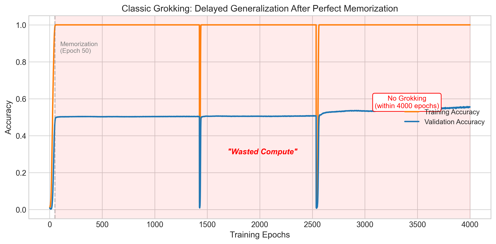
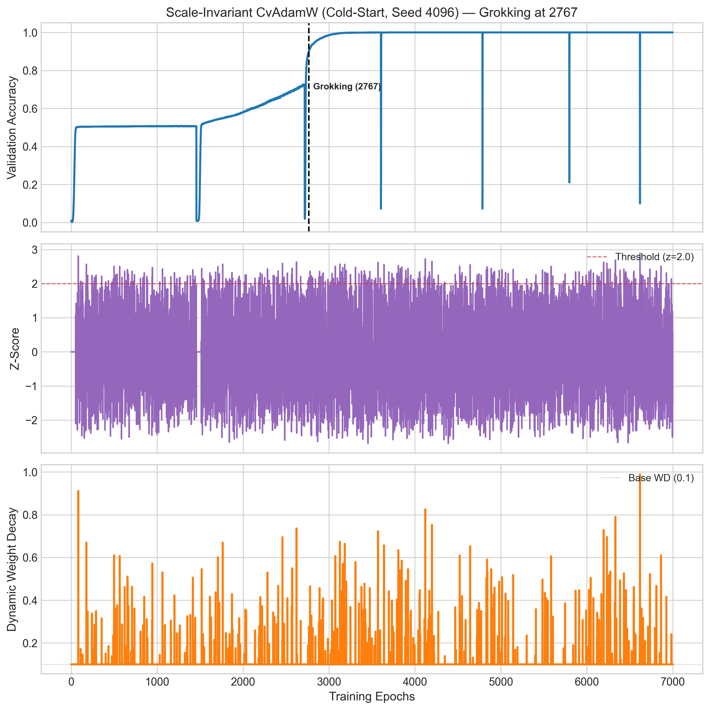

# Thermodynamic Weight Decay: Exploring Grokking Acceleration via Attention Specific Heat

Chitraansh Pandey

Independent Researcher

chitraanshpandey@gmail.com

github.com/baymaxbyte/cbo_core

## Abstract

Grokking—the delayed generalization of neural networks long after they have memorized their training data—wastes thousands of training epochs and is notoriously unpredictable. Building on the recent result that Transformer attention is formally isomorphic to a thermodynamic system, we treat the variance of attention logits as a *specific heat* $C_{v}$ and show that its peak reliably precedes the generalization transition. We introduce **CvAdamW**, a drop-in AdamW variant that monitors $C_{v}$ online and injects “thermal energy” by dynamically scaling weight decay when a phase transition is detected. Through a strictly iterative development process we identify three failure modes—initialization noise, mini-batch micro-ripples, and “slingshot blinding”—and resolve them with a memorization gate and an exponential-moving-average shock absorber. On modular arithmetic $(a+b\bmod 97)$, CvAdamW enables grokking at epoch 2802 in a 4000-epoch budget where the baseline never groks. We further propose a *scale-invariant* $z$-score reformulation that removes task-specific hyperparameters, and evaluate it across 10 paired seeds. A paired analysis shows the cold-start variant reduces mean grokking latency by 257 epochs ($6.0\%$; median $166$ epochs; Wilcoxon $p=0.049$, Cohen’s $d=0.68$, bootstrap $95\%$ CI $[53,489]$), improving 8 of 10 seeds; on this single task $C_{v}$ peaks before grokking in all 10 seeds. Our results indicate that neural networks may expose detectable precursors of impending generalization transitions, and that a physically motivated, proportional intervention can facilitate generalization within a fixed compute budget. Code and data are public.

## 1 Introduction

Modern over-parameterized networks frequently exhibit *grokking* [5]: training accuracy saturates within tens of epochs while validation accuracy remains at chance for hundreds or thousands of epochs, then abruptly jumps to near-perfect. The intervening plateau is computationally wasteful and, worse, its duration is difficult to predict in advance. A practitioner cannot easily tell whether a model is about to generalize or has stalled permanently.

Recent theory offers a striking reinterpretation of this phenomenon. Kim [1] prove that the attention mechanism is formally isomorphic to a canonical thermodynamic ensemble: the softmax is the Boltzmann distribution that minimizes Helmholtz free energy, the scaling factor $1/\sqrt{d_{k}}$ is an inverse temperature, the attention logits $QK^{\top}$ are energy levels, and—critically—the *variance* of those logits behaves as a *specific heat*. In statistical mechanics, specific heat diverges at phase transitions. If grokking is a phase transition, the network should announce it through a spike in this observable.

We take this prediction literally and ask a control-theoretic question: *if the network signals its own phase boundary, can we detect that signal online and supply exactly the energy needed to cross it?* **[p. 2]** The physical actuator is weight decay. Since the effective temperature of the attention system scales as $T_{\mathrm{eff}}\propto\sqrt{d_{k}}/\lVert W\rVert^{2}$, increasing weight decay shrinks the parameter norm and *heats* the system. Our contribution is an optimizer that closes this loop.

#### Contributions.

- We show empirically that, on modular arithmetic, the attention specific heat $C_{v}=\mathrm{Var}(QK^{\top}/\sqrt{d_{k}})$ peaks before grokking in every seed we tested (Section 6.1).
- We introduce **CvAdamW**, a thermodynamically-aware optimizer that scales weight decay in proportion to the smoothed momentum of $C_{v}$ (Section 3), and document three failure modes and their fixes.
- We propose a *scale-invariant* $z$-score formulation that eliminates task-specific thresholds (Section 4).
- We provide a paired statistical evaluation over 10 seeds—per-seed results, nonparametric tests, effect sizes, bootstrap confidence intervals, lead-time statistics, and a precursor correlation analysis—rather than point estimates (Section 6.3).

## 2 Background

### 2.1 The thermodynamic isomorphism of attention

For a single query, attention computes weights over $n$ keys via

$$
p_{i}=\frac{\exp(z_{i}/\sqrt{d_{k}})}{\sum_{j=1}^{n}\exp(z_{j}/\sqrt{d_{k}})},\qquad z_{i}=(QK^{\top})_{i}. \tag{1}
$$

This is exactly the Boltzmann distribution $p_{i}=e^{-E_{i}/T}/Z$ with energy levels $E_{i}=-z_{i}$, inverse temperature $\beta=1/\sqrt{d_{k}}$, and partition function $Z=\sum_{j}e^{-E_{j}/T}$ [1]. Under this mapping the specific heat of a canonical ensemble, $C_{v}=\mathrm{Var}(E)/T^{2}$, corresponds to the variance of the scaled attention logits. Following Kim [1], we identify the specific heat of the attention “information gas” with

$$
C_{v}\;=\;\mathrm{Var}\!\left(\frac{QK^{\top}}{\sqrt{d_{k}}}\right). \tag{2}
$$

Thermodynamically, $C_{v}$ measures the energy required to change the system’s temperature and diverges at a phase transition. Our working hypothesis is that grokking is such a transition, so $C_{v}$ should spike as the model reorganizes its internal representations from memorization to generalization.

### 2.2 Grokking and weight decay

Grokking was first characterized on algorithmic tasks by Power et al. [5] and has since been linked to weight norm and regularization [2, 4]. A common view is that memorization corresponds to a sharp, high-curvature minimum, while generalization lives in a flatter basin; escaping the former requires either implicit or explicit pressure on the parameter norm. Weight decay [3] is the standard tool. The thermodynamic picture makes this precise: with

$$
T_{\mathrm{eff}}\;\propto\;\frac{\sqrt{d_{k}}}{\lVert W\rVert^{2}}, \tag{3}
$$

increasing weight decay reduces $\lVert W\rVert$ and therefore raises $T_{\mathrm{eff}}$. More weight decay is, literally, more heat.

## 3 Method: CvAdamW

CvAdamW is a drop-in replacement for AdamW that computes a *dynamic* weight decay $\lambda_{t}$ each epoch as a function of the $C_{v}$ trajectory. The base optimizer is unchanged; only the regularization coefficient is modulated.

**[p. 3]**

### 3.1 Proportional heat injection ($\kappa/\tau$ formulation)

Let $C_{v}(t)$ be the specific heat measured at epoch $t$. We track the smoothed momentum of its velocity with an exponential moving average (EMA):

$$
\delta_{t} =C_{v}(t)-C_{v}(t-1), \tag{4}
$$

$$
\mu_{t} =\alpha\,\mu_{t-1}+(1-\alpha)\,\delta_{t}, \tag{5}
$$

$$
\lambda_{t} =\lambda_{\mathrm{base}}+\kappa\cdot\max\!\left(0,\;\mu_{t}-\tau\right). \tag{6}
$$

Here $\alpha=0.9$ gives an effective window of $1/(1-\alpha)=10$ epochs, $\tau$ is a noise floor below which fluctuations are ignored, and $\kappa$ amplifies sustained positive momentum into weight-decay units. When $C_{v}$ is flat or falling, $\mu_{t}\leq\tau$ and the optimizer reverts to standard AdamW with $\lambda_{\mathrm{base}}=0.1$. As $C_{v}$ climbs toward the transition, $\mu_{t}$ grows and $\lambda_{t}$ scales proportionally.

#### The memorization gate.

None of the above activates until the model has memorized, enforced by $\text{train\_acc}\geq 0.99$. A phase transition is only meaningful once the system has reached the metastable (memorized) state.

### 3.2 Three failure modes

###### p3-4

CvAdamW was not obtained in one shot. Each design element resolves a specific, observed failure (full logs in the accompanying repository).

**(1) Initialization noise.** Without any gating, all detectors fired at epoch 16, mistaking the chaotic attention patterns of random initialization for a phase transition. Injecting heat this early performed *worse* than baseline: one cannot force a system out of a minimum it has not yet entered. The memorization gate resolves this.

**(2) Mini-batch micro-ripples.** With the gate but without smoothing, a discrete kinematic trigger fired at epoch 240 on a single-epoch upward blip caused by batch-sampling noise. The one-shot intervention was wasted. The $\alpha=0.9$ EMA absorbs 1–2 epoch noise while passing the sustained, $50$–$200$ epoch rise of a real transition (Figure 1).

###### p3-7

**(3) Slingshot blinding.** During major structural reorganization, competing circuits transiently degrade training accuracy—the “slingshot” effect [7]. In one run a large $C_{v}$ spike coincided with train_acc dropping below $0.99$, closing the gate exactly at the peak and blinding a discrete trigger. A continuous, proportional optimizer sidesteps this: it has already accumulated momentum before the gate closes, so the thermal energy is delivered as the mountain forms rather than after it has passed.

These failures motivate the central design principle of continuity. A proportional response that tracks signal magnitude is robust to timing errors that are fatal to a one-shot trigger.

*Figure 1: Classic grokking on $(a+b)\bmod 97$. Training accuracy saturates within tens of epochs, while validation accuracy remains at chance for thousands of epochs (shaded “wasted compute”). Under a constrained 4000-epoch budget the baseline never groks.* **[p. 4]**

## 4 Scale-Invariant Reformulation

The $\kappa/\tau$ formulation has two task-specific constants: $\tau$ is an absolute magnitude and $\kappa$ a dimensional conversion factor. On a task where $C_{v}$ occupies a different range, both require retuning. We remove them by treating the velocity $v_{t}=C_{v}(t)-C_{v}(t-1)$ as a random variable and detecting statistical anomalies. Using EMA estimates of its running mean and variance,

$$
\mu_{t} =\beta_{z}\,\mu_{t-1}+(1-\beta_{z})\,v_{t}, \tag{7}
$$

$$
\sigma_{t}^{2} =\beta_{z}\,\sigma_{t-1}^{2}+(1-\beta_{z})\,(v_{t}-\mu_{t-1})(v_{t}-\mu_{t}), \tag{8}
$$

$$
Z_{t} =\frac{v_{t}-\mu_{t}}{\sqrt{\sigma_{t}^{2}}+\epsilon}, \tag{9}
$$

$$
\lambda_{t} =\lambda_{\mathrm{base}}+\max\!\left(0,\;Z_{t}-z_{\mathrm{thresh}}\right). \tag{10}
$$

The only free constant, $z_{\mathrm{thresh}}=2.0$, is a universal $2\sigma$ anomaly threshold.

#### Cold-start vs. continuous sensor.

The memorization gate creates a choice of when to begin accumulating statistics. The *cold-start* variant starts $\mu,\sigma^{2}$ only after the gate opens ($\text{train\_acc}\geq 0.99$), **[p. 4]** maximizing sensitivity to the first post-gate signal. The *continuous sensor* variant tracks statistics from epoch 1 (gating only the actuator), providing a warm baseline. As we show, the cold-start variant is paradoxically stronger: a warm baseline dilutes the relative anomaly of a genuine transition.

## 5 Experimental Setup

All experiments use a 2-layer decoder-only Transformer ($d_{\mathrm{model}}=128$, 4 heads, $d_{k}=32$, RoPE positional encoding [6], GELU) on modular addition $(a+b)\bmod 97$, a dataset of $97^{2}=9409$ examples with a $50/50$ train/validation split. The base optimizer is AdamW [3] ($\text{lr}=3\times 10^{-4}$, $\lambda_{\mathrm{base}}=0.1$, batch size 512). We report the *grokking epoch*, defined as the first epoch at which validation accuracy exceeds $0.95$. The scale-invariant study uses 10 seeds $\{42,123,256,512,1024,2048,3141,4096,7777,9999\}$ over 7000 epochs; the $\kappa/\tau$ study uses 5 seeds over 10,000 epochs.

## 6 Results

### 6.1 Observed Cv precursor dynamics

###### p4-2

Across every configuration we ran on this task, $C_{v}$ exhibits a pronounced peak that precedes the validation-accuracy transition (quantified in Section 6.3). Figure 2 contrasts three regimes under a 4000-epoch budget. The baseline (A) shows a clear $C_{v}$ peak yet remains trapped at chance accuracy: the signal is present but the system lacks the energy to cross. The step-function intervention (B) injects a fixed weight-decay spike ($0.1\!\to\!1.0$) at the detected peak (epoch 3049) and groks 284 epochs later. CvAdamW (C) scales weight decay smoothly to a peak of $1.61$ and groks earliest, at epoch 2802. Under this budget the baseline never groks, so CvAdamW’s contribution is not merely acceleration but *enabling* generalization.

*Figure 2: Master comparison under a 4000-epoch budget (single seed). **(A)** Baseline AdamW: $C_{v}$ (red) peaks but validation accuracy (blue) stays at chance. **(B)** Step-function: a binary weight-decay spike at the detected peak forces grokking. **(C)** CvAdamW: continuous, proportional weight-decay scaling groks earliest.* **[p. 5]**

*Figure 3: Weight-decay schedules and resulting validation accuracy. The step-function (red) applies a binary spike with a fixed cooldown; CvAdamW (green) applies a smooth, proportional response that tracks $C_{v}$ momentum. The continuous schedule generalizes earlier.* **[p. 6]**

### 6.2 Continuous vs. discrete intervention

Figure 3 overlays the two weight-decay schedules. The step-function is fragile: its single spike must land precisely at the peak and is defeated by slingshot blinding. The continuous schedule delivers energy throughout the transition and is immune to single-epoch gate closures, consistent with the physical intuition that phase transitions are extended, not instantaneous, events.

**[p. 5]**

### 6.3 Scale-invariant paired study

We evaluate the scale-invariant cold-start variant against the baseline across 10 paired seeds. Because every seed is run under both conditions, we use a *paired* analysis. Let $d_{i}=\text{Baseline}_{i}-\text{ColdStart}_{i}$; positive values favor our method. Table 1 gives the full per-seed results (including the continuous-sensor variant), so readers can inspect variance, outliers, and robustness directly; Table 2 summarizes the paired statistics.

*Table 1: Per-seed grokking epoch (first epoch with validation accuracy $>0.95$) for the baseline and the two scale-invariant CvAdamW variants over 7000 epochs. Lower is better.* **[p. 6]**

| Seed | Baseline | Cold-Start | Continuous |
|---|---|---|---|
| 42 | 5301 | 4934 | 5785 |
| 123 | 4971 | 5111 | 4665 |
| 256 | 4843 | 4707 | 4514 |
| 512 | 4218 | 4197 | 4179 |
| 1024 | 4535 | 4655 | 3604 |
| 2048 | 3714 | 2933 | 3969 |
| 3141 | 5078 | 4055 | 5063 |
| 4096 | 2962 | 2767 | 3078 |
| 7777 | 4127 | 3889 | 4925 |
| 9999 | 3381 | 3314 | 3550 |
| Mean | 4313 | 4056 | 4333 |
| Std | 776 | 829 | 817 |

*Table 2: Paired statistical comparison: baseline AdamW vs. scale-invariant cold-start CvAdamW over 10 seeds (7000 epochs). Positive improvement means fewer epochs to grok. All values are computed from the released per-seed data.* **[p. 7]**

| Metric | Result |
|---|---|
| Mean baseline grokking epoch | 4313 |
| Mean cold-start grokking epoch | 4056 |
| Mean improvement | 257 epochs ($6.0\%\pm 8.4\%$) |
| Median improvement | 166 epochs ($4.3\%$) |
| Paired $t$-test (two-tailed) | $t(9)=2.15,\;p=0.060$ |
| Wilcoxon signed-rank (two-sided) | $W=8,\;p=0.049$ |
| rank-biserial $r$ | $0.71$ |
| Cliff’s $\delta$ | $0.22$ |
| Cohen’s $d$ (paired) | $0.68$ (medium) |
| Wins (cold-start better) | $8/10$ |
| Sign test (two-sided) | $p=0.109$ |
| Bootstrap $95\%$ CI ($10^{4}$ resamples) | $[53,\;489]$ epochs |
| Classical $95\%$ CI | $[-13,\;527]$ epochs |

###### p5-2

The cold-start variant improves 8 of 10 seeds with a mean reduction of 257 epochs ($6.0\%$) and a median of 166 epochs ($4.3\%$). The evidence is suggestive but mixed at $n=10$: the two-sided Wilcoxon signed-rank test is significant ($p=0.049$, rank-biserial $r=0.71$) and the bootstrap $95\%$ **[p. 6]** confidence interval for the mean improvement excludes zero ($[53,489]$), whereas the two-tailed paired $t$-test ($p=0.060$), the sign test ($p=0.109$), and the classical confidence interval ($[-13,527]$) do not reach significance. The effect size is medium (Cohen’s $d=0.68$; Cliff’s $\delta=0.22$). We report the disagreement between tests transparently rather than selecting the most favorable one. The two regressions (seeds 123 and 1024) are small ($-140$ and $-120$ epochs) relative to the largest gains (seeds 2048 and 3141: $+781$ and $+1023$ epochs).

#### $C_{v}$ is a precursor

###### p6-1

As predicted by Kim [1], $C_{v}$ acts as a precursor and also serves as a prerequisite for our method. On the undisturbed baseline trajectory we locate, for each seed, the epoch of the peak of the EMA-smoothed $C_{v}$ after memorization (train_acc $\geq 0.99$) and compare it to the grokking epoch. Consistent with Kim [1], we observe that $C_{v}$ peaks before grokking **[p. 7]** across all seeds (10/10; mean lead time $2400$ epochs, std $974$, median $2396$). This replication is what motivates using $C_{v}$ as a control signal for adaptive intervention.

Importantly, while the $C_{v}$ peak consistently precedes grokking, its timing is not strongly correlated with the eventual grokking epoch (Pearson $r=-0.099$, $p=0.79$; Spearman $r=0.055$, $p=0.88$). This suggests that $C_{v}$ acts as a *qualitative* precursor signal rather than a *quantitative* predictor of remaining training time—sufficient to trigger an intervention, but not, on its own, to forecast *when* generalization will occur.

*Figure 4: Scale-invariant CvAdamW on seed 4096. **Left:** cold-start gate, grokking at epoch 2767. **Right:** continuous sensor, grokking at epoch 3078. Each panel shows validation accuracy, the running $z$-score, and the dynamic weight decay. The cold-start variant produces a sharper anomaly and grokks earlier.* **[p. 7]**

### 6.4 Strength vs. universality trade-off

###### p7-2

The scale-invariant formulation reaches a maximum dynamic weight decay of only $0.8$–$1.1$, versus $1.5$–$2.6$ for the $\kappa/\tau$ version. Because $Z_{t}$ rarely exceeds $3.0$, the extra weight decay is capped near $1.0$. The $\kappa=5.0$ amplification of the original formulation delivers stronger thermal shocks and is more effective on this deep phase boundary, but requires retuning per task. **[p. 8]** Figure 4 shows the cold-start and continuous variants on a shared seed: the cold-start anomaly is sharper and groks earlier, matching the statistics in Table 2.

## 7 Discussion

Our experiments support three conclusions. First, we replicate—on this task—the prediction of Kim [1] that $C_{v}$ peaks before the phase boundary (10/10 seeds), providing empirical support for one consequence of the thermodynamic interpretation rather than the full isomorphism. This replication validates $C_{v}$ as a usable control signal; however, because its peak timing does not correlate with the grokking epoch, we treat it as a qualitative precursor that can *trigger* intervention, not a quantitative forecaster of remaining training time. Second, exploiting the signal requires care—raw $C_{v}$ is too noisy for discrete triggers, memorization must complete before intervention is meaningful, and a continuous response is essential to survive slingshot dynamics. Third, the principal value of the method is *reliability*: when grokking is possible but slow, CvAdamW offers modest acceleration, but when the baseline cannot grok within the compute budget, CvAdamW facilitates it.

#### Negative results and design lessons.

###### p8-2

We emphasize the failure modes as a contribution in their own right. Three successive detector formulations failed—the first fired on initialization noise (all triggers at epoch 16), the second on batch-induced single-epoch micro-ripples, and discrete triggers were defeated by slingshot dynamics that close the memorization gate exactly at the $C_{v}$ peak. Each negative result directly motivated a design element (the memorization gate, the EMA shock absorber, and continuous proportional scaling). Reporting these failures is intended to save others the same iterations and to justify why the final design takes the form it does.

#### Limitations.

We flag several limitations explicitly. *(1) Single task.* All results are on modular arithmetic $(a+b)\bmod 97$ with a small 2-layer Transformer, where grokking is unusually clean; we do not claim generality to other tasks or architectures. *(2) No evidence on language or vision models.* We have not tested GPT-style language models or Vision Transformers, where emergence is more gradual and the precursor may be harder to detect. *(3) No evidence that $C_{v}$ is uniquely superior.* We have not compared $C_{v}$ head-to-head against other progress measures (attention entropy, weight norm, gradient norm, loss derivative); we therefore cannot claim it is the best available signal, only that it is a usable one. *(4) Limited statistical power.* With $n=10$ seeds the tests disagree at the margin (Wilcoxon and bootstrap significant; $t$-test and sign test not), and the $C_{v}$-peak epoch does not linearly predict the grokking epoch (Section 6.3). *(5) Threshold portability.* The scale-invariant threshold $z_{\mathrm{thresh}}=2.0$, though task-agnostic by construction, may still need adaptation on very different problems.

#### Future work.

The most important next experiment is a head-to-head comparison of $C_{v}$ against other progress measures (attention entropy, weight norm, gradient norm, and the training-loss derivative) to establish whether $C_{v}$ is uniquely useful. Further priorities are breadth (other modular operations such as $a\times b$ and $a-b\bmod p$, and other moduli $p\in\{53,67,113\}$), component ablations, and weight-decay schedule controls that separate “the signal matters” from “more weight decay helps.” A natural algorithmic step is a hybrid that uses $z$-score detection (a universal trigger for *when* to act) together with $\kappa$-style amplification (a strong response for *how hard* to push). Beyond weight decay, the same $C_{v}$ signal could modulate learning-rate noise, gradient clipping, or dropout. Finally, scaling to GPT-style language models and Vision Transformers will test whether the precursor remains actionable where grokking is harder to observe.

## 8 Conclusion

We recast grokking as a thermodynamic phase transition for which the specific heat of attention logits may act as a detectable precursor. CvAdamW listens to this signal and supplies proportional thermal energy via dynamic weight decay, which on modular arithmetic enables generalization within a fixed compute budget where the baseline never groks. A scale-invariant $z$-score variant removes task-specific tuning and yields a modest, statistically suggestive improvement across seeds (significant under the Wilcoxon test and a bootstrap interval, though not under all tests at $n=10$). On this task, neural networks appear to expose precursors of impending generalization; whether the **[p. 9]** signal generalizes beyond modular arithmetic, and whether it is uniquely informative among progress measures, remain open questions we hope to address next.

## References

- [1] G. Kim Thermodynamic isomorphism of transformers: a lagrangian approach to attention dynamics. arXiv preprint arXiv:2602.08216. Cited by: §1, §2.1, §6.3, §7.

- [2] Z. Liu, E. J. Michaud, and M. Tegmark Omnigrok: grokking beyond algorithmic data. In International Conference on Learning Representations (ICLR), Cited by: §2.2.

- [3] I. Loshchilov and F. Hutter Decoupled weight decay regularization. In International Conference on Learning Representations (ICLR), Cited by: §2.2, §5.

- [4] N. Nanda, L. Chan, T. Lieberum, J. Smith, and J. Steinhardt Progress measures for grokking via mechanistic interpretability. In International Conference on Learning Representations (ICLR), Cited by: §2.2.

- [5] A. Power, Y. Burda, H. Edwards, I. Babuschkin, and V. Misra Grokking: generalization beyond overfitting on small algorithmic datasets. In ICLR MATH-AI Workshop, Cited by: §1, §2.2.

- [6] J. Su, Y. Lu, S. Pan, A. Murtadha, B. Wen, and Y. Liu RoFormer: enhanced transformer with rotary position embedding. arXiv preprint arXiv:2104.09864. Cited by: §5.

- [7] V. Thilak, E. Littwin, S. Zhai, O. Saremi, R. Paiss, and J. Susskind The slingshot mechanism: an empirical study of adaptive optimizers and the grokking phenomenon. arXiv preprint arXiv:2206.04817. Cited by: §3.2.
