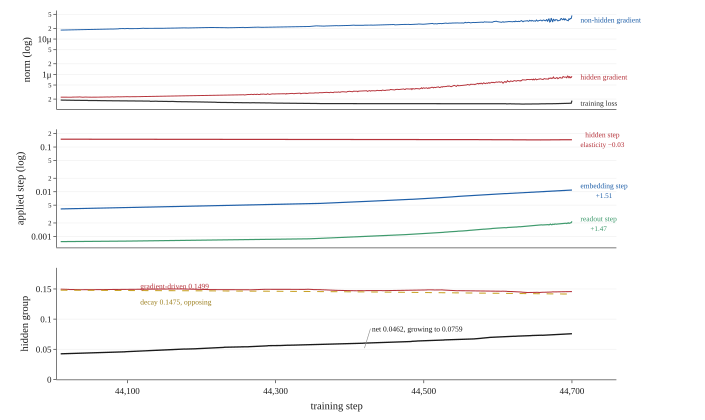
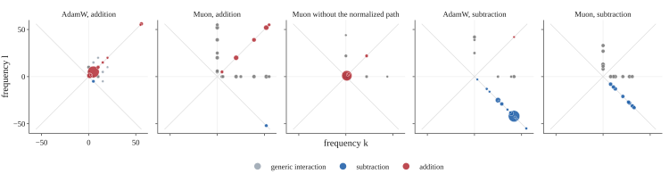
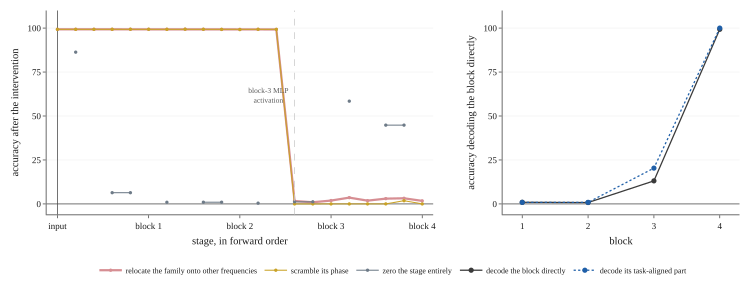

# Post-Grokking Collapse at the Representation–Readout Interface in Muon-Trained Transformers

Ali Janati Affiliation: [1em] Data Science Institute, Columbia University, New York, NY, USA Kaoutar El Maghraoui Affiliation: Department of Computer Science, Columbia University, New York, NY, USA Andrei Kanavalau Affiliation: Stanford University, Stanford, CA, USA Anass Belfatmi Affiliation: CentraleSupélec, Gif-sur-Yvette, France

## Abstract

Under the standard split that gives Muon the hidden weight matrices and leaves embeddings and the output head to AdamW, Muon reaches the grokking threshold on modular addition in fewer steps. The solutions it reaches do not hold. Every configuration in a nine-point sweep on $(a+b)\bmod 113$ groks and every one subsequently loses generalization. AdamW is not exempt: across five seeds the selected AdamW reference falls below threshold on four of them, reaching $27.59\%$. The instability holds across two moduli, two widths, two training fractions, and modular subtraction, and it spreads with depth.

The failure arises at the interface between the representation and the readout, which the residual stream leaves identified only jointly, up to an invertible map the loss does not select. Once the training set is solved the gradient falls to order $10^{-6}$ and the two optimizers answer differently: applied step size has an elasticity of $-0.03$ on gradient magnitude for the Muon group against $+1.5$ for the AdamW groups, and the two separate at $8.0$ times the rate per parameter. Branching from bit-identical states, freezing either group prevents the failure. Held fixed for the remainder of training, the embeddings and readout remove it across five runs and $451{,}400$ post-grokking steps, and across five paired seeds where the unfrozen arm records $137$ to $321$ sub-threshold evaluations and the frozen arm records none. Ablating Muon’s normalization and orthogonalization is not a substitute: with the learning rate raised so the ablated optimizer learns at all, it collapses the representation from $326$ effective conjugate pairs to $4$, shows no recurrent collapse, and fails terminally.

Filtering the representation to the Fourier family that computes the task separates two failures. Across forty-three checkpoints spanning five seeds and three regimes that family reaches exactly $100\%$ in isolation at every one. In *circuit failure* it no longer solves the task. In *circuit masking* it still solves it perfectly while the full model reaches $45.85\%$: the family contributes a positive margin on every example, including every one the model answers wrongly, and is outvoted by an adversarial remainder of nearly equal size. Rescaling the family alone restores the model to $99.9\%$, and in the trajectory analyzed here grokking is the same condition resolving upward. The task selects the family, exchanging $(k,k)$ for $(k,-k)$ on subtraction. Across an abrupt collapse the Fourier support that standard progress measures track is unchanged and its power distribution retains a cosine similarity of $0.9899$.

*Figure 1: A grokked circuit failing, at ten-step evaluation resolution. Upper row: spectral measures of the addition family against the pre-collapse state at step $44{,}700$. Lower row: accuracy of the model and of the model restricted to the addition family. Across the single interval marked, test accuracy falls from $100\%$ to $19.04\%$ and addition-only accuracy to $24.78\%$, while within the addition family the set of dominant frequencies is unchanged, with Jaccard index $1.0000$, and the power distribution across them has cosine similarity $0.9899$. Support- and power-based progress measures report an intact circuit at the step the model stops computing the task. The model then returns to $99.90\%$ within $300$ steps with the power distribution reaching only $0.55$, having re-solved the task on a different set of frequencies. The addition family is the non-constant $(k,k)$ modes of the two-dimensional Fourier transform of the final residual over the operand grid.* **[p. 2]**

## 1 Introduction

Grokking, the onset of generalization long after training accuracy has saturated, is a standard testbed for mechanistic accounts of learning [9]. Modular addition is its canonical instance. Transformers trained on it compute sums in a Fourier basis, representing operands as angles and combining them over a sparse set of frequencies [8]. The tools that established this account, which identify the dominant frequencies and measure **[p. 2]** the fraction of representational power they carry, have become the standard way to check whether a circuit is present.

Muon [6] orthogonalizes the momentum buffer before applying it, and is used on hidden weight matrices only, with embeddings and the output head assigned to AdamW [7]. Under this routing it reaches the grokking threshold on modular arithmetic faster than AdamW alone [14, 17]. We reproduce that result on modular addition. What follows it does not depend on the setting: the instability we report holds across two moduli, two widths, two training fractions, two operations, and depths $1$, $2$, and $4$.

The solutions Muon reaches are known to differ from AdamW’s in structure. Muon-trained hidden states carry higher effective rank [12], and the update rule yields a more isotropic singular spectrum than Adam’s [16]. Both results are spectral, measured on weight matrices and hidden states. On a task whose algorithm is known, that difference can be measured functionally instead, in the basis the model computes in, and read against the number of frequencies the algorithm needs. We do that here, and ablate Muon’s normalized-orthogonalization path: dispersion over the non-constant spectrum collapses from $326$ effective conjugate pairs to $4$ while the family the model computes through is unchanged. The speedup itself is an instrument: it places a grokked circuit within a few thousand steps, which lets us observe the post-grokking regime repeatedly inside single runs, branch matched trajectories from bit-identical parameter states, and intervene on the circuit at a cost that would be prohibitive at AdamW’s timescale.

The post-grokking regime is unstable. Every configuration in our Muon sweep generalizes and then loses generalization, in the worst cases falling below $1\%$ test accuracy and recovering, repeatedly, over hundreds of thousands of steps. Sweeping the output-head learning rate over a factor of five and its weight decay from zero to $0.5$ changes the timing and severity of these events but eliminates none of them. **[p. 3]** AdamW is not exempt. Four of the seven AdamW configurations that grok in our sweep also lose generalization afterward, and the severity rises monotonically with the learning rate, from no sub-threshold evaluations at $10^{-3}$ to $918$ at $10^{-2}$. What distinguishes the two optimizers is that in AdamW the failure is conditional on pushing the step size, while in Muon it holds across every configuration tested. Comparable failures have been reported as cyclic instability in adaptive optimizers [13], as floating-point failure in the softmax [11], as a consequence of shifting circuit efficiency under weight decay [15], and as an anti-grokking phase in which test accuracy collapses while training accuracy remains perfect [10]. 10 additionally report that this late collapse escapes existing progress measures, and propose a weight-spectral statistic that detects it.

###### p3-1

The failure we study is not of that kind. Training accuracy falls with test accuracy, from $100\%$ to $21.12\%$ in the same evaluation interval, and the training loss rises from $1.53\times 10^{-7}$ to $57.5$. A mechanism acting on generalization alone would leave the training set solved. This one does not, which points to the interface between the representation and the readout rather than to either alone. We decompose the collapse and identify which component of the learned circuit changes when the function fails.

Our account starts from a known property of the architecture. The residual stream has no privileged basis: it can be rotated, with the matrices that read from and write to it rotated correspondingly, without changing what the model computes [4]. The logits depend on the final residual representation $h$ and the unembedding $W_{U}$ only through the product $W_{U}h$, so for any invertible $R$ the pair $(Rh,\,W_{U}R^{-1})$ implements the same function. The hidden representation and the readout are identified only jointly, and the loss provides no pressure toward any particular choice of $R$.

The stream is written by the token and position embeddings and by the attention and MLP output projections, and read by the query–key–value and MLP input projections and by the unembedding. A change of basis transforms every writer on the left and every reader on the right, so the basis is fixed jointly by all of them rather than by $h$ and $W_{U}$ alone. Split-optimizer routing cuts across that structure. Muon holds hidden matrices that both write and read; AdamW holds two writers, the token and position embeddings, and one reader, the unembedding. A trained model occupies one arbitrary point in the family of equivalent bases, reached by the two parameter groups co-adapting over the course of training.

The two optimizers respond differently to a vanishing gradient. Over the $691$ steps preceding the collapse we analyze, the training loss sits at $1.5\times 10^{-7}$ and the gradient norms on the hidden and auxiliary groups are of order $10^{-6}$ and $10^{-5}$. Regressing each group’s gradient-driven applied update on its gradient norm in logs across the window gives an elasticity of $-0.026$ for the hidden group against $+1.51$ and $+1.47$ for the embeddings and the readout, with $R^{2}$ between $0.84$ and $0.98$. The Newton–Schulz iteration normalizes its input before orthogonalizing and returns a matrix whose singular values are near one whatever produced it; AdamW carries no such property over a window in which the gradient drifts, because its first and second moments track horizons of ten and a thousand steps and the ratio between them grows rather than cancelling. The two groups separate: cumulative displacement over the window reaches $0.073$ per parameter in root mean square on the hidden group against $0.0091$ on the auxiliary group, a factor of $8.0$. Over longer matched branches the separation becomes functional: each side ends able to decode its own representation and not the other’s. We call the resulting failure hidden–readout misalignment. 1 identify the same failure as the largest component of catastrophic forgetting, where representational geometry survives while the readout ceases to match it. There the misalignment is produced by training on new tasks. Here there is no distribution shift and no new task. The training set is solved and stays solved throughout the window in which the two sides separate, and both accuracies then fail together. The failure survives every setting of the output-head learning rate and weight decay. Changing the size of a step taken along a direction the loss does not constrain does not remove the direction.

The account predicts which measurements will register the failure and which will not. Fourier support is invariant under any invertible change of basis, because $R\hat{h}$ vanishes only where $\hat{h}$ does. The distribution of power across those frequencies is invariant when $R$ is orthogonal. Measures that evaluate the function itself are invariant under neither. All three hold at the collapse: test accuracy falls from $100\%$ to $19.04\%$ and **[p. 4]** accuracy restricted to the addition family to $24.78\%$, while within that family the set of dominant frequencies is identical to the pre-collapse state with Jaccard index $1.0000$ and its power distribution has cosine similarity $0.9899$. Figure 1 shows the interval.

The family is not an assumption of the analysis. Trained on $(a-b)\bmod 113$ under the same configuration and initialization, the model computes through the $(k,-k)$ modes at $100\%$ in isolation while $(k,k)$ falls to chance, exactly reversing the addition result. The task selects the family.

The two groups also lose each other. Branching two trajectories from a bit-identical parameter state and letting them run, each branch ends able to decode its own addition representation at $100\%$ and the other’s at chance, in both directions, and the two unembedding matrices reach a cosine similarity of $-0.028$. Two readouts that were the same matrix become nearly orthogonal while each remains correct for the representation it grew alongside.

#### Contributions.

###### p4-3

- **Muon groks faster, and post-grokking instability is not unique to it.** Every one of nine Muon configurations groks, against seven of eleven swept AdamW configurations, with mean times of $13{,}011$ and $30{,}486$ steps, and the advantage holds across modulus, training fraction, width, and depth. Across five seeds it is $1.54$ at the median and holds on four of them, with Muon’s grokking step spanning one hundred steps against AdamW’s seven thousand seven hundred. A Muon step costs $1.75$ to $1.80$ times an AdamW step, so the depth-$2$ advantage is $2.22$ in steps and $1.28$ in elapsed time. None of the nine Muon configurations is strictly stable, and the count of sub-threshold evaluations has no monotone relationship to either hidden hyperparameter. Four of the seven grokking AdamW configurations also collapse, with severity rising monotonically in the learning rate from none at $10^{-3}$ to $918$ at $10^{-2}$. Across five seeds neither selected setting is strictly stable: Muon records $137$ to $321$ sub-threshold evaluations on all five and the AdamW baseline records one or two on four of five, reaching $27.59\%$. The optimizers differ in severity by two orders of magnitude, not in whether the failure occurs. With depth the condition disappears: the AdamW configuration stable at depth $1$ records $556$ sub-threshold evaluations at depth $2$ and never sustains generalization at depth $4$.
- **The failure is localized to the representation–readout interface, and anchoring it prevents collapse.** Over the $691$ steps before a collapse the training loss holds at $1.5\times 10^{-7}$ and the gradient norms are of order $10^{-6}$ and $10^{-5}$, while the elasticity of applied step size on gradient magnitude is $-0.03$ for the Muon group against $+1.5$ for the AdamW groups, and the two separate at $8.0$ times the rate per parameter. Branching from bit-identical states, freezing either group suppresses the failure; within the auxiliary group the unembedding is the component whose motion it requires, and hidden matrices together with the unembedding reproduce it. Removing the normalized-orthogonalization path does not produce a stable alternative: six ablated runs generalize, none dips below threshold, and all six end in a non-finite loss, while Muon reaches a minimum of $29.49\%$ and recovers to $96.48\%$. Holding embeddings and readout fixed once the circuit has formed leaves no post-grokking evaluation below $95\%$ across five runs, $451{,}400$ steps, and $4{,}519$ evaluations, and across five paired seeds of the main condition where the unfrozen arm records $137$ to $321$ and reaches minima of $16.27\%$. It is the only configuration in this study with no sub-threshold evaluation on any seed.
- **The task selects the family, and its basis is exact and not shared.** Across forty-three solved checkpoints spanning five seeds and three optimizer regimes, projection onto the $(k,k)$ Fourier family gives exactly $100.00\%$ at every one and ablating it leaves $1.71\%$, while subtraction, $a$-only, $b$-only, and the constant mode give exactly $0.88\%$ in isolation everywhere. On $(a-b)\bmod 113$, under matched initialization, configuration, and code path, the two families exchange sufficiency roles exactly: $(k,-k)$ gives $100\%$ at every solved checkpoint and $(k,k)$ gives $0.88\%$. **[p. 5]** Transporting the family onto other diagonal frequencies at matched power gives $2.64\%$; randomizing phase per conjugate pair gives $0.19\%$, below the chance rate of $0.88\%$, and per channel gives $0.78\%$. Two branches diverging from a bit-identical state each decode their own representation at $100\%$ and the other’s at chance, with readout matrices reaching cosine similarity $-0.028$.
- **The update rule shapes how widely the representation is spread, and ablating its normalized-orthogonalization path implicates that path.** Under matched initialization and configuration the Muon representation occupies $326.09$ effective conjugate pairs of the non-constant spectrum on addition and $211.46$ on subtraction, against AdamW’s $4.95$ and $2.54$, leaving the task-aligned family holding $28.0\%$ and $27.7\%$ of non-constant power against AdamW’s $91.0\%$ and $95.4\%$. Each operation supplies a family that provably computes nothing on the other’s task, which gives the spread a floor to be measured against: AdamW places $0.0\%$ to $0.3\%$ of power there and Muon $2.5\%$ to $17.7\%$. Ablating the normalization and orthogonalization together collapses the count to $4.11$, past AdamW’s, while leaving the family untouched at $100\%$ sufficiency.
- **Filtering separates two collapse modes, and grokking is one of them reversed.** Projecting onto the addition family distinguishes *circuit failure*, where the isolated family no longer solves the task and gives $2.65\%$ and then chance, from *circuit masking*, where it still gives $100\%$ while the full model reaches $45.85\%$. Masking is a competition on amplitude. The margin through the unembedding decomposes exactly: the family contributes $+5.72$ and is outvoted by an adversarial remainder at $-6.43$, while in the frozen branch $+19.28$ overwhelms $-7.67$. The family produces a positive margin on every example in both branches, including every one the masked model answers wrongly, and on those examples its margin is higher rather than lower. Rescaling the family alone, with no retraining, raises the masked model from $45.85\%$ to $99.9\%$. One matched trajectory passes through failure, full recovery, and masking. Grokking is masking resolving upward, the cleanup phase of 8 on the same quantity: the family solves the task in isolation from step $3{,}000$ while its share rises from $1.05\%$ to $70.62\%$. At the collapse step, support is unchanged at Jaccard $1.0000$ and power has moved by one percent.
- **Construction and alignment are separated in depth.** Fourier-specific sensitivity first appears at an MLP in ten of eleven solved checkpoints and at no attention write, while decoding a post-block residual directly with the unembedding first reaches $95\%$ at the final block in all $41$ generalizing checkpoints, never exceeding $17.97\%$ earlier. In the mature Muon checkpoints an MLP in the penultimate block writes the code and the final block makes it legible. Adding depth introduces computational stages whose residual states are not yet directly aligned with the unembedding.

Code is available at https://github.com/Na00s/muon-grokking.

## 2 Setup

### 2.1 Task and data

We train on modular arithmetic with $p=113$, on $(a+b)\bmod p$ throughout and on $(a-b)\bmod p$ where stated. Each example is the token sequence $[a,\,b,\,{=}]$, where the third position holds a dedicated equals token, so the vocabulary contains $p+1=114$ tokens and the output layer has $p=113$ classes. The ordered full grid of operand pairs contains $p^{2}=12{,}769$ examples. Unless stated otherwise we assign a fixed random $30\%$ of the grid to training, giving $3{,}830$ training pairs and $8{,}939$ held-out pairs, and train full batch with cross-entropy. The split is generated once from the run seed and shared by all matched comparisons.

**[p. 6]**

Runs load a saved initial state from disk rather than re-initializing at launch. We evaluate on the training and held-out sets every $100$ steps and write a checkpoint every $1{,}000$ steps. Depth-$1$ and depth-$2$ runs last $100{,}000$ steps and depth-$4$ runs last $300{,}000$.

### 2.2 Architecture

The model is a decoder-only transformer with $d_{\text{model}}=128$, four attention heads of size $32$, MLP width $512$, ReLU activation, and sequence length $3$. Attention is causal, and the logits are read from the final position. Every projection is bias-free and the model contains no normalization layers, so the residual stream is a plain sum of the embedding, the attention writes, and the MLP writes. The absence of normalization matters for the analysis in Section 1: LayerNorm is the one operation in a standard transformer that distinguishes a coordinate system in the residual stream, and without it the stream is exactly invariant to an invertible change of basis absorbed by the surrounding matrices. Four matrices write into the stream, the token embedding, the position embedding, the attention output projection, and the MLP output projection, and three read from it, the fused QKV projection, the MLP input projection, and the unembedding. An invertible $R$ applied to the stream is absorbed by transforming every writer on the left and every reader on the right. Normalization would restrict rather than remove this freedom. Root-mean-square normalization without a learned gain commutes with orthogonal $R$, since $\|Rx\|=\|x\|$, leaving an $O(d)$ symmetry that is $8{,}128$-dimensional at this width; a learned per-coordinate gain restricts it further, to the transformations that gain absorbs. Preservation of the power distribution across a collapse, to a cosine of $0.9899$, is consistent with a near-orthogonal change of representation, and therefore with one lying inside the subgroup normalization keeps.

Each block contains four two-dimensional weight matrices: the fused QKV projection ($384\times 128$), the attention output projection ($128\times 128$), the MLP input projection ($512\times 128$), and the MLP output projection ($128\times 512$). A block therefore holds $196{,}608$ parameters. With the token embedding, position embedding, and unembedding, the depth-$1$ model has $226{,}048$ parameters in total.

Depth is varied by appending blocks under nested initialization: embeddings, block $0$, and the unembedding are shared across depths, and additional blocks are appended so that deeper models begin from a strict superset of the shallower model’s initial state. The depth-$2$ model has $8$ hidden matrices and $422{,}656$ parameters and the depth-$4$ model has $16$ hidden matrices and $815{,}872$ parameters.

### 2.3 Optimizer routing

Parameters are partitioned into three groups, listed in Table 1. The hidden group holds the four two-dimensional matrices in each block and is the only group Muon ever receives; our implementation refuses any parameter that is not a matrix. The auxiliary group holds the token and position embeddings. Where the distinction between the auxiliary and readout groups is not at issue we refer to the two together as the non-hidden parameters. The unembedding is kept as its own group so that the output head can be given a separate learning rate and weight decay, and so that it can be frozen independently in the interventions reported below. The AdamW baseline uses the identical architecture, data, and initialization, and places every parameter under a single AdamW instance.

*Table 1: Parameter groups and the optimizer assigned to each. The AdamW baseline places all parameters under one AdamW instance with a single learning rate and weight decay.* **[p. 7]**

| Group | Parameters | Optimizer |
|---|---|---|
| Hidden | QKV, attention output, MLP input, MLP output, per block | Muon |
| Auxiliary | Token embedding, position embedding | AdamW |
| Readout | Unembedding | AdamW |

Muon maintains an exponential moving average of the gradient with coefficient $\beta=0.95$, forms a Nesterov-style update $(1-\beta)g_{t}+\beta m_{t}$, normalizes it by its Frobenius norm, and applies five quintic Newton–Schulz iterations with coefficients $(3.4445,\,-4.7750,\,2.0315)$ to approximate the orthogonal factor $UV^{\top}$ of the update’s singular value decomposition. Matrices with more rows than columns are transposed before the iteration and transposed back afterwards. The result is scaled by $\sqrt{\max(1,\,\text{rows}/\text{cols})}$, weight decay is applied in decoupled form, and the scaled update is subtracted. The iteration runs in float32.

Table 2 gives the configurations used throughout. The AdamW baseline was selected from eleven configurations of a single global learning rate and weight decay. The Muon configuration was selected from **[p. 7]** nine configurations of the hidden group, with the auxiliary and readout settings taken from the separate sweeps of Section 3, which vary those groups over a factor of five in learning rate and from zero to $0.5$ in weight decay.

*Table 2: Selected configurations. Stable Muon and Muon are the same configuration up to the freeze; their trajectories differ only through backend nondeterminism, which Section 5 reports.* **[p. 7]**

| Configuration | Group | Optimizer | Settings |
|---|---|---|---|
| AdamW baseline | All parameters | AdamW | $\text{lr}=10^{-3}$, $\text{wd}=3.0$ |
| Muon | Hidden | Muon | $\text{lr}=0.03$, $\text{wd}=0.1$, $\beta=0.95$, $\text{NS}=5$ |
| Auxiliary | AdamW | $\text{lr}=10^{-3}$, $\text{wd}=1.0$ |  |
| Readout | AdamW | $\text{lr}=2.5\times 10^{-4}$, $\text{wd}=1.0$ |  |
| Stable Muon | Muon, with auxiliary and readout groups frozen after circuit formation |  |  |

All AdamW groups use $\beta_{1}=0.9$ and $\beta_{2}=0.999$. Runs execute on Apple MPS in float32. Replaying a saved trajectory on this backend is not bitwise deterministic: two runs of the depth-$4$ Muon configuration reach sustained generalization at $52{,}600$ and $101{,}300$ steps. Speed comparisons use the first; the second is descriptive and bounds run-to-run variation. The mechanistic matched branches are constructed by branching from a single in-memory state within one process rather than by re-running from a saved checkpoint, so they begin with zero parameter difference by construction. The five-seed Muon and Stable Muon comparison instead uses deterministic replay, with the two arms verified identical at every logged evaluation before the freeze.

### 2.4 Operational definitions

Because the post-grokking regime is the object of study, timing and stability need definitions that survive a trajectory that crosses a threshold more than once. We use those in Table 3 throughout.

*Table 3: Operational definitions. Evaluations occur every $100$ steps, so a sustained criterion requires the threshold to hold across a $500$-step window.* **[p. 8]**

| Term | Definition |
|---|---|
| Sustained $99.9\%$ train | First evaluation followed by five evaluations at or above $99.9\%$ train accuracy |
| Sustained $95\%$ test | First evaluation followed by five evaluations at or above $95\%$ test accuracy |
| Memorization plateau | Sustained-$95$ test step minus sustained-$99.9$ train step |
| Strictly stable | No post-grokking evaluation below $95\%$ test accuracy |

Both criteria are strict. Sustained $95\%$ is a stricter grokking criterion than first crossing, and it is the criterion under which all speed comparisons are made, so a configuration that touches the threshold and falls away is not credited with grokking. Strict stability is correspondingly demanding: a single evaluation at $94\%$ anywhere in the remaining hundreds of thousands of steps disqualifies a run. We therefore report the count and the depth of sub-threshold evaluations alongside the binary label throughout, so that a run failing by one evaluation is distinguishable from one failing by nine hundred.

### 2.5 Seed replication

Training sweeps and the matched-branch causal experiments run at a single seed. The selected configurations are additionally trained at five seeds, $0$ through $4$, each for $100{,}000$ steps under the same settings with no retuning, and the resulting checkpoints are put through the family, frequency, phase, sparsity, and **[p. 8]** spectral-dispersion analyses. The seed varies the initialization and the train/test split together, so these are five draws of the problem instance rather than five initializations on fixed data.

These runs execute on CPU, where the implementation is bitwise deterministic. On the accelerator backend it is not, and seed variance confounded with backend nondeterminism would make the spread uninterpretable. Two runs at one seed are therefore the same trajectory until the freeze fires, which makes the Muon and Stable Muon arms paired without forking a process: across all five seeds they agree to a maximum absolute difference of zero on test accuracy and training loss over the seventy-four to seventy-five evaluations preceding the freeze.

## 3 Speed and the onset of instability

### 3.1 Sweeps and baseline selection

We swept AdamW over eleven configurations spanning four learning rates and three weight decays, and Muon over nine configurations of the hidden group, holding the auxiliary and readout settings fixed. Every run in both sweeps used the same architecture, data split, and step budget of $100{,}000$. Tables 4 and 5 give the results.

*Table 4: AdamW sweep. Seven of eleven retained configurations reach sustained $95\%$ test accuracy. Post-grokking evaluations below $95\%$ increase monotonically with the learning rate.* **[p. 8]**

| LR | WD | Sustained $95\%$ | Min after grokking | Evals $<95\%$ | Strictly stable |
|---|---|---|---|---|---|
| $3\times 10^{-4}$ | $0.1$ | no grok |  |  |  |
| $3\times 10^{-4}$ | $1.0$ | no grok |  |  |  |
| $3\times 10^{-4}$ | $3.0$ | $25{,}500$ | $95.67\%$ | $0$ | yes |
| $10^{-3}$ | $0.1$ | no grok |  |  |  |
| $10^{-3}$ | $1.0$ | $52{,}500$ | $96.49\%$ | $0$ | yes |
| $10^{-3}$ | $3.0$ | $8{,}200$ | $95.01\%$ | $0$ | yes |
| $3\times 10^{-3}$ | $0.1$ | $49{,}500$ | $13.26\%$ | $2$ | no |
| $3\times 10^{-3}$ | $1.0$ | $8{,}500$ | $53.72\%$ | $4$ | no |
| $10^{-2}$ | $0.1$ | $62{,}900$ | $0.54\%$ | $258$ | no |
| $10^{-2}$ | $1.0$ | $6{,}300$ | $0.41\%$ | $918$ | no |
| $10^{-2}$ | $3.0$ | no grok |  |  |  |

*Table 5: Muon sweep over the hidden group. All nine configurations reach sustained $95\%$ test accuracy and none is strictly stable. The count of sub-threshold evaluations has no monotone relationship to either hyperparameter.* **[p. 9]**

| LR | WD | Sustained $95\%$ | Min after grokking | Evals $<95\%$ | Strictly stable |
|---|---|---|---|---|---|
| $0.03$ | $0.1$ | $5{,}400$ | $69.40\%$ | $56$ | no |
| $0.01$ | $0.1$ | $6{,}000$ | $53.24\%$ | $107$ | no |
| $0.03$ | $0.3$ | $7{,}200$ | $75.63\%$ | $2$ | no |
| $0.01$ | $0.3$ | $8{,}500$ | $76.60\%$ | $145$ | no |
| $0.03$ | $0.03$ | $9{,}000$ | $0.78\%$ | $592$ | no |
| $0.003$ | $0.1$ | $14{,}400$ | $90.07\%$ | $5$ | no |
| $0.003$ | $0.03$ | $19{,}000$ | $21.24\%$ | $130$ | no |
| $0.01$ | $0.03$ | $19{,}500$ | $0.83\%$ | $473$ | no |
| $0.003$ | $0.3$ | $28{,}100$ | $78.59\%$ | $265$ | no |

Baseline selection needs stating before the comparison, because the fastest AdamW configuration is not usable. At $\text{lr}=10^{-2}$, $\text{wd}=1.0$ AdamW reaches sustained $95\%$ in $6{,}300$ steps, faster than any other AdamW setting, and then spends $918$ evaluations below that threshold and ends at $36.82\%$, which across seeds is the best of five outcomes rather than a typical one. We therefore take as the baseline the fastest configuration that both groks and remains strictly stable across this sweep, $\text{lr}=10^{-3}$, $\text{wd}=3.0$ at $8{,}200$ steps. **[p. 9]** The seed replication below returns to that setting, where strict stability does not hold. For Muon no configuration is strictly stable, so the selected configuration is simply the fastest, $\text{lr}=0.03$, $\text{wd}=0.1$ at $5{,}400$ steps.

### 3.2 Speed

Both optimizers fit the training set almost immediately. Sustained $99.9\%$ train accuracy arrives between step $200$ and step $1{,}400$ in every configuration that groks, under either optimizer, so the difference between them lies entirely in the delay from memorization to generalization rather than in the speed of fitting. Averaged over successful configurations that delay is $30{,}100$ steps for AdamW and $12{,}478$ for Muon.

On the main condition Muon reaches sustained generalization in $5{,}400$ steps against $8{,}200$ for the AdamW baseline, a factor of $1.52$ at this seed. The gap between the sweeps as a whole is larger: successful AdamW configurations average $30{,}486$ steps and Muon configurations average $13{,}011$, a factor of $2.34$. That mean is computed over AdamW’s successes alone: four of its eleven configurations never generalize within the budget and are excluded, while all nine Muon configurations are included, so the factor of $2.34$ is a conservative estimate. These are step counts; Section 9 reports elapsed time at the depths where it was recorded.

Across five seeds Muon reaches sustained generalization between $5{,}300$ and $5{,}400$ steps and the selected AdamW reference between $4{,}000$ and $11{,}700$, medians of $5{,}400$ and $8{,}300$. The median advantage is $1.54$, and Muon is faster on four of the five seeds. AdamW’s variance is what moves: its slowest seed takes nearly three times its fastest, while Muon’s five span one hundred steps.

The main condition is the narrowest margin we measure. Table 6 varies the modulus, the training fraction, and the model width, holding everything else fixed. Muon groks in all three variants and AdamW in two, and where both succeed the ratios are $4.92$ and $4.79$ rather than $1.52$.

*Table 6: Controlled variation of modulus, training fraction, and width. Stable Muon and Muon share a configuration up to the freeze, so differences in their grokking step measure run-to-run variation on this backend rather than an effect of the intervention.* **[p. 10]**

| Variant | Regime | Sustained $95\%$ | Min post-grokking | Outcome |
|---|---|---|---|---|
| $p=97$, train $30\%$, width $128$ | AdamW | $31{,}000$ | $95.52\%$ | stable |
| Muon | $6{,}300$ | $15.49\%$ | unstable |  |
| Stable Muon | $6{,}300$ | $95.05\%$ | stable |  |
| $p=113$, train $20\%$, width $128$ | AdamW | no grok |  |  |
| Muon | $15{,}100$ | $49.25\%$ | unstable |  |
| Stable Muon | $14{,}500$ | $95.16\%$ | stable |  |
| $p=113$, train $30\%$, width $64$ | AdamW | $84{,}800$ | $96.38\%$ | stable |
| Muon | $17{,}700$ | $53.23\%$ | unstable |  |
| Stable Muon | $16{,}500$ | $95.67\%$ | stable |  |

### 3.3 Instability

No Muon configuration is strictly stable. Every one of the nine reaches sustained $95\%$ and every one subsequently falls below it, with sub-threshold counts ranging from $2$ to $592$ and post-grokking minima as low as $0.78\%$. The counts have no monotone relationship to the hidden learning rate or to the hidden weight decay: the two configurations with the fewest failures use $\text{wd}=0.3$ and $\text{wd}=0.1$, and the two with the most use $\text{wd}=0.03$ and $\text{wd}=0.03$, while the fastest and slowest configurations record $56$ and $265$ respectively. **[p. 10]** Every point on the grid is unstable.

AdamW behaves differently. Four of its seven grokking configurations are also unstable, so post-grokking collapse is not a property of Muon, but in AdamW the severity tracks the learning rate. At $3\times 10^{-4}$ and $10^{-3}$ no grokking configuration falls below threshold at this seed. At $3\times 10^{-3}$ instability appears in a mild form, two and four sub-threshold evaluations. At $10^{-2}$ it becomes severe, $258$ and $918$, and across seeds that setting usually fails to generalize at all. Within a single optimizer, pushing toward faster grokking produces exactly the instability we then study.

Muon occupies that regime at every configuration we retain, at the canonical five Newton–Schulz iterations that 17 identifies as the learning-rate-robust choice over shorter horizons. The Newton–Schulz iteration normalizes its input before orthogonalizing, so the size of a hidden step is set by the learning rate and the matrix shape rather than by the gradient that produced it. Section 4 measures that step and ablates the normalization and the orthogonalization jointly, at a raised learning rate. In the ablated runs the update carries the magnitude of the momentum buffer, no recurrent collapse occurs during their recorded lifetimes, and every run ends in a non-finite loss.

The instability is not confined to one operation. Trained on $(a-b)\bmod 113$ with the same configurations, the Muon run records $18$ post-grokking evaluations below $95\%$ with a minimum of $1.52\%$ and the AdamW run records none, reproducing the asymmetry of the matched depth-$1$ addition pair at $194$ and none.

Two further sweeps confirm that the failure is not an artifact of the output head’s optimization. Varying the readout learning rate over $10^{-4}$, $2.5\times 10^{-4}$, and $5\times 10^{-4}$ changes the timing and depth of collapse, with post-grokking minima of $37.13\%$, $79.40\%$, and $3.81\%$, and leaves every setting unstable. Varying the readout weight decay over $0$, $0.1$, and $0.5$ gives minima of $33.34\%$, $0.79\%$, and $1.12\%$, and again leaves every setting unstable. The zero-weight-decay case is the important one. Decay does pull the readout: Section 4 finds its decay component exceeding its gradient component on $14.9\%$ of the steps before a collapse. Removing the decay nonetheless leaves the collapse in place, so what pulls the readout is not what drives the failure.

Everything above is measured at one seed. Replicating the selected settings at five shows that neither optimizer is strictly stable at either. Muon records between $137$ and $321$ sub-threshold evaluations on all five, with minima from $16.27\%$ to $76.05\%$, and groks on all five between $5{,}300$ and $5{,}400$ steps. The AdamW baseline records one or two on four of the five, with a minimum of $27.59\%$, and groks between $4{,}000$ and $11{,}700$. Strict stability at the AdamW setting is a property of a single seed rather than of the configuration. What separates the two optimizers is severity, by two orders of magnitude in the evaluation count, not whether the failure occurs.

At $\text{lr}=10^{-2}$ the replication is harsher than the single-seed sweep. **[p. 11]** Three of the five seeds never reach sustained $95\%$ at all, the two that do record $805$ and $956$ sub-threshold evaluations, and every one of the five ends within a tenth of a point of the chance rate. The single-seed figure of $36.82\%$ at that setting is the most favourable outcome of five, not a typical one.

## 4 Localizing the collapse

The failures of Section 3 are abrupt, recurrent, and reproducible from a saved state. This section uses that reproducibility. We branch matched trajectories from a single in-memory parameter state and vary which parameters are permitted to move, which isolates what the failure requires without any confound from re-initialization or from replay nondeterminism.

The branches run from a Muon configuration at hidden learning rate $0.01$ and weight decay $0.1$, with the non-hidden parameters in a single AdamW group at $10^{-3}$, which we call the auxiliary group throughout this section; the component branches below separate the token embedding, the position embedding, and the unembedding within it.

### 4.1 The gradient vanishes and the hidden step does not

Long before a collapse the model has solved the training set and the loss has gone to numerical zero. Table 7 and Figure 2 follow the $691$ steps preceding one such event.

*Table 7: Diagnostics through the quiet window and across the collapse. The training loss and both gradient norms are numerically negligible until the failure. The Muon update column is the orthogonalized step before weight decay, constant to within three percent; the net displacement after decay is smaller and grows across the window, and is reported in the text.* **[p. 11]**

| Step | Train loss | Hidden grad. norm | Non-hidden grad. norm | Muon update norm |
|---|---|---|---|---|
| $44{,}100$ | $1.77\times 10^{-7}$ | $2.33\times 10^{-7}$ | $1.95\times 10^{-5}$ | $0.1498$ |
| $44{,}300$ | $1.55\times 10^{-7}$ | $2.73\times 10^{-7}$ | $2.20\times 10^{-5}$ | $0.1494$ |
| $44{,}500$ | $1.50\times 10^{-7}$ | $4.06\times 10^{-7}$ | $2.67\times 10^{-5}$ | $0.1481$ |
| $44{,}700$ | $1.53\times 10^{-7}$ | $8.64\times 10^{-7}$ | $3.52\times 10^{-5}$ | $0.1455$ |
| $44{,}710$ | $57.50$ | $25.26$ | $836.10$ | $0.1429$ |
| $44{,}720$ | $6.58$ | $5.09$ | $92.55$ | $0.1655$ |

###### p11-4

The loss leaves the basis underdetermined, and near saturation the gradient it produces is small enough that the two optimizers respond to it differently. We report the response as an elasticity: the slope of a log–log regression of a group’s gradient-driven applied update on its gradient norm, fitted over all $691$ steps of the window. It is zero for an update whose size does not track the gradient and one for an update proportional to it. The hidden group’s elasticity is $-0.026$ with $R^{2}=0.84$, against $+1.51$ on the embeddings with $R^{2}=0.98$ and $+1.47$ on the readout with $R^{2}=0.95$. Over the same window the hidden gradient norm grows by a factor of $3.92$ while its gradient-driven step changes by $0.97$; the non-hidden gradient grows by $2.60$ while the embedding and readout steps grow by $2.65$ and $2.84$. The Newton–Schulz iteration normalizes its input before orthogonalizing and returns singular values near one whatever produced it. AdamW has no equivalent property here: its scale invariance holds for a constant rescaling of the gradient, not for a magnitude drifting over hundreds of steps, since the first moment tracks a ten-step horizon and the second a thousand-step one and the ratio between them grows.

The orthogonalized step is not what the hidden matrices actually move by. Weight decay opposes it almost exactly: at step $44{,}100$ the gradient-driven component is $0.1499$ and the decay component is $0.1475$, a **[p. 12]** ratio of $0.984$, leaving a net displacement of $0.0462$. The hidden group’s motion through the quiet window is the small residual of two large opposing terms, and that residual grows by $64\%$, from $0.0462$ to $0.0759$, while the orthogonalized step itself stays flat. The readout is pulled by decay rather than by the loss on $14.9\%$ of quiet-window steps, its decay component exceeding its gradient component by a ratio of $1.006$ at step $44{,}100$ and falling to $0.405$ by $44{,}700$.

The two groups therefore separate. Over this window the hidden group accumulates $0.073$ of displacement per parameter in root mean square against $0.0091$ for the auxiliary group, a factor of $8.0$. The separation is not a fixed ratio of learning rates. The instantaneous per-parameter ratio falls from $16.2$ at step $44{,}100$ to $3.3$ at $44{,}700$ as the auxiliary group accelerates and the hidden group does not, a five-fold swing that a constant ratio cannot produce.

The approach is measurable in advance. Across the same window the training loss falls by a fifth, from $1.88\times 10^{-7}$ to $1.53\times 10^{-7}$, while both gradient norms rise by the factors above. The loss reports steady improvement while the two sides are pulled apart.

The failure itself occupies a single evaluation interval. The training loss rises by a factor of $3.8\times 10^{8}$, the readout gradient norm rises from $3.52\times 10^{-5}$ to $836.10$, and both accuracies fall together, training from $100\%$ to $21.12\%$ and test from $100\%$ to $19.04\%$. The orthogonalized Muon step over that interval is $0.1429$, lower than the $0.1455$ that preceded it; its maximum over the branch, $0.2011$, occurs at step $44{,}910$, after the event. Nothing about the orthogonalized step is anomalous at the moment the model breaks. That training accuracy falls with test accuracy places this failure outside the accounts in which generalization degrades while the training set stays solved, and is what a readout that can no longer decode its own representation predicts.

*Figure 2: The $691$ steps before a collapse, at every step. Top: the training loss falls while both gradient norms rise. Middle: the gradient-driven applied step of each parameter group, with the log–log elasticity on its own gradient norm. Muon’s does not track the gradient; the two AdamW groups track it more than proportionally. Bottom: on the hidden group the gradient-driven step and the weight decay oppose each other to within two percent, so the net displacement is a small residual, and that residual grows by $64\%$ across the window while the step producing it stays flat.* **[p. 13]**

### 4.2 Which parameters the failure requires

Table 8 reports branches from a common state at step $44{,}000$, each run to step $46{,}000$ with a different subset of parameters held fixed.

*Table 8: Matched branches from a single state at step $44{,}000$, each run to step $46{,}000$. Collapse is recorded when training accuracy falls below $90\%$. Freezing either optimizer-managed side of the interface prevents it; within the auxiliary group only the unembedding does.* **[p. 12]**

| Branch | First train collapse | Min test | Final test | Max aux. grad. norm |
|---|---|---|---|---|
| *Group branches* |  |  |  |  |
| Control | $44{,}700$ | $16.77\%$ | $100.00\%$ | $913.07$ |
| Freeze hidden | none | $99.07\%$ | $99.08\%$ | $2.79\times 10^{-5}$ |
| Freeze auxiliary | none | $100.00\%$ | $100.00\%$ | $0$ |
| *Auxiliary component branches* |  |  |  |  |
| Control | $44{,}710$ | $43.57\%$ | $99.93\%$ | $329.29$ |
| Freeze token embedding | $44{,}910$ | $34.74\%$ | $99.90\%$ | $3278.60$ |
| Freeze position embedding | $44{,}760$ | $37.78\%$ | $99.92\%$ | $323.76$ |
| Freeze unembedding | none | $100.00\%$ | $100.00\%$ | $4.94\times 10^{-6}$ |
| Hidden and unembedding only | $45{,}290$ | $40.80\%$ | $100.00\%$ | $348.00$ |

Each branch runs for $2{,}000$ steps, over which the control fails after $710$. Freezing either group suppresses the failure for the whole window. Freezing the token embedding delays it by $200$ steps and freezing the position embedding by $50$, neither of which prevents it, and the token-embedding branch records the largest non-hidden gradient norm of any branch at $3278.60$. Freezing the unembedding prevents it outright, and the non-hidden gradient norm never exceeds $4.94\times 10^{-6}$, so the loss never becomes informative at any point in the **[p. 13]** branch. Freezing the token and position embeddings while leaving the hidden matrices and the unembedding free reproduces the failure, at step $45{,}290$, which shows the two groups the mechanism names are together sufficient.

Freezing the auxiliary group does not stop the hidden matrices from moving. Muon continues to apply updates of $0.146$ and hidden displacement reaches $45.87$ by step $46{,}000$, against $23.52$ at step $44{,}700$, while the training loss holds at $1.5\times 10^{-7}$ and test accuracy holds at $100\%$. The walk is confined, not halted.

Both freezes work, and they work from opposite ends of the same mechanism. Once the training set is solved the loss constrains the pair only through the product $W_{U}h$, and constrains neither side on its own. The gradient they share does not select a member of that family and provides only a weak restoring signal near saturation, and they respond to it differently. AdamW’s step tracks the gradient and Muon’s does not, so the hidden matrices continue to traverse the unconstrained direction at a rate the readout does not match. Each freeze removes one of the two ingredients. Fixing the readout leaves only those representations it can decode able to satisfy the loss, so any departure raises the loss and produces a gradient opposing it. Fixing the hidden matrices leaves nothing traversing the unconstrained direction in the first place. With both free, every consistently transformed pair satisfies the loss equally and nothing opposes the separation. The failure requires the conjunction. The necessary condition attaches to the interface between the two groups rather than to either of them, which is why either freeze suppresses it and neither group alone is responsible. What these branches measure is functional incompatibility, not a fitted change of basis: the two sides cease to decode each other while each remains correct for its own representation.

**[p. 14]**

These branches establish what the failure requires over a short window. That holding the non-hidden parameters fixed also prevents recurrence over the remainder of training is a separate claim, supported in Section 5 by five runs carried to completion.

### 4.3 The instability is the survivable failure

The branches above locate the failure among parameters. Ablating Muon’s normalized-orthogonalization path implicates the update rule and shows what the alternative is. The ablation removes the Frobenius normalization and the Newton–Schulz iteration together, leaving the momentum buffer, the shape scaling, and the weight decay in place, so the update carries the magnitude and direction of the buffer itself. It does not isolate the two operations from each other, and it is not matched in learning rate: without normalization the step scales with the gradient, and the rate has to be raised to $0.3$ or $1.0$ from the selected $0.03$ for the model to learn at all.

What it produces is not a stable optimizer. Table 9 reports six ablated runs that reach sustained generalization, spanning two learning rates, two backends, and single and double precision. None records a post-grokking evaluation below $95\%$, and all six end in a non-finite loss.

*Table 9: Ablated runs that reach sustained generalization. Minimum is the lowest test accuracy from the sustained-$95$ step to the last recorded evaluation. Terminal is the step at which the loss becomes non-finite.* **[p. 14]**

| Learning rate | Backend | Precision | Grokked | Minimum | Terminal |
|---|---|---|---|---|---|
| $0.3$ | MPS | float32 | $3{,}100$ | $97.28\%$ | $23{,}514$ |
| $0.3$ | CPU | float32 | $3{,}100$ | $97.52\%$ | $24{,}485$ |
| $0.3$ | CPU | float64 | $3{,}100$ | $97.06\%$ | $22{,}889$ |
| $1.0$ | MPS | float32 | $6{,}800$ | $97.11\%$ | $23{,}800$ |
| $1.0$ | CPU | float64 | $7{,}700$ | $95.96\%$ | $29{,}831$ |
| $1.0$ | CPU | float32 | $6{,}500$ | $95.60\%$ | $38{,}955$ |

The terminal failure is not specific to single precision: it occurs in float64 at steps $22{,}889$ and $29{,}831$, and the terminal steps span $22{,}889$ to $38{,}955$ rather than clustering. Nor is it a threshold in the weight norm. The longest run’s hidden norm is flat over its final stretch, $5.5617$ at step $30{,}000$ against $5.5631$ at $38{,}900$, and it fails at a norm lower than three of the runs that failed earlier. What the trajectories do show is a norm bled down by weight decay, from $11.35$ at step $5{,}000$ to between $6.2$ and $6.5$ by step $22{,}000$ across every configuration at a given learning rate, which leaves the model progressively more fragile without setting a point at which it must fail.

Muon reaches a minimum of $29.49\%$ on the matched run and recovers to $96.48\%$. Its first sub-threshold evaluation falls at step $17{,}300$ and it records thirteen by step $22{,}889$, the earliest ablated failure, so the ablated runs span the window in which Muon oscillates and none of them does. No recurrent collapse occurs in any ablated run before its terminal failure. The two failures differ in kind: Muon’s is one a model returns from.

## 5 Preventing the collapse

Section 4 showed that the failure requires both sides of the representation–readout interface to keep moving, and that fixing either side suppresses it over a short window. This section anchors the AdamW-managed input and output coordinates for the remainder of training.

**[p. 15]**

### 5.1 The intervention

We hold the token embedding, the position embedding, and the unembedding constant from a step after the circuit has formed, while hidden matrices continue to receive Muon updates for the rest of the run. We call the resulting configuration Stable Muon. In four of the five the freeze step is set automatically: the schedule is triggered once test accuracy reaches $95\%$ at five consecutive evaluations, and takes effect $2{,}000$ steps after the first evaluation in that streak. The main-condition run uses a fixed step of $8{,}000$. Across all five the freeze lands between $2{,}100$ and $2{,}200$ steps after sustained generalization.

Stable Muon and Muon are the same configuration until the freeze, so any difference in when they reach the threshold measures run-to-run variation rather than an effect of the intervention.

### 5.2 Long-run prevention

###### p15-3

Table 10 reports five runs to $100{,}000$ steps with the non-hidden parameters frozen. Across $451{,}400$ post-grokking steps and $4{,}519$ evaluations, none falls below $95\%$ test accuracy.

*Table 10: Stable Muon across five runs covering four settings; the main condition appears twice, under a fixed freeze step and under the automatic trigger. The minimum is the lowest test accuracy at any evaluation from the sustained-$95$ step onward, and in every run it is the value at that step itself.* **[p. 15]**

| Run | Grokked | Frozen | Post-grokking steps | Minimum | Evals $<95\%$ |
|---|---|---|---|---|---|
| Main condition | $5{,}900$ | $8{,}100$ | $94{,}100$ | $95.34\%$ | $0$ |
| Selected Stable Muon | $5{,}400$ | $7{,}500$ | $94{,}600$ | $95.74\%$ | $0$ |
| $p=97$ | $6{,}300$ | $8{,}400$ | $93{,}700$ | $95.05\%$ | $0$ |
| Training fraction $20\%$ | $14{,}500$ | $16{,}600$ | $85{,}500$ | $95.16\%$ | $0$ |
| Width $64$ | $16{,}500$ | $18{,}600$ | $83{,}500$ | $95.67\%$ | $0$ |
| Total |  |  | $451{,}400$ |  | $0$ |

The minima carry more information than the zero counts. They range from $95.05\%$ to $95.67\%$, and in each run that value is the accuracy at the evaluation which first met the sustained criterion. After crossing the threshold none of these runs ever returned to it. Against the ordinary Muon configurations of Section 3, which reach minima of $0.78\%$ and $0.83\%$ and spend up to $592$ evaluations below threshold, the intervention does not reduce the depth of the excursions; it removes them.

The intervention is not paid for in speed. Grokking is unchanged by construction, since the freeze applies only after the threshold has been crossed, and the per-step cost falls once it does. Within a single depth-$2$ run the median step costs $57.87$ milliseconds before the freeze and $54.72$ after it, and at depth $4$ the figures are $111.39$ and $107.75$, since the frozen parameters stop receiving updates. The pre-freeze rates match ordinary Muon’s $57.81$ and $110.87$, which confirms in elapsed time what the configuration guarantees by construction.

The Stable Muon runs of Table 6 were replayed independently and reach sustained generalization at $6{,}300$ steps under $p=97$ against $6{,}300$ for Muon, at $14{,}500$ under training fraction $20\%$ against $15{,}100$, and at $16{,}500$ at width $64$ against $17{,}700$. Those differences bound the run-to-run variation of one configuration on this backend and carry no information about the intervention.

### 5.3 Across seeds

The five runs above vary the task and the architecture at one seed. Figure 3 varies the seed at the main condition, with the two arms paired: each Muon run and its frozen counterpart are the same trajectory to the freeze, agreeing to a maximum absolute difference of zero over the evaluations preceding it.

###### fig-3

*Figure 3: The intervention at five seeds. Each trajectory is shared until the freeze, then continues twice: once under ordinary Muon and once with the embeddings and unembedding held constant. The two arms are identical before the freeze to a maximum absolute difference of zero across every logged evaluation. Afterwards the unfrozen arm falls below threshold between $137$ and $321$ times per seed and reaches minima as low as $16.27\%$, while the frozen arm never falls below $95.67\%$ on any of the five. The paired difference in sub-threshold count runs from $-321$ to $-137$ and the paired difference in minimum from $+19.62$ to $+80.55$ points. The vertical axis spans the full accuracy range, so the depth of each excursion is shown rather than clipped.* **[p. 16]**

**[p. 16]**

Freezing removes every sub-threshold evaluation on every seed. The unfrozen arm records between $137$ and $321$ and reaches minima as low as $16.27\%$; the frozen arm records none and never falls below $95.67\%$. Set against the AdamW baseline of Section 3, which records one or two on four of five seeds with a minimum of $27.59\%$, the frozen configuration is the only one in this study with no sub-threshold evaluation on any seed. The intervention does not restore a baseline; it produces a stability neither optimizer reaches unaided.

### 5.4 The group, not the component

Section 4 identified the unembedding as the auxiliary component whose motion the failure requires. Freezing it alone is not the same intervention. Holding only the unembedding constant from step $8{,}000$, and leaving the token and position embeddings free, leaves the run unstable: the minimum post-grokking accuracy is $83.13\%$ and eighteen of $936$ evaluations fall below $95\%$. Freezing the embeddings and the unembedding together at the same step in the same configuration produces none.

The two measurements ask about opposite sides of the same basis. **[p. 17]** The unembedding reads the stream, and fixing it removes the reader whose motion a collapse requires. The token and position embeddings write into the stream, and leaving them free leaves the basis parameterized by components that continue to move. Necessity over two thousand steps identifies the reader; prevention over ninety thousand requires the writers as well.

## 6 Fourier decomposition and intervention suite

Every analysis in this paper operates on a single object: the model’s internal state viewed as a function of the operand pair, decomposed into two-dimensional Fourier modes. This section defines that decomposition, the family partition built on it, and the interventions used throughout.

### 6.1 The decomposition

For a chosen point in the forward pass we run the model on all $p^{2}$ operand pairs and collect the resulting states into a tensor $X\in\mathbb{R}^{p\times p\times d}$, where $X[a,b,:]$ is the state produced by the input $[a,\,b,\,{=}]$ and $d$ is the width of that state. Applying an orthonormal two-dimensional discrete Fourier transform over the two operand axes gives

$$
\widehat{X}[k,l,:]\;=\;\frac{1}{p}\sum_{a=0}^{p-1}\sum_{b=0}^{p-1}X[a,b,:]\,e^{-2\pi i(ka+lb)/p}\;\in\;\mathbb{C}^{d},
$$

and the power carried by mode $(k,l)$ is $\|\widehat{X}[k,l,:]\|^{2}$, summed over channels. Because $X$ is real, $\widehat{X}[k,l]=\overline{\widehat{X}[-k,-l]}$, so modes occur in conjugate pairs and any filter that is to return a real state must retain or remove both members of a pair together. Transforms are computed in single precision on CPU, since prime-length transforms are not deterministically supported on the accelerator backend used for training.

The decomposition applies unchanged to any cached state: the post-embedding residual, the residual after each attention or MLP write, the MLP activation itself, and the final residual that the unembedding reads. Nothing about it depends on individual channels being interpretable, so states from different layers, different depths, and different training trajectories are all described in the same coordinates without first solving a neuron correspondence between them.

### 6.2 Mode families

The $p^{2}$ modes partition into six families, given in Table 11. The partition is exact: the families are pairwise disjoint and their union is the full grid. For $p=113$ this gives $112$ modes each to the addition, subtraction, $a$-only, and $b$-only families, one to the constant mode, and the remaining $12{,}320$ to the generic interaction family. The addition and subtraction families are disjoint because $p$ is odd: a shared mode would require $k\equiv-k$, hence $2k\equiv 0\pmod{p}$, which for odd prime $p$ forces $k=0$, and $k=0$ belongs to neither family.

*Table 11: The six mode families. The families are pairwise disjoint and exhaust the $p\times p$ grid, so any statement about one family and its complement is an exact accounting of the whole representation.* **[p. 18]**

| Family | Modes | Count at $p=113$ |
|---|---|---|
| Addition | $(k,k)$, $k\neq 0$ | $112$ |
| Subtraction | $(k,-k)$, $k\neq 0$ | $112$ |
| $a$-only | $(k,0)$, $k\neq 0$ | $112$ |
| $b$-only | $(0,l)$, $l\neq 0$ | $112$ |
| Constant | $(0,0)$ | $1$ |
| Generic interaction | all remaining $(k,l)$ | $12{,}320$ |
| Total |  | $12{,}769$ |

The addition family is the one a Fourier algorithm for $(a+b)\bmod p$ requires, since a mode $(k,k)$ contributes a term in $ka+kb=k(a+b)$ and therefore depends on the operands only through their sum. Under conjugate symmetry its $112$ modes form $56$ conjugate pairs, and we index the family by pair rather than by individual mode throughout. The subtraction family stands in the same relation to $(a-b)\bmod p$ that the addition family does to $(a+b)\bmod p$, and Section 7 shows that a model trained on subtraction computes through it.

Two conventions apply. Power fractions attributed to the addition family are normalized against all non-constant power, so the constant mode enters neither numerator nor denominator. Filters that retain the addition family retain the full diagonal including the constant mode, since the unembedding is bias-free and a constant component of $h$ contributes a fixed offset to every logit that a filtered reconstruction would otherwise discard.

**[p. 18]**

Exhaustiveness carries a consequence we use repeatedly. Removing the addition family and retaining the addition family are complementary operations on the same partition, so measuring accuracy after ablating addition is the same measurement as measuring accuracy after retaining everything else. The two are reported separately throughout and agree exactly, checking that the filters are implemented as intended.

### 6.3 Filtering

Given a set $S$ of modes, filtering to $S$ means zeroing every coefficient outside $S$ in $\widehat{X}$, inverting the transform, substituting the result back at the point the state was cached, and completing the computation. When the cached state is the final residual, completing the computation means applying the unembedding. When it is an intermediate state, it means running the remaining blocks and then the unembedding, so that the measurement asks what the rest of the network does when it receives only the part of the representation carried by $S$. All parameters are left untouched in either case.

Two readings follow. *Sufficiency* of $S$ is the accuracy obtained when the state is filtered to $S$, and answers whether $S$ carries enough to solve the task. *Necessity* is the accuracy obtained when $S$ is zeroed and everything else retained, and answers whether the task can be solved without it. A family that is both sufficient in isolation and necessary for the remainder is the one the model computes with.

### 6.4 Interventions

Sufficiency and necessity establish which family matters but say nothing about whether the particular modes within it matter, whether their relative phases matter, or whether the representation is legible outside the model that produced it. Table 12 lists the interventions used to separate these.

*Table 12: Interventions applied to a cached state. Each is designed to hold one property of the representation fixed while destroying another, so that a drop in accuracy attributes to the property destroyed.* **[p. 19]**

| Intervention | Preserved | Destroyed |
|---|---|---|
| Family sufficiency | Modes in one family | All other families |
| Family ablation | All other families | Modes in one family |
| Equal-power relocation | Total power, family membership | Which frequencies carry it |
| Random native subset | Family membership, power scale | Which of the used frequencies survive |
| Pair-global phase scramble | Support and power exactly | Relative phase across pairs |
| Channelwise phase scramble | Support and power exactly | Relative phase across channels |
| Cross-readout substitution | Both representations intact | Pairing of state with its own readout |

Equal-power relocation moves the representation onto a different set of frequencies within the same family while holding the total power of the family fixed, which separates the claim that a model uses the addition family from the stronger claim that it uses a particular basis within it. Coefficient vectors are transported whole, together with their conjugates, under a random derangement of the target pairs, so power is preserved exactly and no pair is left where it was. Random native subsets retain a randomly chosen subset of the frequencies the model actually uses, at matched cardinality, which distinguishes a code distributed across many frequencies from one concentrated in a few. The two phase scrambles multiply coefficients by random unit-modulus factors, either one factor per conjugate pair applied across all channels, or an independent factor per channel; both leave the power spectrum numerically unchanged and destroy only the complex structure. Cross-readout substitution decodes the final residual of one model with the unembedding of another, leaving both objects otherwise intact and testing only whether the pairing between them is required.

**[p. 19]**

We also report a sparsity threshold: the smallest number of conjugate pairs, taken in descending order of power, whose retention alone reaches $95\%$ accuracy, together with the fraction of family power those pairs carry.

## 7 The learned algorithm

Sections 4 and 5 located the failure in parameter space without asking what the model computes. This section applies the decomposition of Section 6 to establish the algorithm, the basis it occupies, and how the optimizer sets the width of that basis.

### 7.1 One family computes the task

###### p19-3

Table 13 applies the sufficiency and ablation interventions of Section 6 to each of the six mode families at forty-three checkpoints where the model has generalized, spanning five seeds and three optimizer regimes. The addition family alone reaches exactly $100.00\%$ at every one of them, with no variation by seed, optimizer, or training step. Removing it leaves $1.71\%$ on average and never more than $4.24\%$. Removing any other family leaves at least $95.79\%$. Subtraction, $a$-only, $b$-only, and the constant mode give exactly $0.88\%$ in isolation at every checkpoint, the chance rate. Generic interaction modes average $3.28\%$ and reach $14.21\%$ at their worst, which is above chance and far below the task.

*Table 13: Family interventions at forty-three solved checkpoints, spanning five seeds and the Muon, Stable Muon, and AdamW regimes. Sufficiency retains only the named family; ablation removes it and retains the rest. The chance rate is $0.88\%$.* **[p. 19]**

| Family | Sufficiency | Range | Ablation | Range |
|---|---|---|---|---|
| Addition | $100.00\%$ | $[100.00,\,100.00]$ | $1.71\%$ | $[0.67,\,4.24]$ |
| Subtraction | $0.88\%$ | $[0.88,\,0.88]$ | $99.61\%$ | $[95.79,\,100.00]$ |
| $a$-only | $0.88\%$ | $[0.88,\,0.88]$ | $99.85\%$ | $[97.76,\,100.00]$ |
| $b$-only | $0.88\%$ | $[0.88,\,0.88]$ | $99.85\%$ | $[97.72,\,100.00]$ |
| Constant | $0.88\%$ | $[0.88,\,0.88]$ |  |  |
| Generic interaction | $3.28\%$ | $[0.78,\,14.21]$ | $99.99\%$ | $[99.78,\,100.00]$ |

Because the families partition the grid, the addition ablation and the sufficiency of everything else are the same measurement, and they agree at $1.71\%$ with identical ranges. The representation contains one mechanism for modular addition and its complement cannot compute the task. **[p. 20]** Being unable to compute it is not the same as being indifferent to it: Section 8 decomposes the margin through the unembedding and finds the complement contributing negatively on the correct class, on more than nine tenths of examples. The same family and the same interventions apply under both optimizers, extending across optimizer choice the invariance 3 report across architectures and seeds for group composition.

Neither property is produced by grokking, which 8 established for this task: the generalizing circuit forms well before the test-accuracy jump, and the jump occurs during a cleanup phase in which weight decay removes the memorizing components and the network becomes sparser in the Fourier basis. Our measurements agree and sharpen the accounting. The trajectory analysis below follows an AdamW run at learning rate $10^{-3}$ and weight decay $1.0$, which reaches sustained generalization at $37{,}000$ steps at the thousand-step resolution of this analysis, rather than the $8{,}200$ of the swept baseline, and so resolves the pre-grokking regime across a longer window. The sweep run at that same setting reaches it at $52{,}500$; the two are separate runs of one configuration on the backend of Section 2, and the gap is the run-to-run variation documented there. Tracking it at thousand-step resolution, the addition family is sufficient at $95.14\%$ at step $3{,}000$, when the model scores $0.30\%$ and the family holds $1.05\%$ of non-constant power, and its complement leaves $0.01\%$. At step $20{,}000$ the figures are $97.00\%$, $0.29\%$, $1.66\%$, and $0.02\%$. The complement never computes the task at any point in training, leaving $0.68\%$ at step $100{,}000$.

Two quantities do change. The code concentrates within the family: the five strongest conjugate pairs give $4.91\%$ at step $3{,}000$, $19.48\%$ at step $20{,}000$, $70.73\%$ at step $30{,}000$, and $100\%$ at step $37{,}000$. And the family’s share of non-constant power rises over the same interval from $1.05\%$ to $70.62\%$, reaching $90.51\%$ by step $100{,}000$. Generalization arrives with the concentration and the share. Which algorithm the representation contains is settled long before either.

*Figure 4: The twenty highest-power conjugate pairs of the final residual at a converged checkpoint, placed on the mode grid and sized by their share of non-constant power. Grey lines mark the addition family along $l=k$ and the subtraction family along $l=-k$. AdamW places $80.1\%$ of non-constant power on a single pair of the family the task selects and $77.7\%$ on subtraction; Muon’s strongest pair carries $7.9\%$, with the rest spread across the family and across modes outside it; ablating the normalized path returns the strongest pair to $58.9\%$. Between the addition and subtraction panels the occupied line moves from one diagonal to the other.* **[p. 20]**

### 7.2 The task selects the family

Nothing in the analysis privileges the addition family. It is one of six that partition the mode grid, and the claim under test is that whichever family matches the task is the one the model computes through. Modular subtraction tests that directly: for $(a-b)\bmod p$ the subtraction family $(k,-k)$ should take the role $(k,k)$ holds for addition, and $(k,k)$ should become inert.

Figure 4 shows the effect on the mode grid. We trained the selected Muon and AdamW configurations on $(a-b)\bmod 113$ at depth $1$, with no retuning, and put the checkpoints through the same intervention suite. **[p. 21]** A depth-$1$ addition control was trained alongside them from the same initial state and through the same code path, so the comparison is matched on initialization, configuration, depth, and analysis. Table 14 gives the result.

*Table 14: Family sufficiency and ablation on the two operations. The addition columns at depths $2$ and $4$ are the checkpoints of Table 13; the depth-$1$ columns are matched to the subtraction runs on initialization, configuration, and code path. Chance is $1/113=0.885\%$.* **[p. 21]**

|  | Addition, depths $2$ and $4$ | Addition, depth $1$ | Subtraction, depth $1$ |
|---|---|---|---|
| $(k,k)$ sufficiency | $100.00\%$ | $100.00\%$ | $0.88\%$ |
| $(k,-k)$ sufficiency | $0.88\%$ | $0.88\%$ | $100.00\%$ |
| $(k,k)$ ablation | $1.34\%$ | $1.51\%$ | $99.68\%$ |
| $(k,-k)$ ablation | $98.26\%$ | $97.51\%$ | $2.54\%$ |
| $a$-only sufficiency | $0.88\%$ | $0.88\%$ | $0.88\%$ |
| $b$-only sufficiency | $0.88\%$ | $0.88\%$ | $0.88\%$ |
| Constant sufficiency | $0.88\%$ | $0.88\%$ | $0.88\%$ |
| Generic sufficiency | $1.38\%$ | $1.59\%$ | $2.38\%$ |
| Solved checkpoints | $11$ | $6$ | $4$ |

The two families exchange sufficiency roles exactly and show the corresponding necessity pattern. On subtraction, $(k,-k)$ reaches $100.00\%$ at every one of the four solved checkpoints individually, spanning both optimizers and both an early checkpoint at step $9{,}000$ and a converged one at $100{,}000$, and $(k,k)$ sits at $0.88\%$, the chance rate to the digit. Ablating $(k,-k)$ leaves $2.54\%$; the figure is carried by the earliest checkpoint, at $96.5\%$ baseline and $7.29\%$, while the other three give $0.81\%$, $0.87\%$, and $1.20\%$. No unselected family is sufficient under either operation; their isolated accuracies sit at or near the chance rate.

The instability transfers with the algorithm. On subtraction the Muon run records $18$ post-grokking evaluations below $95\%$ against the AdamW run’s none, matching the matched addition pair at $194$ and none.

The family that computes the task is therefore selected by the task, not by the analysis. We refer to the *task-aligned family* below, meaning $(k,k)$ for addition and $(k,-k)$ for subtraction. What that family contains is the subject of the rest of this section.

### 7.3 The basis is exact

Identifying the family does not identify the code. Three interventions hold the family fixed and vary what is inside it, all applied to the complete family so that they are comparable. They are reported on addition models, where the intervention suite is written against $(k,k)$.

Transporting every conjugate pair onto a different diagonal frequency under a random derangement, carrying whole coefficient vectors so that power is preserved exactly, gives $2.64\%$ on average across the seed replication, ranging from $0.88\%$ to $15.04\%$ over $430$ replicates. The model does not use an arbitrary basis within the addition family; it relies on particular frequencies.

Randomizing the phase of each conjugate pair with one angle applied across all channels gives $0.19\%$ on average. This is below the chance rate of $0.88\%$: a coherent rotation of phase leaves the model systematically wrong rather than uninformed, which is what an algorithm that reads the answer off a sum of angles produces when the angles are offset. Randomizing phase independently per channel gives $0.78\%$, four times higher, destroying the code rather than displacing it.

The code is also sparse, and how sparse it is depends on the optimizer. Taken in descending order of power, the seed replication gives a median of three conjugate pairs to reach $95\%$ at AdamW checkpoints, with **[p. 22]** a range of two to four across fourteen of them, against a median of fourteen for Muon with a range of three to seventeen, and eleven for Stable Muon with a range of eight to nineteen. The same ordering holds in the depth sweep, where AdamW needs two or three and Muon three to fifteen.

### 7.4 Runs do not share a basis

That runs of this task can arrive at different algorithms is established: 18 show that changes to hyperparameters and initialization produce qualitatively distinct circuits from the same training set. The divergence here is of a different kind and needs neither. Both runs implement the same algorithm on the same family; what differs is the basis they implement it in. Branching two trajectories from a bit-identical parameter state and letting both continue, each ends able to decode its own addition representation at $100\%$ and the other’s at $0.88\%$, in both directions, and the two unembedding matrices reach a cosine similarity of $-0.028$. Two readouts that were the same matrix become nearly orthogonal while each remains correct for the representation beside which it developed.

### 7.5 The optimizers distribute the algorithm differently

Both optimizers reach the same algorithm. They do not distribute the representation that carries it in the same way. Table 15 reports two quantities on the matched depth-$1$ runs, where initialization, configuration, and code path are identical. The first is the inverse participation ratio over all non-constant conjugate pairs, of which there are $6{,}384$ at $p=113$; it equals one when all power sits on a single pair and $N$ when power is spread evenly over $N$, and it measures the dispersion of the whole representation rather than of the task-aligned family alone. The second is the share of non-constant power that the task-aligned family holds.

*Table 15: Spectral dispersion at solved checkpoints of the matched depth-$1$ runs. Effective pairs is the inverse participation ratio over all $6{,}384$ non-constant conjugate pairs, reported as a mean with range. Family power is the task-aligned family’s share of non-constant power, meaning $(k,k)$ for addition and $(k,-k)$ for subtraction, and top-five power is the share carried by the five strongest pairs of the spectrum. The final row ablates the normalization and orthogonalization together.* **[p. 22]**

| Operation | Optimizer | Effective pairs | Family power | Top-five power |
|---|---|---|---|---|
| Addition | AdamW | $4.95$ $[3.68,\,10.20]$ | $91.0\%$ | $93.7\%$ |
| Addition | Muon | $326.09$ $[96.91,\,578.90]$ | $28.0\%$ | $13.1\%$ |
| Subtraction | AdamW | $2.54$ $[2.45,\,2.72]$ | $95.4\%$ | $96.5\%$ |
| Subtraction | Muon | $211.46$ $[33.25,\,377.24]$ | $27.7\%$ | $16.0\%$ |
| Addition | Muon, path ablated | $4.11$ $[2.04,\,6.05]$ | $66.5\%$ | $94.0\%$ |

Under both operations AdamW concentrates the representation onto between two and five effective pairs out of $6{,}384$, whose five strongest carry over ninety percent of the non-constant power, and places nearly all of that power in the family that computes the task. Muon spreads it across two orders of magnitude more pairs, leaves under a fifth of the power in the five strongest, and leaves the task-aligned family holding a quarter to a half rather than nine tenths.

The contrast replicates across seeds. Over the five-seed study, AdamW occupies $4.40$ effective pairs on average across thirty solved checkpoints, ranging from $2.57$ to $10.29$, while Muon occupies $385.85$ across twenty-five, ranging from $203.03$ to $555.98$, and Stable Muon $343.96$ across thirty-six. Freezing the readout interface does not concentrate the representation; it leaves the dispersion where Muon put it and removes the instability anyway.

**[p. 23]**

The same ordering holds inside the family, where only $56$ conjugate pairs are available. Measured over those alone in the generality suite of Section 3, the AdamW solution occupies $1.99$ effective pairs at $p=97$ and $2.59$ at width $64$, while the Muon solution occupies $47.41$, $21.33$, and $55.34$ across the three variants. AdamW concentrates task-family power on roughly two of the fifty-six available pairs; Muon distributes it across most of them. This measures how power is spread within the family, not how many frequencies the computation requires, which is the separate question the minimum sufficient subset of Section 7.3 answers.

That Muon produces less concentrated representations than AdamW is known. 17 reports that orthogonalizing optimizers reach a Fourier-distributed solution where AdamW reaches a sparse-Fourier circuit. 12 report higher effective rank in Muon-trained hidden states and prove that spectral normalization removes the singular-value imbalance which coordinate-wise normalization leaves in place, and 16 report a more isotropic singular spectrum under Muon’s update rule. Those measurements are spectral, taken on weight matrices and hidden states. The measurement here is in the basis the model computes in, which lets the dispersion be read against the family that carries the algorithm: the same runs that spread power over two orders of magnitude more of the spectrum leave the task-aligned family holding a third of it rather than nine tenths.

Having two operations sharpens it further, because each supplies a family that provably cannot solve the other’s task in isolation. AdamW places $0.0\%$ to $0.3\%$ of non-constant power in the inert family under both operations. Muon places $2.5\%$ to $8.4\%$ there on addition and $5.9\%$ to $17.7\%$ on subtraction, in a family whose sufficiency at those same checkpoints is the chance rate. Section 8 shows the non-task-aligned remainder is not inert in the full representation: taken together it carries a negative margin on the correct class.

###### p23-4

The spread comes from the update rule. Ablating the normalization and the orthogonalization together, with the learning rate raised so the ablated optimizer learns at all, collapses dispersion from $326.09$ effective pairs to $4.11$, past AdamW’s $4.95$, and the power carried by the single strongest pair rises from $0.040$ to $0.566$ against AdamW’s $0.397$. Normalized orthogonalization approximately equalizes the update’s singular values instead of preserving the imbalance the gradient carries, and removing it concentrates the representation by a factor of eighty.

What the ablation does not change is which family the code occupies. Across the solved checkpoints of the ablated runs, projection onto $(k,k)$ gives $100\%$ at every one, ablating it leaves $1.18\%$, and every other family sits at the chance rate. The task selects the family and the update rule sets how widely power is spread across the spectrum; the two are separable.

## 8 What changes when the circuit stops working

Section 7 established that the addition family computes the task in isolation at every solved checkpoint, that a handful of conjugate pairs suffice, and that exact frequency identity, phase, and readout compatibility are each required. This section follows what happens to that family when the model stops working.

### 8.1 What the filter measures

The intervention of Section 6 separates two questions. Filtering the final residual to the addition family and decoding asks whether the family still computes the task. Comparing that accuracy to the unfiltered model asks whether the rest of the network lets it through. A family that solves the task perfectly in isolation while the full model is at chance is correct but masked at its native amplitude, and the two failures below are distinguished by exactly this comparison. Across the $98$ checkpoints of all our studies the family in isolation is at least as accurate as the model containing it at $95$, and the three exceptions exceed it by under a point. Filtering to the task-aligned family does not cost accuracy; it recovers it.

We report alongside it the family’s share of non-constant power and the number of the twenty highest-power **[p. 24]** conjugate pairs that belong to the family. Both are descriptive: they move with the failures without determining them, since the interventions of Section 7 change the function while holding power and support fixed. What the share stands in for is identified below.

Table 16 follows all three quantities along two branches from a bit-identical state at step $126{,}200$, one continuing under ordinary optimization and one with the non-hidden parameters frozen.

*Table 16: The addition family along matched branches. Pairs counts how many of the twenty highest-power conjugate pairs at the final residual belong to the family; share is the family’s fraction of non-constant power; addition-only is accuracy when the representation is filtered to the family.* **[p. 24]**

| Step | Branch | Pairs | Share | Addition-only | Full |
|---|---|---|---|---|---|
| $126{,}200$ | control | $11$ | $83.95\%$ | $100.00\%$ | $94.07\%$ |
| $126{,}200$ | freeze | $11$ | $83.95\%$ | $100.00\%$ | $94.07\%$ |
| $160{,}000$ | control | $1$ | $11.88\%$ | $2.65\%$ | $3.29\%$ |
| $160{,}000$ | freeze | $12$ | $89.33\%$ | $100.00\%$ | $98.97\%$ |
| $180{,}000$ | control | $0$ | $0.32\%$ | $0.88\%$ | $0.97\%$ |
| $180{,}000$ | freeze | $12$ | $88.32\%$ | $100.00\%$ | $97.95\%$ |
| $230{,}000$ | control | $4$ | $67.69\%$ | $100.00\%$ | $98.41\%$ |
| $230{,}000$ | freeze | $12$ | $90.78\%$ | $100.00\%$ | $99.47\%$ |
| $300{,}000$ | control | $3$ | $20.38\%$ | $100.00\%$ | $45.85\%$ |
| $300{,}000$ | freeze | $12$ | $90.69\%$ | $100.00\%$ | $98.89\%$ |

The frozen branch holds all three for $174{,}000$ steps: eleven or twelve pairs, a share between $85\%$ and $91\%$, and full accuracy never below $97.95\%$. The control loses all three and recovers all three.

*Figure 5: Left: every checkpoint placed by the accuracy of the task-aligned family in isolation against the accuracy of the model containing it, over $98$ checkpoints from all studies. Circuit failure sits at the origin, where neither works; circuit masking sits at the lower right, where the family solves the task and the model does not. At $95$ of the $98$ the family alone is at least as accurate as the full model, and the three exceptions exceed it by under a point. Right: rescaling the task-aligned component of the masked checkpoint by $\alpha$, with the rest of the representation and the readout untouched.* **[p. 24]**

**[p. 25]**

### 8.2 Two failures

Figure 5 places every checkpoint by these two accuracies. At steps $160{,}000$ and $180{,}000$ filtering to the addition family gives $2.65\%$ and then $0.88\%$, the chance rate. The family no longer computes the task, and projecting onto it does not recover the model because the projected component itself no longer implements it. The family has by then fallen out of the twenty highest-power pairs almost entirely, holding one and then none of them, with $11.88\%$ and then $0.32\%$ of non-constant power. We call this circuit failure.

###### p25-2

At step $300{,}000$ filtering to the family gives $100\%$. The code is intact and the isolated circuit solves the task. The full model reaches $45.85\%$, and the family holds $20.38\%$ of non-constant power against the frozen branch’s $90.69\%$. We call this circuit masking. The circuit is correct and the representation it sits in overwhelms it.

Rescaling establishes that relative amplitude is what stands between the two, with the family’s share of power a descriptive proxy for it. Decomposing the final residual into the task-aligned component and the remainder, reconstructing as $\alpha\,h_{\text{family}}+h_{\text{remainder}}$, and sweeping $\alpha$ raises the masked model’s accuracy monotonically: $45.85\%$ at its native scale, $88.52\%$ at $\alpha=2$, $95.00\%$ at $\alpha=2.55$, and $99.91\%$ at $\alpha=6$. Nothing is retrained and the readout is untouched. The crossing at $\alpha=2.55$ occurs at a share of $0.6247$, below the frozen branch’s native $0.9069$.

The recovery at step $230{,}000$ restores both, four of the top pairs and a $67.69\%$ share, and the model returns to $98.41\%$. It then loses share again by step $300{,}000$ while the isolated family still gives $100\%$. A single trajectory passes through circuit failure, full recovery, and circuit masking.

### 8.3 Masking is a competition on amplitude

Because the unembedding is bias-free and linear, the margin on the correct class decomposes exactly into the contribution of the task-aligned component and that of the remainder. The competitor class is fixed once per example as the runner-up under the full model, and every component’s margin is the correct-class logit minus that same competitor’s logit, so the two contributions sum to the full margin by linearity. Table 17 gives both at the matched checkpoints.

*Table 17: Decomposition of the correct-class margin through the unembedding at step $300{,}000$, against a competitor class fixed per example as the runner-up under the full model. The final column is the fraction of examples on which the component alone produces a positive margin.* **[p. 25]**

| Branch | Component | Mean | On correct | On wrong | Fraction $>0$ |
|---|---|---|---|---|---|
| Control | full | $-0.71$ | $2.15$ | $-3.13$ | $0.4585$ |
| Control | task-aligned | $+5.72$ | $5.30$ | $6.08$ | $1.0000$ |
| Control | remainder | $-6.43$ | $-3.15$ | $-9.21$ | $0.0475$ |
| Freeze | full | $+11.61$ | $11.76$ | $-1.67$ | $0.9889$ |
| Freeze | task-aligned | $+19.28$ | $19.30$ | $17.18$ | $1.0000$ |
| Freeze | remainder | $-7.67$ | $-7.54$ | $-18.86$ | $0.0622$ |

The task-aligned component produces a positive margin on every example in both branches, including every example the masked model answers incorrectly. At this checkpoint it is not degraded, not partial, and not absent from the model’s errors. The remainder is not neutral either: it contributes a negative margin in both branches, on $95\%$ and $94\%$ of examples respectively. In the frozen branch the task-aligned term of $+19.28$ overwhelms an opposition of $-7.67$ and the model answers correctly. In the control the task-aligned term of $+5.72$ is outvoted by an opposition of $-6.43$ of nearly equal size, and the net margin is negative.

Where the control fails, the circuit is not weaker. Its task-aligned margin on those examples is $+6.08$, **[p. 26]** higher than the $+5.30$ it produces on the examples it answers correctly, while the opposition runs $-9.21$ against $-3.15$. The failures are where the remainder is strong, not where the circuit is weak.

This is what representational share proxies for. The operative quantity is the ratio between the task-aligned margin and the opposition, and rescaling by $\alpha$ moves the first without moving the second, which is why $\alpha\approx 2.5$ suffices: it restores the amplitude needed to win a competition the component was losing, without altering what the component encodes.

### 8.4 What the standard measures report

The progress measures inherited from mechanistic accounts of grokking are the set of active frequencies and the distribution of power across them. We compute both within the addition family, which is the tightest form of the test: the measures are applied to exactly the modes that carry the algorithm. Under a change of basis the set is exactly invariant, since $R\hat{h}$ vanishes only where $\hat{h}$ does, and the power distribution is invariant when $R$ is orthogonal. Measures of the function itself are invariant under neither.

###### p26-3

A depth-$1$ collapse replayed at ten-step resolution separates the three. Between two consecutive evaluations, training accuracy falls from $100\%$ to $21.12\%$ and test accuracy from $100\%$ to $19.04\%$, while the mean margin on the isolated addition circuit moves from $+18.14$ to $-46.85$. Over the same interval, within the addition family, the set of dominant frequencies is identical to the pre-collapse state with a Jaccard index of $1.0000$ and the power distribution across them has a cosine similarity of $0.9899$. Accuracy restricted to the addition family falls to $24.78\%$.

The support-based statistic registers nothing, the power-based statistic shifts by one percent, and the functional measure registers the failure in full. A spectral audit of this model at this step reports an intact circuit.

The displacement over that interval is one-sided. Relative to the pre-collapse state the unembedding moves by $1.285$ of its own norm and the hidden representation by $0.392$, a ratio of $3.28$ where the same ratio held near $0.55$ through the preceding window. Substituting the pre-collapse readout into the collapsed representation recovers $26.31\%$, and substituting the pre-collapse representation under the collapsed readout recovers $5.74\%$.

### 8.5 Grokking is masking in reverse

That grokking removes what buries an existing circuit is the cleanup phase of 8. In the trajectory analyzed here, cleanup is masking resolving upward with the family already solving the task in isolation, and masking collapse is the same quantity falling. The two transitions are one measurement run in opposite directions. Neither direction requires weight decay on the readout: the sweep of Section 3 includes a setting with the readout’s decay at zero that collapses like the rest, matching the condition under which 10 observe late-stage collapse.

Along the AdamW trajectory of Section 7, the family is sufficient from step $3{,}000$ onward, and the share rises from $1.05\%$ at step $3{,}000$ to $1.66\%$ at $20{,}000$, $11.08\%$ at $30{,}000$, $33.20\%$ at $35{,}000$, and $70.62\%$ at $37{,}000$. Test accuracy over those steps is $0.30\%$, $0.29\%$, $2.08\%$, $15.97\%$, and $100\%$. Accuracy follows the share and not the algorithm, which is settled throughout.

### 8.6 Recovery lands on a new basis

A model that loses the circuit and recovers does not return to the code it had. Replaying a depth-$1$ collapse and its recovery, full accuracy returns to $99.90\%$ within $300$ steps while the cosine similarity of the addition-family power distribution to the pre-collapse state falls to $0.36$ and reaches only $0.55$. **[p. 27]** The pre-collapse representation is not decodable under the recovered readout at any point, holding between $4.2\%$ and $5.7\%$ throughout, while the recovered representation is decodable under the pre-collapse readout at $90.73\%$.

The matched branches show the same divergence in the frequencies themselves. Their five strongest modes are identical at the branch point and share none by step $160{,}000$, $180{,}000$, or $230{,}000$, and one in five at step $300{,}000$. Two trajectories that began as the same parameters end using different frequencies to compute the same function.

### 8.7 Circuit components do not transfer without their readout

Substituting the frozen branch’s addition component into the control at step $300{,}000$ and decoding with the frozen branch’s readout gives $99.99\%$. The same component under the control’s own readout gives $5.05\%$. Substituting the frozen branch’s full final representation gives $97.61\%$ under its own readout and $4.46\%$ under the control’s. Substituting only the frozen branch’s non-addition component into the control, leaving the control’s addition code and readout in place, gives $36.79\%$, below the $45.85\%$ the control reaches unmodified.

A working circuit transplanted alone does not work. It works when moved together with the readout that developed beside it, which is the interface the failure runs along.

## 9 Depth

The sweeps, interventions, and circuit analysis so far are reported at depth $1$, except the matched branches of Section 8, which run at depth $4$. This section varies depth directly, appending blocks under nested initialization so that deeper models begin from a strict superset of the shallower model’s initial state.

### 9.1 The advantage grows and the instability stops being one-sided

Muon reaches sustained generalization in $2{,}300$ steps at depth $2$ against the AdamW baseline’s $5{,}100$, and in $52{,}600$ steps at depth $4$ where the same baseline peaks at $96.69\%$, ends at $1.64\%$, and never sustains the threshold within $300{,}000$ steps. The factor grows from $1.52$ at depth $1$ to $2.22$ at depth $2$ and exceeds $5.70$ at depth $4$, where the AdamW baseline is right-censored at the $300{,}000$-step budget.

Steps are not seconds. The Newton–Schulz iteration runs on every hidden matrix at every step, and a Muon step costs $1.75$ times an AdamW step at depth $2$, $57.81$ against $33.06$ milliseconds, and $1.80$ at depth $4$, $110.87$ against $61.68$. These rates are the median over evaluation intervals and are stable within runs to better than one percent. Elapsed time is measured from the start of training and includes the common evaluation and checkpointing schedule. Table 18 gives the comparison in both units. The depth-$2$ advantage falls from $2.22$ in steps to $1.28$ in elapsed time, $133$ seconds against $170$. At depth $4$ Muon reaches sustained generalization in $5{,}856$ seconds and the AdamW baseline does not reach it in $19{,}768$, so the advantage there exceeds $3.37$ rather than $5.70$. Freezing the non-hidden parameters lowers the per-step cost, as Section 5 reports.

*Table 18: Time to sustained generalization, in optimizer steps and in elapsed seconds on a single device. Per-step cost is the median over evaluation intervals. The AdamW baseline at depth $4$ is right-censored at the step budget.* **[p. 28]**

| Depth | Optimizer | ms/step | Steps to grok | Seconds to grok | Advantage |
|---|---|---|---|---|---|
| $2$ | AdamW | $33.06$ | $5{,}100$ | $170$ |  |
| Muon | $57.81$ | $2{,}300$ | $133$ | $2.22\times$ steps, $1.28\times$ time |  |
| $4$ | AdamW | $61.68$ | $>300{,}000$ | $>19{,}768$ |  |
| Muon | $110.87$ | $52{,}600$ | $5{,}856$ | $>5.70\times$ steps, $>3.37\times$ time |  |

The instability grows faster. At depth $1$ the selected AdamW configuration is strictly stable and every Muon configuration is not. At depth $2$ that same AdamW configuration records $556$ post-grokking evaluations below $95\%$ against Muon’s $145$, with a minimum of $1.73\%$ and a final accuracy of $45.65\%$. At depth $4$ its failure to sustain generalization and its collapse are one event. The condition that separates the two optimizers at depth $1$, a large step size, disappears once the model is deep enough.

### 9.2 The intervention weakens

Holding embeddings and readout fixed after the circuit forms is clean at depth $2$: no post-grokking evaluation falls below $95\%$ across $97{,}700$ further steps. At depth $4$ it is partial. An exact-state matched branch at step $126{,}200$, where the two arms differ by zero parameters, raises mean post-branch accuracy from $48.07\%$ to **[p. 28]** $97.50\%$ and final accuracy from $36.88\%$ to $98.87\%$, and cuts evaluations below $90\%$ from $1{,}353$ to $66$. Brief dips remain: $175$ of $1{,}738$ evaluations fall below $95\%$, against none in the five shallower configurations.

Anchoring the non-hidden input and output coordinates eliminates recurrence at depths $1$ and $2$ and reduces sub-$90\%$ evaluations by a factor of twenty at depth $4$.

### 9.3 Fourier-specific commitment first appears at an MLP

The interventions of Section 6 apply at any cached state, which locates where in the network the Fourier code exists. Applying them stage by stage separates two properties that do not coincide.

Table 19 follows a mature depth-$4$ checkpoint. Zeroing the attention write of block $2$ or block $3$ costs the model everything, leaving $0.94\%$ and $0.44\%$. Those components are required. Relocating the addition family onto other diagonal frequencies at the same stages, or randomizing its phase, costs nothing: accuracy stays at $99.3\%$. Those writes are computationally necessary and do not yet carry the frequency- and phase-specific code the interventions target.

*Table 19: Stage-level interventions at depth $4$, step $53{,}000$, baseline $99.30\%$. Relocation transports the addition family onto other diagonal frequencies at matched power; phase scrambling randomizes the phase of each conjugate pair; zeroing removes the component entirely.* **[p. 28]**

| Stage | Kind | Relocation | Phase | Zeroed |
|---|---|---|---|---|
| Block 1 attention write | write | $99.30\%$ | $99.30\%$ | $86.31\%$ |
| Block 2 attention write | write | $99.33\%$ | $99.29\%$ | $0.94\%$ |
| Block 3 attention write | write | $99.29\%$ | $99.30\%$ | $0.44\%$ |
| Block 3 MLP activation | activation | $1.66\%$ | $0.00\%$ | $1.19\%$ |
| Block 3 MLP write | write | $0.95\%$ | $0.00\%$ | $1.19\%$ |
| Block 4 attention write | write | $3.58\%$ | $0.00\%$ | $58.44\%$ |

Sensitivity appears abruptly and it appears at an MLP. Every stage up to and including the block-$3$ attention write is indifferent to where in the addition family the code sits and to its phase. At the block-$3$ MLP activation, relocation gives $1.66\%$ and phase scrambling gives $0.00\%$, and every later stage is at or below chance. The depth-$2$ checkpoint behaves the same way, with the transition at the block-$1$ MLP activation: $99.95\%$ at every earlier stage, then $2.01\%$ under relocation and $0.00\%$ under phase scrambling.

Across the eleven solved checkpoints in the depth sweep, the first stage at which pair-global phase scrambling costs more than half the accuracy is an MLP activation or an MLP write in ten of eleven, and in no checkpoint is it an attention write. The exception is a depth-$2$ AdamW checkpoint, where the first stage below half is the post-attention residual of the final block at $45.92\%$, immediately upstream of that block’s **[p. 29]** MLP. Which block carries the transition also varies.

Two conclusions follow. A component can be necessary to the computation without carrying the code that computes the task, which is why ablation alone cannot locate a circuit. And the interventions that identify the Fourier algorithm in Section 7 identify it at a specific place: the output of an MLP, and the residual stream downstream of it.

*Figure 6: A depth-$4$ Muon checkpoint. Left: accuracy after intervening on each stage in forward order. Relocating the task-aligned family onto other frequencies and scrambling its phase leave the model above $99\%$ at every stage through the block-$3$ attention write and destroy it at the block-$3$ MLP activation; the two coincide before the cliff. Zeroing a stage destroys accuracy everywhere, so earlier stages are computationally necessary while carrying no frequency- and phase-specific code. Right: decoding a post-block residual directly with the unembedding, for the state itself and for its task-aligned part alone. Neither is legible before the final block, and the task-aligned part is the more legible of the two wherever both are partial.* **[p. 29]**

### 9.4 Alignment to the readout is a final-block property

Depth changes how much of the network the circuit is spread across. It does not change where the representation becomes legible.

Decoding a post-block residual directly with the unembedding, skipping every remaining block, gives Table 20 and the right panel of Figure 6. Across $41$ checkpoints at which the model generalizes, the final block reaches between $95.07\%$ and $100\%$. No earlier block reaches $95\%$ at any checkpoint. Over $77$ non-final measurements the highest value is $17.97\%$, and over all $84$ checkpoints including the ones where the model has failed, the highest is $18.11\%$.

*Table 20: Direct-readout accuracy by post-block residual, decoding with the unembedding and skipping the remaining blocks. Values are ranges over checkpoints at which the model generalizes.* **[p. 30]**

| Depth | Regime | Earlier blocks | Final block |
|---|---|---|---|
| $2$ | AdamW | $0.7$–$1.1\%$ | $100.00\%$ |
| $2$ | Muon | $0.8$–$5.1\%$ | $95.8$–$100.00\%$ |
| $2$ | Stable Muon | $1.3$–$5.2\%$ | $96.4$–$99.4\%$ |
| $4$ | Muon | $0.8$–$18.0\%$ | $95.1$–$99.3\%$ |
| $4$ | Stable Muon | $0.7$–$18.1\%$ | $95.2$–$98.7\%$ |

Filtering to the family raises that accuracy at every partially aligned stage. Across the seventeen residual states where the full state decodes above chance and below $95\%$, filtering to the addition family raises the accuracy in sixteen, by $4.88$ points on average: at the depth-$4$ block-$3$ residual it gives $20.35\%$ against the full state’s $13.11\%$, and at the block-$4$ post-attention state $51.33\%$ against $44.80\%$, while the complement stays at chance throughout. The competition of Section 8 is visible along the forward pass and not only across training: the family is legible before the state containing it is.

At depth $4$ the penultimate block reaches between $5\%$ and $18\%$ and tracks the final block: when the model is healthy at step $53{,}000$ the two read $13.1\%$ and $99.3\%$, and when it has collapsed at step $100{,}000$ they read $0.9\%$ and $25.5\%$. Partial alignment accumulates in the block before the readout and completes only in the block adjacent to it.

**[p. 30]**

In the mature Muon checkpoints at both depths, construction and alignment happen in different blocks: an MLP in the penultimate block writes the Fourier code, and the final block makes it legible to the unembedding. Where the transition falls in the final block, as in the depth-$2$ AdamW checkpoint and in some Stable Muon checkpoints, the two coincide.

Where the two branches diverge is the same block. Comparing the control and the frozen arm of the depth-$4$ matched pair at every checkpoint after their shared state, the power spectral cosine between them stays above $0.98$ in the first block at all nineteen and above $0.59$ in the second and third, while in the fourth it falls to between $0.03$ and $0.44$ at fourteen of them. The branches keep computing the same thing for three blocks and part company in the one that feeds the readout.

This bears on the mechanism of Section 4. The failure is a separation between the representation the readout sees and the readout itself, and the representation the readout sees is assembled in the last block regardless of how many precede it. Adding depth adds computational stages whose residual states are not directly aligned with the unembedding, and it does not distribute the alignment across them. The parameter group whose motion the collapse requires is the same at every depth, and the representation–readout interface does not grow with the model.

## 10 Related work

#### Grokking on modular arithmetic.

9 introduced the phenomenon. 8 reverse-engineered the Fourier algorithm on this task and identified three phases, establishing that the generalizing circuit forms before the test-accuracy jump and that the jump occurs during a cleanup phase in which memorizing components are removed. 18 showed that hyperparameters and initialization select qualitatively different algorithms from the same training set, and 3 established universality across architectures and seeds for group composition. Section 7 replicates the algorithm identification under both optimizers and finds the same family, the same requirement of exact frequency identity and phase, and different bases. Section 8 expresses cleanup as a rise in the family’s share of representational power, the same quantity whose fall produces circuit masking, and decomposes that share into the margin the family contributes against the margin the rest of the representation contributes.

#### Failure after grokking.

13 report cyclic instability under adaptive optimizers. 15 describe ungrokking when the training set is reduced. 11 identify softmax collapse and a naive loss minimization direction that lowers the loss by scaling logits without altering predictions. 10 report an anti-grokking phase in which test accuracy returns to chance while training accuracy remains perfect, and observe that it escapes existing progress measures. The failure studied here escapes those measures too, but it is not that phase: training accuracy falls with test accuracy, from $100\%$ to $21.12\%$ in the same evaluation interval. It also stands in an instructive relation to the naive loss minimization **[p. 31]** direction. Both are directions a model continues to travel after the training set is solved. That one lowers the loss without changing predictions. The one here is underdetermined rather than descending: a coordinated reparameterization of the residual stream leaves logits and loss untouched, so nothing pulls the two sides back into agreement when split optimization moves them at different rates, and $W_{U}h$ changes only once their motion stops being mutually compatible.

#### Muon.

6 introduced the optimizer, and 7 deployed it at scale under the split routing used here. 14 and 17 report faster grokking on modular arithmetic, and 17 isolates orthogonalization rather than spectral scaling as the cause, reports that orthogonalizing optimizers reach a Fourier-distributed solution where AdamW reaches a sparse-Fourier circuit, and finds that reducing the Newton–Schulz count from five to one buys speed at the price of a solution prone to transient collapse, concluding that five iterations are the learning-rate-robust choice. Two of those findings meet ours. The spread we measure in Section 7 is the same phenomenon, quantified against a sufficiency threshold and against the family the task selects rather than described. And the collapse we study occurs at the canonical five iterations, over horizons of $100{,}000$ steps and beyond, where the choice that is robust at shorter ones is not. 12 show that Muon-trained hidden states carry higher effective rank and prove that spectral normalization removes the singular-value imbalance which coordinate-wise normalization leaves in place, and 16 report a more isotropic singular spectrum under Muon’s update rule. Those measurements are spectral and correlational. Section 7 measures the same difference in the basis the model computes in, and ablates the normalized-orthogonalization path, which implicates that path in the spread.

#### The representation–readout dissociation before grokking.

2 decompose training into representation learning in the encoder and readout calibration in the final classifier, and show that the relative speed of the two governs grokking and epoch-wise double descent, with the readout train-biased before the onset. 5 localize the delay itself to the readout on encoder–decoder arithmetic models: a linear probe reads the structure off the encoder at $99.7\%$ while sequence accuracy is near $38\%$, transplanting a trained encoder accelerates grokking by $2.75$ times while transplanting a trained decoder hurts, and freezing a converged encoder while retraining the decoder removes the plateau.

Both accounts concern the approach to generalization. Section 8 finds the same dissociation there, with the task-aligned family solving the task in isolation from step $3{,}000$ while the model sits at chance, and then finds it again on the far side: after the model has generalized, under continued training on an unchanged task, the two sides come apart and the model loses a circuit it still contains. The interventions run in the opposite direction as well. Freezing the encoder-side representation removes their plateau; freezing the readout suppresses our failure over a matched window, and long-run prevention requires anchoring the embeddings and the readout together.

#### Representation and readout.

4 state that the residual stream carries no privileged basis and can be rotated with the matrices reading from and writing to it transformed correspondingly. 1 identify misalignment between a representation and its readout as the largest component of accuracy loss in continual learning, where training on new tasks produces it and representational geometry survives while the readout ceases to match. Here there is no distribution shift and no new task. The training set is solved and stays solved throughout the window in which the two sides separate, under continued optimization of a loss that has gone flat, and both accuracies then fail together.

**[p. 32]**

## 11 Conclusion and future work

The family a model computes through is chosen by the task. Trained on $(a-b)\bmod 113$ under the configuration selected for addition, a transformer solves it through the $(k,-k)$ modes at $100\%$ in isolation while $(k,k)$ falls to chance, exactly reversing the addition result. The family-level prediction survives the operation swap.

A transformer can hold a circuit that solves the task perfectly and answer incorrectly. We find that state twice: before grokking, when the circuit occupies one percent of the representation, and after collapse, when its share has fallen from $84\%$ to $20\%$. Between them the model works. The circuit is not unusable in either state. It is outvoted: read through the unembedding it produces a positive margin on every example, including every one the model answers wrongly, and the rest of the representation contributes a negative margin of nearly equal size. Rescaling the circuit alone, changing nothing else, restores the model to $99.9\%$.

What drives the collapse is that the representation and the readout are identified only jointly, and are optimized separately. Near saturation the loss does not select a unique member of that equivalent family and supplies only a weak restoring signal, and the two sides move at different rates, $8.0$ times apart per parameter, with an elasticity of applied step size on gradient magnitude of $-0.03$ for the Muon group against $+1.5$ for the AdamW groups. Freezing either side prevents the failure, and holding the AdamW-managed input and output coordinates fixed after the circuit forms prevents it in five runs across $451{,}400$ post-grokking steps and on all five paired seeds of the main condition, where the unfrozen arm records $137$ to $321$ sub-threshold evaluations and the frozen arm records none on every one. It is the only condition stable across all five; the AdamW reference achieves it on one. Ablating the normalization and orthogonalization is not an alternative: it collapses the spectral dispersion by a factor of eighty while leaving the family the model computes through untouched, and no ablated run shows a recurrent collapse before failing terminally.

The measurements that identify a grokked circuit do not see this. At the step the function dies, the set of active frequencies within the family that computes the task is unchanged and their power distribution retains a cosine similarity of $0.9899$ with the pre-collapse state. A circuit can be present and correct yet masked within the full representation, and the instruments that establish the first two say nothing about the third.

Two follow-up measurements would test more specific predictions of this account. Fitting the transformation between a healthy representation and a collapsed one and applying it to the healthy readout tests directly whether the drift is a change of basis, since an aligned readout should recover the collapsed representation. And a variant that retains the orthogonalization while letting the step scale with the gradient separates the two operations the ablation removes together, predicting dispersion that stays high alongside a collapse that does not.

Seed replication settles the principal stability results and replicates the task-family, frequency, phase, sparsity, and spectral-dispersion findings across five seeds. The matched collapse, the cross-readout comparison, and the layerwise causal analysis remain single-seed studies. The account makes three further predictions. Removing hidden weight decay should triple a net motion that is currently the residual of an orthogonalized step against an almost equal decay term, and bring the collapse forward. A decoder fit from scratch on a representation in circuit failure should recover the task if the information survives and only the readout has lost access to it. And the residual basis symmetry, exact over $\mathrm{GL}(d)$ here and restricted to $O(d)$ under root-mean-square normalization, makes a normalized architecture a direct test of how far the account reaches. Extending the frequency, phase, and cross-readout controls to subtraction would test the basis rather than the family alone.

## References

- D. Anthes, S. Thorat, P. König, and T. C. **[p. 33]** Kietzmann (2023) Diagnosing catastrophe: large parts of accuracy loss in continual learning can be accounted for by readout misalignment. In Conference on Cognitive Computational Neuroscience, pp. 748–751. External Links: Link Cited by: §1, §10.

- C. Chou, O. Uzdelewicz, N. Chiu, Y. Yang, and S. Chung (2026) Two speeds of learning: a representation-readout decomposition of grokking and double descent. arXiv preprint arXiv:2605.27078. Cited by: §10.

- B. Chughtai, L. Chan, and N. Nanda (2023) A toy model of universality: reverse engineering how networks learn group operations. In International Conference on Machine Learning (ICML), External Links: Link Cited by: §10, §7.1.

- N. Elhage, N. Nanda, C. Olsson, T. Henighan, N. Joseph, B. Mann, A. Askell, Y. Bai, A. Chen, T. Conerly, N. DasSarma, D. Drain, D. Ganguli, Z. Hatfield-Dodds, D. Hernandez, A. Jones, J. Kernion, L. Lovitt, K. Ndousse, D. Amodei, T. Brown, J. Clark, J. Kaplan, S. McCandlish, and C. Olah (2021) A mathematical framework for transformer circuits. Transformer Circuits Thread. External Links: Link Cited by: §1, §10.

- L. Gomezjurado Gonzalez (2026) The long delay to arithmetic generalization: when learned representations outrun behavior. arXiv preprint arXiv:2604.13082. Cited by: §10.

- K. Jordan, Y. Jin, V. Boza, J. You, F. Cesista, L. Newhouse, and J. Bernstein (2024) Muon: an optimizer for hidden layers in neural networks. Note: https://github.com/KellerJordan/Muon Cited by: §1, §10.

- J. Liu et al. (2025) Muon is scalable for LLM training. arXiv preprint arXiv:2502.16982. External Links: Link Cited by: §1, §10.

- N. Nanda, L. Chan, T. Lieberum, J. Smith, and J. Steinhardt (2023) Progress measures for grokking via mechanistic interpretability. In International Conference on Learning Representations (ICLR), External Links: Link Cited by: 5th item, §1, §10, §7.1, §8.5.

- A. Power, Y. Burda, H. Edwards, I. Babuschkin, and V. Misra (2022) Grokking: generalization beyond overfitting on small algorithmic datasets. arXiv preprint arXiv:2201.02177. External Links: Link Cited by: §1, §10.

- H. K. Prakash and C. H. Martin (2025) Grokking and generalization collapse: insights from HTSR theory. In HiLD Workshop at the International Conference on Machine Learning (ICML), External Links: Link Cited by: §1, §10, §8.5.

- L. Prieto, M. Barsbey, P. A. M. Mediano, and T. Birdal (2025) Grokking at the edge of numerical stability. In International Conference on Learning Representations (ICLR), External Links: Link Cited by: §1, §10.

- T. Ruan, F. Zhang, S. Wang, and S. Zhang (2026) Muon learns more robust and transferable features than adam. arXiv preprint arXiv:2606.09658. External Links: Link Cited by: §1, §10, §7.5.

- V. Thilak, E. Littwin, S. Zhai, O. Saremi, R. Paiss, and J. **[p. 34]** Susskind (2022) The slingshot mechanism: an empirical study of adaptive optimizers and the grokking phenomenon. arXiv preprint arXiv:2206.04817. External Links: Link Cited by: §1, §10.

- A. Tveit, B. Remseth, and A. Skogvold (2025) Muon optimizer accelerates grokking. arXiv preprint arXiv:2504.16041. External Links: Link Cited by: §1, §10.

- V. Varma, R. Shah, Z. Kenton, J. Kramár, and R. Kumar (2023) Explaining grokking through circuit efficiency. arXiv preprint arXiv:2309.02390. External Links: Link Cited by: §1, §10.

- S. Wang, F. Zhang, J. Li, C. Du, C. Du, T. Pang, Z. Yang, M. Hong, and V. Y. F. Tan (2025) Muon outperforms adam in tail-end associative memory learning. arXiv preprint arXiv:2509.26030. External Links: Link Cited by: §1, §10, §7.5.

- Y. Wang (2026) The active ingredient in muon’s grokking. arXiv preprint arXiv:2607.20512. External Links: Link Cited by: §1, §10, §3.3, §7.5.

- Z. Zhong, Z. Liu, M. Tegmark, and J. Andreas (2023) The clock and the pizza: two stories in mechanistic explanation of neural networks. In Advances in Neural Information Processing Systems (NeurIPS), External Links: Link Cited by: §10, §7.4.
