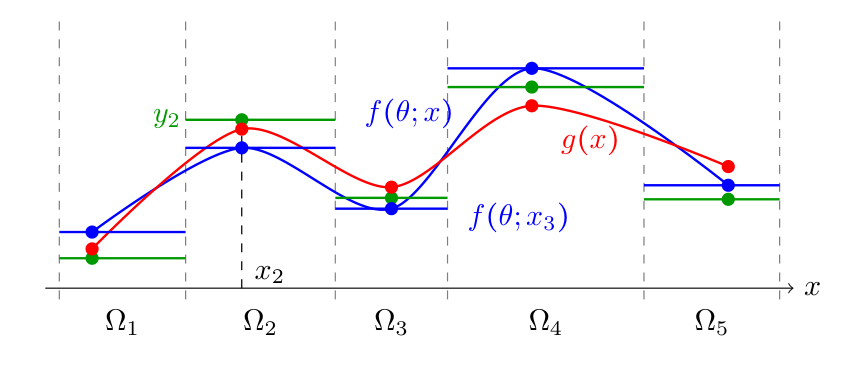

# Wang, Kevrekidis, Belkin 2026 — A Theoretical Analysis of Generalization Dynamics in Neural Networks under Gradient Descent with Weight Decay

See also: [global concept index](../../concepts/index.md).

**Yuqing Wang**, **Ioannis G. Kevrekidis** (Johns Hopkins University), **Mikhail Belkin** (University of California San Diego).

arXiv [2609.07755](https://arxiv.org/abs/2609.07755), 7 September 2026 (v1), 56 pages, 1 figure, 0 tables. In corpus — 0. Total citations per Semantic Scholar — 1 (snapshot of 2026-10-02).

Files analysing this paper:

- [`2609.07755.a-theoretical-analysis-of-generalization-dynamics-in-neural-networks-under-gradient-descent-with-weight-decay.license.txt`](2609.07755.a-theoretical-analysis-of-generalization-dynamics-in-neural-networks-under-gradient-descent-with-weight-decay.license.txt) — the arXiv licence record for this paper.

The anchor scheme and linking rules are in the [README](../README.md).

## What problem the authors consider

This is a theoretical work on neural networks trained by gradient descent with weight decay and a squared loss. The inputs are real-valued vectors, rather than sequences of discrete tokens. Assumption 1 requires the joint distribution of the training inputs to have a density with respect to Lebesgue measure; the population bounds use an input distribution with a density. The results therefore cannot be transferred directly to a finite set of tokens or discrete arithmetic tasks. Replacing tokens with fixed vectors does not by itself satisfy the density requirement: the distribution is still concentrated at individual points.

For the analysis, the authors partition the input space into regions: each region contains its corresponding training input and has positive probability, while intersections between distinct regions have zero probability. The partition is fixed for the analysis. One admissible example is Voronoi cells, which assign an input to the nearest training input, but the theory allows other partitions as well. In each region, the network response at its training input serves as a reference value. [Figure 1](#fig-1) shows how comparison with these reference values separates the generalization error into three contributions. This is an analytical partition, rather than an additional network training algorithm.

**Excerpt card.** The paper's licence (`arxiv-nonexclusive`) does not permit publishing a copy of the original and the complete translation, so the card contains editorial sections and quoted fragments of the source (right of quotation). The full paper: <https://arxiv.org/abs/2609.07755>.

## Concepts addressed

[Grokking](../../concepts/grokking.md). The authors propose a sufficient condition for delayed improvement in generalization: “the optimization error has already become small” (that is, the network already reproduces the training responses well, taking the region weights into account), but prediction changes within the regions have not yet decayed sufficiently. **Prediction variation error** here means the following quantity: within each region, take the squared distance between the network response at an arbitrary input and its response at the corresponding training input, average over the true input distribution within that region, then sum with weights equal to the region probabilities; the authors' definition additionally multiplies the result by three. This is variation in responses as the input changes within a region, rather than variability between training runs or fluctuations in a response over time. A network may respond almost perfectly to the training examples while giving substantially different responses between them. [The authors' interpretation of grokking](#p21-2) is that, after the training error becomes small, additional time is needed to reduce this variation. The proof gives a conditional bound on this reduction; it does not establish that every training run must exhibit an early plateau and an abrupt jump in test accuracy.

[Weight decay](../../concepts/weight-decay.md). The work shows how adding a penalty proportional to the squared weight norm affects an upper bound on prediction variation error. For the layerwise analysis, the authors introduce **Vℓ**: the mean squared change in the contribution of block ℓ to the final output when moving from a training input to other inputs in the same region, averaged using the region probabilities. The block contribution is considered after multiplication by the weights of the linear output layer. This is an auxiliary quantity for bounding the error of the whole network, rather than the test error itself. [The upper bound](#p17-10) consists of an initial quantity multiplied by a geometrically decaying factor and three additional contributions: the blocks' departure from approximate homogeneity, the still nonzero gradient of the training loss, and the regularized loss. The latter includes both the error on training examples and the weight-norm penalty. Weight decay produces the decaying factor, but does not by itself remove the three additional contributions. The authors do not guarantee monotonic decay of the actual prediction variation error at every iteration, do not experimentally compare training with and without weight decay, and do not prove that it is necessary for every instance of grokking.

[Generalization bounds](../../concepts/generalization-bounds.md). The work gives an upper bound on the mean squared difference between the network response and the true function at inputs drawn from the population distribution. [The error decomposition](#fig-1) involves three quantities: data error — how well the training response represents the true function throughout its region; optimization error — how well the network reproduces that training response; and prediction variation error — how much the network responses within a region differ from its response at the training input. Each of the three contributions is averaged over the true distribution and includes the factor of three from the bound on the square of a sum. Once the data and the partition are fixed, the first quantity does not depend on training. The other two change during training. The region weights are their probabilities under the true distribution, so a small ordinary mean training error is not equivalent to a small population error. Reducing the upper bound guarantees a smaller admissible error level; it does not describe the exact error trajectory and does not by itself show how large the actual error was before this reduction.

[Architectural inductive bias](../../concepts/architectural-inductive-bias.md). The authors connect the ability to reduce response differences within regions to properties of the network blocks. The layerwise analysis assumes a linear final layer; the nonlinear blocks have separate weights before and after the nonlinear transformation. What matters is how well these blocks satisfy approximate homogeneity conditions at the inputs and weights encountered during training. [Assumption 7 and its explanation](#p17-5) connect these conditions to the data geometry: they consider the diameter of the set of hidden representations of inputs from one region, that is, the maximum distance between such representations. The authors explain that smaller diameters generally allow smaller approximate homogeneity errors, while more heterogeneous data require stronger block properties. Thus, the combination of architecture and data partition is assessed. The work does not offer an empirical ranking of architectures by their tendency to grok.

[Approximate and local approximate homogeneity](../../concepts/index.md#sec-local-approximate-homogeneity). Homogeneity describes a particular scaling law: multiplying an input by a positive number multiplies the output by a specified power of that number. The authors introduce an approximate condition through [the Euler residual](#p15-10): they compare the block output multiplied by the degree of homogeneity with the directional derivative of the output along the input or set of weights under consideration. The residual is the difference between these quantities; its norm must be uniformly bounded on the specified region. This is a specific mathematical test of departure from homogeneity, rather than an error in predicting a training label. In [the local version](#p15-11), the degree of homogeneity may differ between regions of bounded diameter. A smaller admissible residual means a tighter condition. This residual enters the bound on the level to which layerwise prediction variation can be guaranteed to decrease; the paper does not replace verification of this condition with a simple attribute such as the architecture's name.

[Time to grokking](../../concepts/grokking-time.md). [Corollary 3](#sec-3-3-5) bounds a sufficient training duration for reducing Vℓ to a chosen fraction of its value at the beginning of the interval under consideration. Vℓ describes changes in the contribution of an individual block to the network output between a training input and the other inputs in its region, rather than the fraction of correct test responses. First, an admissible final level of Vℓ is chosen. Three terms of the upper bound are subtracted from this level: the approximate homogeneity residual contribution, the training-gradient contribution, and the regularized-loss contribution. **The positive margin** is the difference remaining after this subtraction; it must be strictly positive. Enough iterations are then required for the geometrically decaying initial contribution to become smaller than this difference. During this time, the network must still be in the neighbourhood of global minimizers of the training loss where the bounds used apply. This is the content of [the authors' explanation of the condition](#p20-7). The result gives a sufficient time for reducing a bounding quantity under its assumptions, rather than the exact time of a test-accuracy jump in an arbitrary experiment. Improving the overall error bound requires corresponding conditions for all layerwise contributions and the input contribution, as well as control of the data and optimization errors.

[Learning rate](../../concepts/learning-rate.md). The work considers gradient descent with a fixed step size and weight decay. Under the assumptions of Theorem 2, the authors guarantee that the weight trajectory reaches a neighbourhood of global minimizers of the training loss; the size of this neighbourhood depends on the step size. [The explanation of the theorem](#p10-9) stresses that a fixed step size does not guarantee an arbitrarily accurate approach to a minimum. Within the neighbourhood, the training error and its gradient are controlled; these bounds subsequently enter the conditions for reducing prediction variation. At the same time, the step size and weight decay coefficient determine the geometric contraction factor. The dependence of sufficient training time on the step size is therefore derived within the theoretical bound and the restrictions on admissible step sizes. The authors do not give a universal learning-rate tuning rule for observing grokking and do not experimentally compare learning-rate schedules.

## What is proved and where the guarantee ends

**Editorial analysis.** The result of the work is a conditional upper bound on the population squared error and an analysis of how its individual contributions may decrease during training. The authors' sufficient condition concerns the layerwise quantities Vℓ that make up the prediction variation error bound. Moving from these quantities to overall generalization also requires control of the data and optimization errors. In [the discussion](#p21-4), the authors explicitly limit their conclusions to qualitative mechanisms and conditions, rather than precise predictions for a particular experiment. The sole illustration is [a diagram of the error decomposition](#fig-1); the paper contains no new set of training experiments.

[The theorem on reaching a neighbourhood of global minimizers](#p9-3) relies on additional assumptions about the training loss and the network, including smoothness, analyticity, and Assumption 4. The latter requires a compact subset of global minimizers to separate the initialization from the region of small weight norms: a trajectory moving towards that region must pass near the minimizers. Consequently, this is not a convergence claim for every network with every initialization. With a fixed step size, [a neighbourhood of minimizers](#p10-9) is guaranteed, rather than exactly reaching a minimum. Analysis of each layer's contribution additionally requires a linear output layer and [control of local approximate homogeneity](#p17-5). The latter condition bounds [the Euler residual](#p15-10) of the network blocks; observing a correlation between weight norm and grokking time cannot substitute for satisfying it.

[The sufficient condition for reducing layerwise variation](#sec-3-3-5) requires the chosen final level of Vℓ to exceed the sum of the three additional bound terms described above, and the trajectory to remain near global minimizers long enough. The decaying initial contribution then has time to fall below [the positive difference between this level and the sum of the additional terms](#p20-7). The theorem does not prove that these requirements hold in every training run. Nor does it give a lower bound on the actual population error before the reduction under consideration: an upper bound can remain large even when the actual error is already small. Therefore, a sufficient condition for reducing the upper bound is not an independent proof of an early plateau or an abrupt test-accuracy jump. [The connection to delayed generalization](#p21-2) is the authors' interpretation of a regime where the optimization error has already become small, but differences in responses within regions still need time to decrease.

Two expressions in Corollary 3 require care when citing. Besides the exact logarithmic bound on sufficient time, the authors give an asymptotic expression with the layer index in the denominator; this is literally undefined for layer zero. This asymptotic expression cannot be used for that layer without separate justification; the exact bound and the original expression in the translation have been preserved. In addition, the index K2, called the exit time in the main text, is defined in [the proof of Theorem 2](#sec-a-3) as the last index of continuous residence of the trajectory in the neighbourhood of minimizers. If the trajectory does not leave the neighbourhood, this index may be infinite. [The proof of Corollary 3](#sec-b-4) refers to the iteration indexed by K2; if the index is infinite, the result needs to be formulated separately for a finite number of iterations. These are editorially noted questions about the applicability of the expressions, rather than an established refutation of the paper's results or a discovered instance of incorrect citation by other works.

# Quoted fragments

Only the fragments the corpus cards refer to are
reproduced here (right of quotation); the paper's licence does not permit
republishing the whole text. Anchor numbering matches the original.

###### p9-3

In this section, based on Theorem 1, we translate the decay of the regularized objective $\mathcal{L}_ {\lambda}$ into convergence to a neighbourhood of the set of global minimizers of the empirical loss $\mathcal{L}$. To this end, we use the geometry of the set of global minimizers inside the controlled ball. Define the set

$$
\mathcal{M}=\lbrace \theta\mkern3mu |\mkern3mu \mathcal{L}(\theta)=0,\theta\in B_{\textbf{0}}(R_{\lambda})\rbrace .
$$

As is discussed in Section 2.2, the decay of $\mathcal{L}_ {\lambda}$ alone does not imply that the empirical loss $\mathcal{L}$ becomes small, since the decrease may instead come from the quadratic regularization term. To recover control of $\mathcal{L}$, we impose a geometric condition requiring part of the set of global minimizers to separate the initialization from the small-norm region where the decay estimate in Theorem 1 stops applying. Consequently, a trajectory moving from the initialization toward this region must enter a neighbourhood of the set of global minimizers of $\mathcal{L}$.

To capture the discrete nature of GD, we define the maximal one-step displacement for a learning rate $\eta$

$$
\epsilon_{\eta}=\eta\sup_{\theta\in B_{\textbf{0}}(R_{\lambda})}\Vert \nabla\mathcal{L}_{\lambda}(\theta)\Vert .
$$

Then every update within the controlled ball satisfies

$$
\Vert \theta^{k+1}-\theta^{k}\Vert =\eta\Vert \nabla\mathcal{L}_{\lambda}(\theta^{k})\Vert \leq\epsilon_{\eta},
$$

namely, $\epsilon_ {\eta}$ is a uniform upper bound on the displacement of one GD step.

With this one-step control, we impose the following separation condition.

###### p10-9

Consequently, GD is guaranteed to reach a neighbourhood of the set of global minimizers. Without additional training strategies, such as a learning-rate schedule or injected stochasticity, the theorem does not claim convergence to an arbitrarily small neighbourhood. Rather, for the fixed learning rate $\eta$, it gives $\mathcal{L}(\theta^{k})=\mathcal{O}(\eta^{2})$ and $\Vert \nabla\mathcal{L}(\theta^{k})\Vert =\mathcal{O}(\eta)$ in this time interval.

###### fig-1

*Figure 1: A schematic illustration of the population error decomposition. The blue and red smooth curves represent the network output $f(\theta;x)$ and the ground truth $g(x)$, respectively. The blue and green piecewise-constant functions represent $\bar{f}_ {\theta}(x)$ and $\bar{y}(x)$, respectively; on each cell $\Omega_ {i}$, they take the values $f(\theta;x_ {i})$ and $y_ {i}$.* **[p. 11]**

We now use the fixed partition to decompose the population error. For each cell $\Omega_ {i}$, the training point $x_ {i}$ serves as the representative input. Then, we define the corresponding piecewise constant cellwise network and label representative functions by

$$
\bar{f}_{\theta}(x):=\sum_{i=1}^{N}f(\theta;x_{i})\mathbbm{1}_{x\in\Omega_{i}},\qquad\bar{y}(x):=\sum_{i=1}^{N}y_{i}\mathbbm{1}_{x\in\Omega_{i}}.
$$

In Figure 1, $\bar{f}_ {\theta}$ is shown by the blue horizontal pieces and $\bar{y}$ by the green horizontal pieces. The population error is then compared along the chain $f(\theta;\cdot)\to\bar{f}_ {\theta}\to\bar{y}\to g$. Therefore, by Jensen’s inequality, the population loss decomposes into three errors:

$$
\mathbb{E}_{x\sim\pi}\Vert f(\theta;x)-g(x)\Vert ^{2} \leq\underbrace{3\mkern3mu \mathbb{E}_{x\sim\pi}\left\Vert f(\theta;x)-\bar{f}_{\theta}(x)\right\Vert ^{2}}_{E_{\rm PV}(\theta)}+\underbrace{3\mkern3mu \mathbb{E}_{x\sim\pi}\left\Vert \bar{f}_{\theta}(x)-\bar{y}(x)\right\Vert ^{2}}_{E_{\rm opt}(\theta)}+\underbrace{3\mkern3mu \mathbb{E}_{x\sim\pi}\left\Vert \bar{y}(x)-g(x)\right\Vert ^{2}}_{E_{\rm data}}.
$$

**[p. 12]**

The three terms are the squared distances between consecutive functions in the chain above. The data error $E_ {\rm data}$ is independent of training once the samples and partition are fixed. The optimization error $E_ {\rm opt}$ is a weighted empirical error evaluated at the training data, which can be seen more clearly from the following cellwise decomposition. The prediction variation error $E_ {\rm PV}$ measures how much the trained network varies within each cell and is the key term for characterizing generalization performance through architecture and optimization dynamics.

Since the cells form a partition up to $\pi$-null sets, the three errors can equivalently be decomposed into local cell contributions:

$$
E_{\rm PV}(\theta) =3\sum_{i=1}^{N}\int_{\Omega_{i}}\pi(x)dx\cdot\mathbb{E}_{\Omega_{i}}\Vert f(\theta;x)-f(\theta;x_{i})\Vert ^{2}, \cr
E_{\rm opt}(\theta) =3\sum_{i=1}^{N}\int_{\Omega_{i}}\pi(x)dx\cdot\Vert f(\theta;x_{i})-y_{i}\Vert ^{2}, \cr
E_{\rm data} =3\sum_{i=1}^{N}\int_{\Omega_{i}}\pi(x)dx\cdot\mathbb{E}_{\Omega_{i}}\Vert y_{i}-g(x)\Vert ^{2},
$$

where $\mathbb{E}_ {\Omega_ {i}}[\cdot]:=\mathbb{E}_ {x\sim\pi}[\cdot\mid x\in\Omega_ {i}]$ is the expectation under the population input distribution conditioned on the event $x\in\Omega_ {i}$. The weights $\int_ {\Omega_ {i}}\pi(x)dx$ are the population masses of the cells. They depend both on the partition and on the true input distribution. Hence the same local error can contribute differently to the population loss depending on where it occurs: errors on high-mass cells are emphasized, while errors on low-density cells are downweighted. Note that this partition is not introduced only for theoretical purposes; it also represents how the training inputs are sampled relative to the true distribution. This is especially useful when the sampling distribution differs from the true input distribution. For instance, if the input data are sampled from a multi-modal distribution different from the true distribution, then a partition with balanced masses may not exist.

In the next three subsections, we bound $E_ {\rm data}$, $E_ {\rm opt}$, and $E_ {\rm PV}$ separately.

###### p15-10

This definition requires the Euler residual with respect to the input variable $u$ to be uniformly bounded over the region $\Omega_ {\theta}\times\Omega_ {u}$, rather than requiring the exact scaling relation $\psi(\theta,tu)=t^{s}\psi(\theta,u)$. The parameter $\epsilon$ quantifies how far the block is from being homogeneous of degree $s$ in this componentwise directional-derivative sense. When $\epsilon=0$, the definition recovers the exact homogeneity with respect to $u$.

###### p15-11

In some situations, a single global degree may be too restrictive. Hence, we localize the preceding condition by allowing the effective degree to depend on the region where the function is evaluated.

###### p17-5

This assumption is essential for quantifying the dynamics of the prediction variation error. One may also impose finer assumptions under which the error parameter $\epsilon_ {\rm ah}$ varies across variables and layers. The first condition controls the response of a block to its hidden input, while the second controls its local response to parameter rescaling. The quantity $\epsilon_ {\rm ah}$ measures the resulting approximation error and depends on both the architecture and the data partition. The requirement on $D_ {u}$ links data geometry to architecture: smaller diameters of the hidden nodes inside the cells generally lead to smaller approximate homogeneity errors, while more heterogeneous data require blocks with stronger local homogeneity.

Under these conditions, the layerwise prediction variation contracts up to three interpretable residual terms.

###### p17-10

Theorem 5 characterizes the dynamics of the prediction variation error, and the complete version is Theorem 6. The first term is the geometric contraction generated by weight decay. The contraction rate of each layer is indeed distinct; see the complete version in Theorem 6 and Section 3.3.3. The three remaining terms quantify the gap from exact decay. This is natural because exact decay would imply that the learned function is eventually close to piecewise constant on the partition cells. The term $E_ {\rm PV,I}$ is the error arising from (local) approximate homogeneity. As discussed above, its magnitude depends on the architecture and the data partition through $\epsilon_ {\rm ah}$, and on the depth $L$ and some bounds over $B_ {\textbf{0}}(R_ {\lambda})$ encoded by $C_ {\rm ah}$. The term $E_ {\rm PV,II}$ is small when the regularized objective $\mathcal{L}_ {\lambda}(\theta)$ has already decreased sufficiently by time $K_ {0}$. The term $E_ {\rm PV,III}$ is controlled primarily by the empirical loss gradient $\nabla\mathcal{L}(\theta)$. **[p. 18]** Hence, it is small when the GD iterates are near a stationary point. However, making the optimization error small additionally requires proximity to the set of global minimizers. Therefore, both errors are small when the iterates are near a global minimizer whose norm of $\theta$ is small. Note that, unlike the regularized loss $\mathcal{L}_ {\lambda}$, neither the prediction variation error $E_ {\rm PV}$ nor the empirical loss $\mathcal{L}$ is guaranteed to decay monotonically. This is consistent with behavior observed in practice; see also one-step characterization in the proof of Lemma 13.

###### sec-3-3-5

#### 3.3.5 Sufficient condition for generalization: grokking

###### p20-7

We first explain the terms in Corollary 3. The assumptions are inherited from the convergence theorem and the approximate homogeneity assumption: the convergence result ensures that, for $K_ {1}\leq K_ {0}\leq K_ {2}$, GD stays in the neighbourhood of global minimizers and hence $\Vert \nabla\mathcal{L}(\theta^{j})\Vert $ is controlled by the scale $\mathsf{L}_ {\mathcal{M}_ {0}}\epsilon_ {\eta}$, while Assumption 7 controls the architecture and partition error through $\epsilon_ {\rm ah}$. The quantity $\epsilon_ {K_ {0}}$ is the remaining decay budget at time $K_ {0}$: it starts from the target amount $c_ {K_ {0}}V_ {\ell}(\theta^{K_ {0}})$ and subtracts the three noncontractive terms in Lemma 4, namely the approximate homogeneity error, the empirical-gradient contribution in the neighbourhood of global minimizers, and the residual contribution of the regularized objective after $K_ {0}$ iterations. The condition $\epsilon_ {K_ {0}}>0$ means that these error terms are strictly smaller than the target reduction of $V_ {\ell}$, or equivalently, the target reduction can not be smaller than these three errors. The second condition requires $K_ {2}-K_ {0}$ to be large enough so that the geometric contraction factor $\left(1-2(\sum_ {r=0}^{\ell}s_ {r,\rm in}+\ell+2)\eta\lambda\right)^{K_ {2}-K_ {0}}$ reduces the initial oscillation $V_ {\ell}(\theta^{K_ {0}})$ below this positive margin $\epsilon_ {K_ {0}}$. Therefore the conclusion $V_ {\ell}(\theta^{K_ {2}})\leq c_ {K_ {0}}V_ {\ell}(\theta^{K_ {0}})$ follows by combining a positive margin at $K_ {0}$ with enough subsequent contraction before the trajectory exits the neighbourhood of global minimizers.

**[p. 21]**

This gives a sufficient condition for improved layerwise generalization. When it holds for every $V_ {\ell}$ and for $V_ {\rm pre}$, the overall prediction variation error also decreases. Once the data error is controlled by the partition and output data assumptions, and the optimization error by the convergence of the empirical objective, the network’s within-cell oscillation is the remaining contribution. Corollary 3 guarantees that this oscillation decreases by a prescribed factor, making the learned function more stable within each partition cell, which tightens the generalization bound.

###### p21-2

We now relate this condition to grokking (Power et al., 2022). Grokking is a delayed generalization phenomenon in which the model first reaches a small training loss while the population or validation error remains large, and then generalizes sharply only after additional training. In the present decomposition, the optimization error has already become small, but the prediction variation error has not yet decayed sufficiently. In this sense, grokking is the “worst case” of generalization within our framework: even after optimization succeeds, the oscillation terms require additional time to decay in the small-loss region. Easier generalization occurs when $V_ {\ell}$ decays before or together with the optimization error, whereas grokking requires a longer time window after $K_ {0}$.

Corollary 3 can therefore be interpreted as a general characterization of the grokking phenomenon. More precisely, grokking occurs when optimization has already made $\mathcal{L}$ and $\mathcal{L}_ {\lambda}$ small, but the network still needs a long time from $K_ {0}$ to $K_ {2}$ for the layerwise oscillation to contract. The sufficient condition identifies three mechanisms that make this delayed improvement possible: a small approximate homogeneity error, a small empirical gradient and a small regularized objective in the neighbourhood of global minimizers, and a sufficiently long residence time in that region.

###### p21-4

This paper develops a general framework for analyzing generalization dynamics by separating the effects of input data and their relationship to the true distribution through partition, the layerwise and blockwise architecture, and the optimization dynamics. Its main advantage is this generality: the decomposition identifies how these components enter the population error and can be adapted to a broad range of learning settings. The same generality also limits the specificity of its conclusions. In particular, the connections to loss reweighting, layerwise learning behavior, and grokking describe qualitative mechanisms and conditions rather than precise predictions for a given task or architecture. A natural extension is therefore to specialize the data partition, architectural assumptions, and local approximate homogeneity bounds to concrete settings, yielding sharper cellwise and layerwise estimates that can be compared directly with empirical behavior. The current framework provides a baseline and a starting point for such refined analyses.

###### sec-a-3

### A.3 Convergence to a neighbourhood of global minimum

###### sec-b-4

### B.4 Necessary/sufficient conditions of generalization
